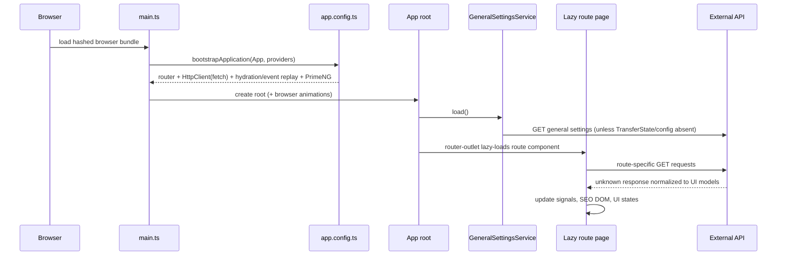
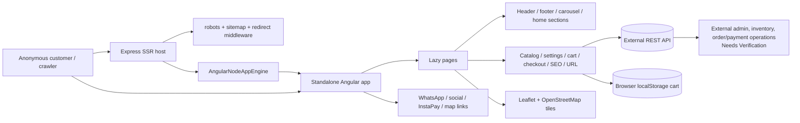
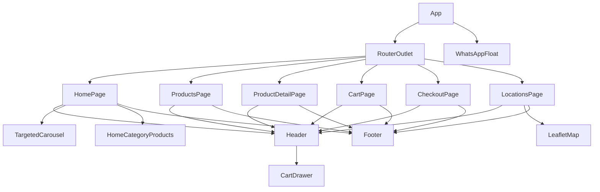
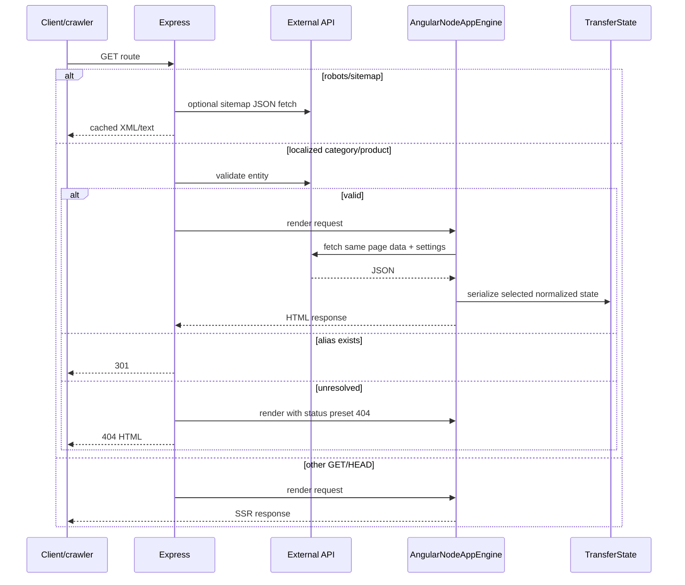
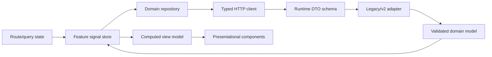

# Kapomatic Website Frontend — Project Rebuild Specification

**Document purpose:** forensic, implementation-ready specification for rebuilding the current storefront without consulting the original source.

**Evidence date:** 2026-08-22

**Repository:** `kapomatic-website-frontend`

**Scope:** current frontend, SSR host, public assets, tests, and build configuration. The backend/admin/database are outside this repository.

**Confidentiality rule:** the configured production API origin is intentionally replaced by `{API_BASE_URL}`. Environment key names are documented; sensitive values are not.

## Evidence and status conventions

- **Verified** means directly demonstrated by current code, templates, configuration, or a validation command.
- **Inferred** means the frontend access pattern strongly implies a contract, but no backend implementation or formal schema is present.
- **Needs Verification** means a backend, business, infrastructure, or design decision cannot be proved here.
- **Not Implemented** means no implementation was found after recursive inspection.
- **Partially Implemented** means visible behavior exists but is incomplete, inconsistent, or UI-only.
- File references are exact repository-relative paths. Line numbers identify the inspected revision and are supplemented by symbol/behavior descriptions because line numbers can move.
- Generated/dependency directories (`node_modules`, `dist`, `.angular`, `coverage`, build caches, `.git`) were excluded from source analysis. Generated `dist` output was inspected only after the validation build to measure bundles.

For readability in dense tables, these labels are exact-path shorthands: **routes** = `src/app/app.routes.ts`; **server routes** = `src/app/app.routes.server.ts`; **server** = `src/server.ts`; **home/products/detail/cart/checkout/locations page** = the matching `.ts` plus `.html` (and locations `.scss`) under `src/app/pages/<name>/`; **header/footer/carousel/home-category component** = the matching files under `src/app/components/<name>/`; **ecommerce/cart/checkout/settings/website-images/SEO/URL/localization service** = `src/app/services/<name>.service.ts`. A citation with a line range refers to the `.ts` file unless it explicitly says HTML/SCSS/template.

---

# 1. Executive Summary

## 1.1 Verified product facts

| Item | Finding | Evidence |
|---|---|---|
| Product name | **Kapomatic Website Frontend**; the visible Arabic brand fallback is **كابوماتيك**. | `package.json:2`; `src/app/components/site-header/site-header.component.html:3-8`; `src/app/services/seo.service.ts:53-66` |
| Business domain | Public automotive ecommerce: automatic gearbox/transmission parts, car spare parts, engine/vehicle oils, and related maintenance products in Egypt. | `src/index.html:5-17`; `src/app/services/seo.service.ts:56-66, 284-325` |
| Purpose | Allow anonymous visitors to discover categories/products, search/filter/sort, view details, keep a local cart, submit delivery/payment details, and locate branches. | `src/app/app.routes.ts`; `src/app/pages/**`; `src/app/services/ecommerce.service.ts`; `src/app/services/checkout.service.ts` |
| Confirmed users | Anonymous retail customers/visitors. No authentication, role, guard, token, account, or protected route exists. | `src/app/app.routes.ts:3-62`; complete search of `src/app` |
| Primary user problems | Finding compatible products; seeing price/discount/availability; reaching the store; and placing a cash/manual-transfer order without an account. | `src/app/pages/products/products.page.*`; `src/app/pages/product-detail/product-detail.page.*`; `src/app/pages/checkout/checkout.page.*`; `src/app/pages/locations/locations.page.*` |
| Business value | A configurable public sales channel with dynamic catalog/settings/promotions, local cart, order intake, payment-proof capture, branch discovery, and SSR SEO output. | `src/app/services/general-settings.service.ts`; `src/app/services/website-images.service.ts`; `src/server.ts`; `src/app/services/seo.service.ts` |
| Current status | A functional but small storefront. Core browsing, cart, checkout, locations, SEO, SSR, and tests build successfully. English UI, favorites, pricing consistency, cart estimates, error recovery, accessibility, and contract typing are incomplete/risky. | Validation in §24/§25; findings throughout this document |

## 1.2 Repository and external-system boundary

**Included here (Verified):** one standalone-component Angular application; six route-page implementations; four shared components; seven services; Express/Angular SSR entry points; dynamic robots/sitemap handlers; Tailwind/SCSS configuration; public fonts/favicon/crawler files; and three unit-test files. Sources: `src/`, `public/`, `angular.json`, `package.json`.

**External (Verified only as a frontend dependency):** catalog/category/search APIs, website/general/shipping settings, targeted promotion images, checkout/order creation, product images/logo URLs, social/map/payment links, and sitemap data. The API server, database, admin console, fulfillment, inventory authority, payment review, and order operations are not included. Sources: all HTTP calls catalogued in §10; `src/server.ts:193-215, 236-297`.

**Needs Verification:** backend technology/database; administrator roles; who reviews transfer proofs; fulfillment/status workflow; whether backend recalculates price, stock, shipping, and totals; production reverse-proxy/CORS/security policy; observability and analytics outside this codebase.

## 1.3 Maintain or rebuild assessment

**Verified assessment:** continued maintenance is possible—the code uses current standalone Angular patterns, strict TypeScript, lazy route chunks, signals, SSR, `withFetch`, and passing tests. A rebuild is nevertheless justifiable if the goal is a reliable bilingual commerce platform rather than incremental stabilization.

Main rebuild drivers:

1. `EcommerceService` is an 833-line permissive adapter that guesses numerous wrappers and aliases, making the real API contract untestable and silent data corruption plausible (`src/app/services/ecommerce.service.ts:326-832`).
2. Financial presentation is inconsistent: listing/home use `retailPrice`, product detail often uses `price`, cart uses `price` before `retailPrice`, and checkout submits the persisted client price (`src/app/pages/products/products.page.html:184-201`; `src/app/pages/product-detail/product-detail.page.html:39-55`; `src/app/services/cart.service.ts:43-67`; `src/app/pages/checkout/checkout.page.ts:158-172`).
3. `/:lang` accepts any single segment and precedes legacy redirects, making `/products`, `/cart`, `/checkout`, and `/locations` redirect declarations unreachable (`src/app/app.routes.ts:9-12, 38-58`).
4. `/en` changes direction/metadata/data-language selection, but nearly all visible labels remain Arabic. Bilingual presentation is **Partially Implemented** (`src/app/services/localization.service.ts`; all templates under `src/app/pages` and `src/app/components`).
5. Checkout sends client-controlled localStorage prices, proof images as unbounded base64 JSON, and has no demonstrated idempotency or contract validation (`src/app/services/cart.service.ts:99-119`; `src/app/pages/checkout/checkout.page.ts:158-228`).
6. Page-level product cards, status blocks, prices, loaders, and errors are duplicated rather than governed by reusable domain/UI primitives (`src/app/pages/products/products.page.html`; `src/app/components/home-category-products/home-category-products.component.html`).
7. The successful production build exceeds its initial raw bundle warning budget by 132.41 kB (§23 and §25).
8. Accessibility gaps include an unmanaged cart dialog, unlabeled search/select controls, incomplete tabs/carousel semantics, and no focus/error-announcement architecture (§21).

## 1.4 Architectural recommendation (not a verified current fact)

Rebuild as an Angular 21 standalone SSR application initially pinned to a supported 21.2.x patch, with schema-validated DTOs, explicit adapters, immutable domain money models, a single cart/pricing policy, feature routes constrained to `ar|en`, reusable catalog UI, a translation dictionary, route-level data/SEO orchestration, and contract/E2E/accessibility tests. Confirm the supported Angular/Node patch at kickoff; do not combine a product rebuild with an unbounded major-version migration.

---

# 2. Complete Technology Inventory

Installed versions below are from `package-lock.json` and `npm ls --depth=0`, not only semver ranges in `package.json`.

| Technology/package | Installed | Configuration | Actual use / purpose | Rebuild disposition | Migration risk |
|---|---:|---|---|---|---|
| Angular core/common/compiler/forms/router/platform-browser/platform-server | 21.2.10 | `package.json`; `angular.json`; `tsconfig*.json` | Standalone components, control flow, reactive forms, DI, signals, lazy router, browser/server rendering | **Keep** on 21.2.x initially; upgrade only after parity | SSR/hydration and template behavior must be retested if major-upgraded |
| Angular CLI | 21.2.8 | `package.json:scripts`; `angular.json` | Build/serve/test commands | **Keep/pin** with build package | CLI/build patch mismatch with Angular core is small but should be aligned |
| `@angular/build` | 21.2.8 | `angular.json` application/unit-test builders | Browser/server bundling, tests | **Keep/pin** | Budget/chunk output may change across versions |
| `@angular/compiler-cli` | 21.2.10 | `tsconfig*.json` | AOT/strict template compilation | **Keep** | Preserve strict options |
| `@angular/ssr` | 21.2.8 | `angular.json:server,ssr,outputMode`; `src/main.server.ts`; `src/server.ts` | AngularNodeAppEngine, server routes, Node handler | **Keep**, simplify request orchestration | SSR engine and route-status APIs are version-sensitive |
| `@angular/animations` | 21.2.10 | `src/main.ts:2,8`; noop provider on server | Browser animations provider; no app animation trigger found | **Remove if PrimeNG is removed** | Verify no retained UI library needs it |
| Angular Signals | framework feature | Throughout services/pages | Cart/global settings and local UI state; computed totals/derived values | **Keep**, impose feature-store boundaries | SSR-localStorage initialization needs deliberate hydration strategy |
| Angular hydration/event replay | 21.2.10 | `src/app/app.config.ts:7,18` | Hydrates SSR DOM and replays pre-hydration events | **Keep** | Cart state can differ between server and browser; test mismatch/flash |
| Angular HTTP fetch backend | 21.2.10 | `src/app/app.config.ts:8,17` | REST calls via fetch-compatible `HttpClient` | **Keep** | CORS, abort/timeout, transfer-cache policy must be explicit |
| RxJS | 7.8.2 | Services/pages | HTTP composition, `combineLatest`, caching, lifecycle teardown | **Keep** | Replace nested/manual subscriptions where cancellation matters |
| TypeScript | 5.9.3 | `tsconfig.json`; lock | Strict ES2022 application | **Keep/pin compatible version** | Schema typing must not be replaced by `unknown` guessing |
| `tslib` | 2.8.1 | TypeScript helper dependency | Runtime helpers | **Keep transitive/runtime** | Low |
| Express | 5.2.1 | `src/server.ts` | SSR host, static files, robots/sitemaps, redirects | **Keep or replace with deployment-standard adapter** | Express 5 error/proxy semantics; forwarded-host trust; cache behavior |
| Tailwind CSS | 3.4.17 | `tailwind.config.js`; `postcss.config.js`; `src/styles.scss` | Almost all component styling | **Keep short-term or migrate tokens atomically** | Undefined custom shades currently produce no CSS; Tailwind 4 migration is nontrivial |
| SCSS | Angular build support | `src/styles.scss`; `src/app/app.scss`; locations SCSS | Font faces, Tailwind entry, Leaflet import, WhatsApp button, map deep styles | **Keep** for globals/complex component rules | `::ng-deep` should be removed via controlled global map theme |
| PostCSS | 8.5.10 | `postcss.config.js` | Tailwind pipeline | **Keep** while on Tailwind 3 | Coordinate version with Tailwind |
| Autoprefixer | 10.5.0 | `postcss.config.js` | CSS vendor prefixing | **Keep** | Low |
| PrimeNG | 21.1.6 | `src/app/app.config.ts:3,19-24` | Provider/Aura theme/ripple only; no PrimeNG component selector/import found | **Remove unless a confirmed rebuild control needs it** | Removal can materially reduce initial JS/theme code; visually verify |
| `@primeuix/themes` | 2.0.3 | `src/app/app.config.ts:4,21-23` | Aura preset solely for PrimeNG configuration | **Remove with PrimeNG** | Low if no hidden component use |
| PrimeIcons | 7.0.0 | global stylesheet in `angular.json:37` | No `pi` icon class found | **Remove** | Ensure no backend-rendered class depends on it (unlikely) |
| Font Awesome Free | 7.2.0 | global `all.min.css` in `angular.json:38`; templates/settings icon map | All visible icons and social-brand icons | **Replace with tree-shaken SVG/icon registry or retain a subset** | Icon names/appearance may change; social aliases need mapping tests |
| Leaflet | 1.9.4 | dynamic import in `locations.page.ts`; CSS global import | Branch map and markers | **Keep if interactive map remains**; lazy-load CSS too | Browser-only lifecycle, tile availability/privacy, 149.55 kB raw lazy JS |
| `@types/leaflet` | 1.9.21 | TypeScript only | Leaflet types | **Keep with Leaflet** | Low |
| Vitest | 4.1.5 | Angular unit-test builder; three specs | Unit/service tests | **Keep and expand** | Browser-vs-jsdom behavior needs clear test split |
| jsdom | 28.1.0 | dev dependency | DOM environment used by test tooling | **Keep if required by builder** | Avoid treating jsdom as real-browser accessibility proof |
| Prettier | 3.8.3 | `.prettierrc` | Formatting configuration; no npm script | **Keep**, add check script | Formatting-only |
| `@types/node` | 20.19.39 | `tsconfig.app.json` | SSR/Node types | **Keep**, align with runtime | Runtime/type mismatch if Node changes |
| `@types/express` | 5.0.6 | server compile | Express types | **Keep with Express** | Align with Express major |
| Angular Language Service extension | editor recommendation | `.vscode/extensions.json` | Developer tooling | **Keep** | None |
| Angular CLI MCP editor server | unpinned `npx -y` command | `.vscode/mcp.json` | Developer AI tooling, not runtime | **Pin/remove by team policy** | Network execution and version drift in developer environments |

## 2.1 Required runtimes

- `package.json` declares npm **11.12.1** through `packageManager`; the validation shell directly reported npm **10.8.2**, while Angular CLI displayed the declared 11.12.1. Rebuild CI must use the declared version consistently (`package.json:11`).
- Installed Angular packages require Node `^20.19.0 || ^22.12.0 || >=24.0.0` (lock-file engine metadata). Validation used Node **20.20.2**, which is supported. Recommended rebuild baseline: an actively supported Node LTS satisfying Angular's exact engine range, pinned in CI/container tooling. **Needs Verification** at implementation kickoff.
- No `.nvmrc`, `.node-version`, Dockerfile, or engines field exists. Add one authoritative runtime pin.

## 2.2 Suspicious/unused dependencies

PrimeNG, Aura theme, PrimeIcons, and browser animations are configured without a used PrimeNG control. All non-Cairo public fonts are unused. These inflate install/assets and possibly initial bundles. Evidence: dependency/import search; `src/styles.scss:2-35`; public font inventory in §8.

---

# 3. Repository and Application Architecture

## 3.1 Meaningful tree

```text
.
├── angular.json                 # build/serve/test/SSR/assets/styles/budgets
├── package.json / package-lock.json
├── tsconfig.json
├── tsconfig.app.json
├── tsconfig.spec.json
├── tailwind.config.js
├── postcss.config.js
├── .editorconfig / .prettierrc / .gitignore
├── .vscode/                     # Angular editor, launch, task, MCP settings
├── README.md
├── PROJECT_OVERVIEW.md          # prior overview; not authoritative
├── public/
│   ├── favicon.ico
│   ├── robots.txt
│   ├── sitemap.xml
│   └── fonts/                   # Cairo active; other families unused
└── src/
    ├── index.html               # static head fallbacks and app host
    ├── styles.scss              # Cairo, Tailwind layers, global Leaflet CSS
    ├── main.ts                  # browser bootstrap
    ├── main.server.ts           # server bootstrap
    ├── server.ts                # Express SSR, SEO endpoints, redirects
    ├── environments/environment.ts
    └── app/
        ├── app.ts / app.html / app.scss
        ├── app.config.ts / app.config.server.ts
        ├── app.routes.ts / app.routes.server.ts
        ├── components/
        │   ├── site-header/
        │   ├── site-footer/
        │   ├── website-targeted-images/
        │   └── home-category-products/
        ├── pages/
        │   ├── home/
        │   ├── products/
        │   ├── product-detail/
        │   ├── cart/
        │   ├── checkout/
        │   └── locations/
        └── services/
            ├── ecommerce.service.ts
            ├── website-images.service.ts
            ├── general-settings.service.ts
            ├── cart.service.ts
            ├── checkout.service.ts
            ├── seo.service.ts
            └── url.service.ts / localization.service.ts
```

Sources: recursive file inventory; every listed source was read in full. There are no guards, resolvers, directives, pipes, interceptors, domain/model folders, state-library folders, scripts directory, deploy manifests, E2E project, or separate production environment file.

## 3.2 Bootstrap and provider flow



Browser bootstrap is `bootstrapApplication` plus `provideAnimations` (`src/main.ts:1-10`). Shared providers include global error listeners, environment `APP_BASE_HREF`, router, fetch-backed HTTP, hydration/event replay, and PrimeNG Aura (`src/app/app.config.ts:1-26`). Root construction immediately calls general-settings `load()` and exposes a computed WhatsApp URL (`src/app/app.ts:11-32`).

Server bootstrap merges the same app config with noop animations and route-aware server rendering (`src/main.server.ts`; `src/app/app.config.server.ts`). This means browser and server share services unless individual code uses platform guards.

## 3.3 High-level system architecture



## 3.4 Component hierarchy



## 3.5 Routing architecture

All page components are standalone and lazy-loaded through `loadComponent` (`src/app/app.routes.ts`). No route guards/resolvers/title strategies exist. Language is a free `:lang` path parameter; `LocalizationService` treats only exact `en` as English and everything else as Arabic (`src/app/services/localization.service.ts:20-36`; `src/app/services/url.service.ts:106-108`). This is an architecture violation: invalid one-segment paths become Arabic home pages, and early `:lang` shadows later one-segment legacy redirects.

## 3.6 SSR, hydration, and rendering

- Every server route, including wildcard, uses `RenderMode.Server`; the validation build reported **0 prerendered routes** (`src/app/app.routes.server.ts:3-24`).
- Express serves explicit robots/sitemap routes before static output, performs backend validation/redirects for localized category/product URLs, performs legacy product-ID redirects, serves browser files with one-year caching, and delegates everything else to Angular (`src/server.ts:133-335`).
- Custom `TransferState` is used for general settings, active categories, public category/product/page results, and active website images (`general-settings.service.ts:42,66-83`; `ecommerce.service.ts:138-150,169-177,182-194,749-761`; `website-images.service.ts:36-52,231-242`).
- Hydration includes event replay. Angular's HTTP transfer-cache behavior is not explicitly configured, so the rebuild must test interaction between framework HTTP caching and custom keys rather than assume one layer is necessary.
- Browser-only code is guarded in cart storage, carousel timers, and Leaflet initialization. Product infinite-scroll code checks `window`/`document` before measurement. Sources: `cart.service.ts:22-40,99-107`; carousel TS `81-95`; locations TS `75-107`; products TS `496-518`.

## 3.7 Service/state architecture

- Root-singleton services use `providedIn: 'root'` and `inject()` rather than constructors.
- There is no central store library. Signals hold cart/settings and page-local view state; RxJS handles HTTP and route streams.
- `CartService` is the only persistent client store. `GeneralSettingsService` is a global configuration store. Catalog and targeted-image services keep in-memory `shareReplay`/Map caches. Sources: §12.
- Pages communicate with header search through `@Input`/`@Output`; otherwise components inject root services directly. No container/presenter boundary exists.
- Templates read services directly (cart/settings/localization), tightly coupling shared UI to application state.

## 3.8 Frontend-to-API communication

```mermaid
flowchart LR
    Page[Page/component] --> Service[Feature service]
    Service --> URL[UrlService + environment.api_base_url]
    Service --> HTTP[HttpClient with fetch]
    HTTP --> API[{API_BASE_URL}]
    API --> Unknown[unknown JSON]
    Unknown --> Adapter[readArray/readObject/readPath/alias coercion]
    Adapter --> Model[UI-facing EcommerceProduct/etc.]
    Model --> Signal[Page/global signals]
    Signal --> Template[Angular template]
```

No auth header, interceptor, API version header, request ID, retry policy, global timeout, or centralized error translation exists. CORS must allow direct browser calls to `{API_BASE_URL}`. Sources: `src/app/app.config.ts:17`; all services in `src/app/services`.

## 3.9 Architectural violations and duplication

| Issue | Evidence | Rebuild requirement |
|---|---|---|
| API/domain/view concerns mixed in one 833-line service | `src/app/services/ecommerce.service.ts` | Split generated/typed client, DTO schemas, adapters, domain repositories |
| Route grammar accepts invalid languages and shadows redirects | `src/app/app.routes.ts:9-58` | Constrain/match `ar|en`; place static legacy routes before parameter route or handle server-only |
| Repeated product-card/pricing markup | products HTML `135-227`; home-category HTML `41-79` | One card component with explicit variants and one money presenter |
| Repeated shell markup on every page | all page templates | Route layout/shell with header, breadcrumb slot, footer |
| Repeated loader/error/empty panels | all page templates/components | Shared status primitives with consistent retry/accessibility |
| Dynamic main-color theme only partially applied | `app.html:1`; header, footer, locations templates | Tokenize dynamic brand palette/contrast; do not leave unused CSS variable |
| Hardcoded Arabic UI under English routes | all templates | Translation catalogue and language switch strategy |
| Dead/unused paths/types | legacy category-ID branches; `TabKey.fitment`; `viewOnly`; `oppositeLanguage`; PrimeNG | Remove only after compatibility confirmation |

---

# 4. Route and Navigation Inventory

## 4.1 Route table

All listed paths render on the server because `app.routes.server.ts` ends in `** → RenderMode.Server`.

| Path | Page / actual routing behavior | Params and query | Entry and exit actions | Data/SEO/states/access | Sources |
|---|---|---|---|---|---|
| `/` | Full-match redirect to `/ar` | None | Browser/server router redirect | No page data; public | `app.routes.ts:4-8` |
| `/:lang` | `HomePage`; accepts **any** one segment, not only ar/en | Path `lang`; normalized to en only if exact `en` | Header/cart/search, categories, promotions, locations | General settings + active categories + active images + deferred home categories; home SEO; independent loading/error/empty blocks; public | `app.routes.ts:9-12`; `home.page.*` |
| `/:lang/categories/:slug` | `ProductsPage` category mode | `lang`, `slug`; no documented route query, but service filters/sort are UI state only | Home breadcrumb; category selector; product details; cart | Public category, category filters, paged products; backend SEO/category JSON-LD; load/error/empty/infinite states; public | routes `14-16`; products TS `134-196,357-450,520-599` |
| `/:lang/search` | `ProductsPage` search or targeted-promotion mode | `q` preferred, legacy `search`; `websiteImageId`; `targetTitle` | Header typing rewrites `q`; product links/cart; clearing input navigates home | Search API or promotion-resolution APIs; search is noindex/follow; target fallback SEO; loading/empty/error; public | routes `18-20`; products TS `143-169,332-355,453-494` |
| `/:lang/products/:slug` | `ProductDetailPage` slug mode | `lang`, `slug` | Breadcrumb to home/category/search; thumbnails/tabs/quantity/cart | Public product API; backend/fallback SEO, Product + Breadcrumb JSON-LD; loading/error; public | routes `22-25`; product detail TS `151-212` |
| `/:lang/cart` | `CartPage` | `lang` | Product links, quantity/remove, checkout/search; header drawer also available | localStorage-backed client cart; no APIs; noindex/nofollow; empty/content states; public | routes `27-29`; cart page/service |
| `/:lang/checkout` | `CheckoutPage` | `lang` | Cart/home/search links; form submission; external tel/InstaPay | General settings + shipping GET + checkout POST; noindex/nofollow; empty/form/submitting/error/success; public | routes `31-33`; checkout page/service |
| `/:lang/locations` | `LocationsPage` | `lang` | Home; external map cards/markers; header/cart | General settings; Leaflet/OSM; index/follow with ar/en alternates; settings loading/error/empty/partial-map warnings; public | routes `35-37`; locations page |
| `/products` | **Intended** redirect to `/ar/search`; **unreachable** because prior `/:lang` consumes it as a home page with language normalized to Arabic | None | Actual exits are home-page actions | Actual SEO canonical becomes `/ar`; public | routes `9-12,38-41` |
| `/products/:id` | Legacy `ProductDetailPage` ID mode; Express normally preflights old product API then 301s to localized slug or returns 404 | `id`; optional `categoryId`; server recognizes `lang=en` or `language=en` for redirect preference | If client-rendered, finds category then fetches product; normal detail actions | Active categories + active-category product; fallback product SEO; public | routes `43-46`; server `271-297`; product detail TS `81-149` |
| `/cart` | Intended redirect to `/ar/cart`; **unreachable**, actually `HomePage` via `/:lang` | None | Home actions | Same as invalid-language home | routes `9-12,48-50` |
| `/checkout` | Intended redirect to `/ar/checkout`; **unreachable**, actually `HomePage` | None | Home actions | Same as invalid-language home | routes `9-12,51-54` |
| `/locations` | Intended redirect to `/ar/locations`; **unreachable**, actually `HomePage` | None | Home actions | Same as invalid-language home | routes `9-12,55-58` |
| `**` | Redirect to `/ar`, but only after all patterns; two-or-more-segment unknown paths generally reach it | Arbitrary | Redirect | Public | routes `59-62` |

## 4.2 Server-created routes and response semantics

Express directly creates `/robots.txt`, `/sitemap.xml`, and `/sitemaps/:kind.xml`; these are not Angular routes (`src/server.ts:133-228`). It also changes localized category/product HTTP status: valid backend object continues to SSR, alias returns 301, unresolved object renders Angular with status 404 (`src/server.ts:230-269`). The development server may not reproduce these status/redirect semantics. Legacy `/products/:id` is a 301-or-404 middleware path in production SSR (`src/server.ts:271-297`).

## 4.3 Complete navigation/link logic

| Origin | Trigger | Destination/outcome | Source |
|---|---|---|---|
| Root floating button | WhatsApp icon | `https://wa.me/{normalized phone}` in new tab | `app.ts:13-31`; `app.html:4-13` |
| Header | Logo/fallback brand | Localized home | header HTML `3-9` |
| Header | Search input | Emits raw value; Home/Products parent applies 300 ms debounce | header TS `25-48`; home TS `65-72`; products TS `243-263` |
| Header | Cart button | Opens in-page drawer; backdrop/close close it | header HTML `30-64` |
| Cart drawer | Product image/title | Localized slug/id detail; closes drawer | header HTML `96-139` |
| Cart drawer | Empty action | Localized search; closes | header HTML `80-93` |
| Cart drawer | Checkout | Localized checkout; closes | header HTML `187-198` |
| Footer | Social icons | Backend-provided external URLs, new tab, noopener/noreferrer | footer HTML `5-17` |
| Footer | “أين تجدنا” | Localized locations | footer HTML `20-22` |
| Home | Category tile | Localized category slug/id | home TS `75-77`; HTML `39-63` |
| Home promotion | Slide | Localized search with `websiteImageId`, optional `targetTitle` | carousel TS `70-79`; HTML `32-62` |
| Home selected section | “عرض الكل” / product card | Category / product | home-category TS `42-48`; HTML `28-79` |
| Products | Category button | Localized category; also immediately starts filter/product calls | products TS `198-206` |
| Products | Product card | Localized product slug/id | products TS `285-287`; HTML `152-214` |
| Product detail | Breadcrumbs | Home and category; search fallback when category slug missing | detail HTML `4-12` |
| Cart | Product image/title | Localized product | cart HTML `74-115` |
| Cart | Checkout / empty action | Checkout / search | cart HTML `43-48,59-71` |
| Checkout | Breadcrumb/success/empty | Home, cart, or search | checkout HTML `26-67` |
| Checkout | Wallet phone | `tel:` link | checkout HTML `202-213` |
| Checkout | InstaPay | Backend URL in new tab | checkout HTML `269-283` |
| Locations | Card/marker | Backend map URL in new tab; marker uses `window.open` | locations HTML `39-47`; TS `119-136` |

No language switch, primary category navigation bar, account navigation, back action, route guard, or router-level 404 page is implemented.

---

# 5. Complete Page Specifications

Shared header/footer details are specified once in §6. Unless noted, each page is a full-height `surface-50` flex column, uses the current route-derived direction, renders the header first and footer last, and constrains main content to `max-w-6xl` (72rem) with 1rem side padding.

## 5.1 Home page

**Purpose/user/route:** storefront landing and entry to discovery for public customers at `/:lang` (normally `/ar` or `/en`). Sources: `src/app/pages/home/home.page.ts`; `home.page.html`.

**Top-to-bottom layout and visible content:**

1. Shared header with search.
2. White breadcrumb strip: “الرئيسية › الصفحة الرئيسية”; both are non-links.
3. Targeted image carousel with its own loading/error/empty/slide states.
4. “الأقسام المتاحة” H1 and caption “تصفح المنتجات المنشورة على الموقع.”
5. Category state:
   - loading text “جاري تحميل الأقسام...”;
   - error `تعذر تحميل الأقسام حالياً.`;
   - empty “لا توجد أقسام متاحة حالياً.”;
   - otherwise a 2-column mobile / 4-column `sm` grid. Each tile has an 80×80 circular image or box icon and category title.
6. Divider.
7. Viewport-deferred selected-category product sections; before activation, a five-card placeholder with no pulse animation. Actual component states are in §6.4.
8. Shared footer.

**Interactions/data/state:** `categories`, `loading`, and `loadError` signals are populated by `GET ecommerce-settings/categories/active`. Category links use slug then ID. Header input trims and, after 300 ms, navigates to localized search with `q`; empty input does nothing. The timer is cleared on destroy (`home.page.ts:35-76`). General settings drive metadata, header/logo/color, contact, and footer. Carousel and deferred products make separate requests.

**SEO/JSON-LD:** an effect repeatedly calls `setHomePage(settings, currentLanguage)`, producing localized title/description, canonical, ar/en/x-default hreflang, Organization + WebSite and conditionally AutoPartsStore schema (`home.page.ts:46-48`; `seo.service.ts:117-131,284-328`). It does not add a Breadcrumb schema for the visual breadcrumb.

**Responsive/RTL:** category grid 2→4 columns at 640px. Selected products 2→3→5 at 640/1024px. Carousel has separate heights (§6.3). Direction changes to LTR on `/en`, but labels remain Arabic, so English is **Partially Implemented**.

**Accessibility/implementation issues:** visual breadcrumb is not navigation; deferred placeholder is not marked busy; category loading is text rather than skeleton; there is no retry. An arbitrary one-segment URL renders this page. Search lacks an associated label. Active category payload may contain embedded products that are fetched again by deferred sections.

**Rebuild acceptance criteria:** valid-language route only; preserve all four sections and state distinctions; search debounce/cancel behavior is deterministic; each category has stable ID/slug and descriptive image alternative; promotion failure does not suppress categories; selected products remain deferred without harmful layout shift; localized visible copy matches route; metadata and structured data are present in SSR HTML; error blocks offer retry where safe.

## 5.2 Products page — category mode

**Purpose/user/route:** browse one public category at `/:lang/categories/:slug`. Sources: `src/app/pages/products/products.page.ts:134-216,289-450,520-599`; `products.page.html`.

**Layout:** shared searchable header; home/products breadcrumb; main loading or page error; then 12-column desktop grid. Filter sidebar occupies 3 columns and listing 9 at `lg`; mobile/tablet stack the sidebar above a full-width listing.

**Sidebar fields/controls:** title “تصفية النتائج”; “مسح” button; category buttons for all active categories; filter-loading panel; each visible specification group has a non-interactive down-chevron and checkbox per sorted unique value. Multiple values and multiple groups are allowed. Filter selections are not reflected in URL/query parameters.

**Listing header:** category H1; category description/subtitle; dynamic “updating” or total result label; sort label and native select. Options are rating descending, price ascending, price descending. The internal default `relevance` has no corresponding `<option>`, so the select can have no valid visible selection—confirmed defect (`products.page.ts:49-53,73`; HTML `107-123`).

**Product card fields:** favorite heart; image/fallback; title; subtitle or brand; five floor-rounded stars plus numeric rating/review count; discounted price, percent badge and struck retail price, or retail price; availability badge; add-to-cart icon/text button. Card navigation and add-to-cart are separate. Out-of-stock disables add. See §6.5 for the duplicated card problem.

**Loading/empty/error/pagination:** outer categories load, products update panel, filters panel, “لا توجد منتجات مطابقة.” empty panel, “جاري تحميل المزيد...” append state. No manual retry or pagination controls. Infinite loading starts within 500px of document bottom and can immediately load subsequent pages until content becomes tall enough or the last page is reached (`products.page.ts:496-518`).

**Data flow:** requests public category by slug, active categories in parallel, then filters by category ID and paged products by slug. Filter query serializes each pair as adjacent repeated `specification` and `value` keys. Sort is sent except for relevance. First-page errors silently fall back to embedded products from active category; no user error is set (`products.page.ts:393-450`). Concurrent filter changes are not canceled and the stale-response guard does not capture selected specifications, so an older response for the same category/sort/query can overwrite newer results.

**SEO:** backend category SEO with fallback title/description, canonical category URL, hreflang only when alternate slugs exist, Breadcrumb + current-page ItemList JSON-LD. Filter/sort state becomes `noindex,follow`, but because it is not in the URL it cannot be reproduced via direct navigation. Infinite-page additions do not refresh ItemList after the first page (`products.page.ts:550-599`).

**Acceptance criteria:** typed category contract; abort/cancel stale requests; URL-serialize filters and sort or explicitly define them as ephemeral; valid default/relevance sort option; server-authoritative global sort; accessible mobile filter disclosure; retry and partial-failure messages; reusable product cards; deterministic unique-key behavior; current filter state restored on reload if URL-backed; SSR category status/SEO is correct; page or cursor pagination cannot load duplicates/endlessly.

## 5.3 Products page — search mode

**Route/query:** `/:lang/search?q=...`; legacy query name `search` is accepted. Header input is bound to `query`. Source: products TS `134-169,243-269,453-518`; HTML `1-25,93-242`.

**Differences from category mode:** no filter/category sidebar; full 12-column listing; H1 “نتائج البحث”; result label `{total} نتيجة بحث عن "{query}"`; empty search makes no API call and shows no matches. Search uses unified `GET public/products/search` with `q,page,limit`; language is not sent to the endpoint but is used by the client adapter to choose `translations[language]` and fall back to the opposite language.

**Sorting:** changing sort does not call the API in search mode. It client-sorts only pages already loaded. Therefore order can change as infinite-scroll adds more results and does not represent a globally sorted backend result. `relevance` returns API order; rating/price reorder the current subset.

**Navigation:** typing waits 300 ms and navigates to the same localized search URL with `q`. Clearing input navigates home. The products-page debounce is not cleared on destroy, unlike HomePage, so a delayed navigation can fire after component teardown (`products.page.ts:47,243-263`).

**SEO:** query page is `noindex,follow`; canonical includes encoded `q`, with known tracking parameters removed. Visible UI is Arabic even on English route (`seo.service.ts:134-182`).

**Acceptance criteria:** trim and minimum-query policy confirmed by business; debounce is canceled on teardown and previous HTTP requests are aborted; query is language-aware by explicit contract; backend or client supplies globally correct sorting; accessible result count/loading announcements; empty query has a deliberate UI; query error is distinguishable from zero results; noindex/canonical policy verified.

## 5.4 Products page — targeted promotion mode

**Route/query:** `/:lang/search?websiteImageId={id}&targetTitle={title}`. `websiteImageId` takes precedence over `q`/`search`. Sources: products TS `143-153,332-355`; carousel TS `70-79`; `website-images.service.ts`.

**Visible behavior:** full-width listing; H1 uses `targetTitle` or “المنتجات المرتبطة”; filter sidebar hidden; the standard cards and client sort remain. Results are not paginated in this component. Promotion ID/title are user-editable query strings; title is displayed and inserted into fallback metadata after Angular escaping.

**Resolution order:** in-memory resolved-products cache → `GET website-images/:id/products` → if empty/error, find active image → use embedded resolved products or resolve category/product/both/price targets. Category resolution issues multiple category-product requests; product target resolution loads all products embedded under active categories. Products are deduplicated by nonempty ID. See §11.

**Error caveat:** the first endpoint error is converted to an empty array; an error in the subsequent active-image fallback can propagate to the page error. An invalid ID usually resolves to an empty target and therefore an empty state, not not-found.

**SEO:** targeted title fallback is index/follow because it is neither a search query nor a filter, but `setProductsPage` canonical path falls back to localized home rather than the promotion query URL (`seo.service.ts:166-182`). This can create an indexable duplicate-like page whose canonical is home. **Must fix.**

**Acceptance criteria:** backend returns a normalized, paginated campaign product contract; target title comes from trusted campaign data rather than query text; invalid/expired promotion state is explicit; canonical/indexing policy is a business decision; no all-catalog fallback download; global sort and pagination work; campaign navigation is analytics-ready if tracking is approved.

## 5.5 Product detail page

**Purpose/routes:** product decision and add-to-cart at `/:lang/products/:slug`; legacy client mode `/products/:id` is described in §4. Sources: `product-detail.page.ts/html`.

**Layout/fields:** shared header without search; home/products breadcrumb; loading/error panel; two-column desktop layout (details 7/12, image gallery 5/12) stacked on smaller widths. Details show:

- H1 title; subtitle or brand; description only when nonempty and different from subtitle.
- Discounted price + percent badge + struck `price`, or undiscounted `price`.
- optional `SKU`/code; stock message; optional shipping note.
- quantity controls (1–99) and add button, disabled out of stock.
- “المواصفات” and “التقييمات” pseudo-tabs. Specs show label/value cards or an empty message. Reviews show five floor-rounded stars, rating with one decimal, and review count; there are no individual reviews, submission, distribution, or API.
- Main image/fallback, plus thumbnail buttons when more than one image.

**State/interactions:** signals for product/category/language/loading/error, quantity, active image and active tab. Add-to-cart has no success feedback. Quantity is not limited by inventory count. `TabKey` includes unused `fitment`. Slug mode calls public product API and builds SEO. Legacy ID mode uses `categoryId` query or downloads active categories to find an embedded product ID, then calls active-category product API (`product-detail.page.ts:15,32-149`).

**Price defect:** product detail displays `p.price` as regular/original price, while listing/home display `retailPrice`; cart picks `price` first when not discounted. The adapter can make these differ. Rebuild must not preserve inconsistent visible totals (§16).

**SEO/JSON-LD:** initial default home metadata is replaced after load. Successful slug response combines backend/fallback metadata, alternate slugs, BreadcrumbList, and Product/Offer/AggregateRating JSON-LD. Data-URL images are omitted from schema. Errors show noindex/nofollow Product Not Found metadata. Express sets actual 404 only in the production SSR middleware; Angular dev/client navigation can retain HTTP 200 (`product-detail.page.ts:151-212`; `seo.service.ts:361-409`; `server.ts:236-269`).

**Accessibility:** pseudo-tabs lack `tablist`/`tab` roles, selected state, relationships, and arrow-key behavior; quantity has a visual label not programmatically associated with the button group; star rating is hidden from assistive tech without a replacement accessible label. Thumbnails have labels. Main images have alt text.

**Acceptance criteria:** one authoritative visible price; quantity capped by confirmed purchasable stock and 99 business maximum; add feedback; semantic tabs or disclosure; accessible rating text; gallery keyboard/current-image state; real not-found route/status in every hosting mode; backend metadata/schema validated; no legacy category scan in normal use; cart line preserves necessary variant/spec identity.

## 5.6 Cart page

**Purpose/route:** full local cart review at `/:lang/cart`. Sources: `cart.page.ts/html`; `cart.service.ts`.

**Layout:** header without search; breadcrumb contains English “Home” then Arabic “عربة التسوق”; 12-column desktop grid with order summary (4 columns) before cart list (8); single-column mobile also shows summary before items. Summary always shows distinct line count, subtotal, estimated shipping `0`, estimated tax `0`, and total; a `discount` computed value is zero and never displayed. Checkout anchor is rendered even when cart is empty. Items show image/fallback, title, optional subtitle, unit price, decrement/quantity/increment, and remove.

**States:** no API/loading/error state. Empty list shows icon/text/search link, while the summary still shows zero and checkout. There is no stock warning, specs, per-line total, free-shipping progress, save-for-later, or clear-cart control on this page.

**Calculation/state:** price/quantity are persisted snapshots, subtotal is `Σ price × qty`; shipping/tax/discount are hardcoded zero; total is clamped to nonnegative. The summary label uses `cartItems().length` (distinct products) rather than badge `cart.count()` (sum of quantities). Currency comes from general settings, normally ignoring stored per-item currency.

**Responsive/accessibility:** item grid is `96px + content` on mobile and `120px + content + action` at 640px; remove moves implicitly when the third column appears. Quantity value has no live announcement. Summary checkout anchor uses `w-full` without `block`/`flex`, so width styling on an inline anchor is unreliable.

**Acceptance criteria:** items precede or remain contextually adjacent to summary on mobile; checkout disabled/hidden for empty or invalid cart; one pricing/shipping service drives cart/drawer/checkout; line and total calculations use minor units/decimal policy; quantity/line count labels are accurate; stale/out-of-stock items are revalidated; line specs/variant identity visible; user can retry validation; semantic table/list and accessible controls.

## 5.7 Checkout page

**Purpose/route:** collect delivery/payment data and post an anonymous order at `/:lang/checkout`. Sources: `checkout.page.ts/html`; `checkout.service.ts`.

**Top-level states:** persistent toast at viewport top-left; breadcrumb; then (1) submitted success card, (2) empty-cart card, or (3) form plus sticky desktop summary. The shipping-settings request is started even when cart is empty or the page is already not usable.

**Delivery fields:** full name, customer phone, governorate select populated from API, detailed address. Exact validators/messages are in §15. Submit is disabled while shipping settings load or POST submits.

**Payment controls:** three radio cards:

- Cash on delivery: no transfer details.
- E-wallet: instruction, optional configured store wallet telephone link, transfer phone, transfer proof file.
- InstaPay: instruction, optional configured external link, transfer phone, transfer proof file.

Switching method changes validators but does not clear hidden manual-payment values. For cash, payload deliberately converts both transfer fields to empty strings.

**Order summary:** each line image/fallback, quantity badge, title, line total. Totals show subtotal; shipping is “يُحسب بعد اختيار المحافظة” until selection; once selected, fee or zero; optional free-shipping success; final subtotal + shipping. Before selection, final total nevertheless displays subtotal, which may look final despite unknown shipping.

**Submission:** invalid form marks all touched and shows error toast; empty cart is separately blocked. POST payload contains customer fields, method, every product `{productId, price, quantity}`, and transfer fields. Success uses `orderId || invoiceId || _id` as reference, records method, clears cart, and shows a success view. Cash/manual success explanatory text is English even on Arabic UI. Failure displays backend `error.message` verbatim if nonempty, otherwise Arabic fallback; form/cart remain. There is no automatic retry, timeout, idempotency key, or post-success navigation (`checkout.page.ts:132-191`).

**Shipping defect:** `CheckoutService` maps a `freeShippingMinimum` from the shipping response, but `CheckoutPage` ignores it and uses only `GeneralSettingsService.freeShippingMinimumAmount` (`checkout.service.ts:67-99`; `checkout.page.ts:45-100,112-120`). Negative API fees are not clamped.

**Proof upload:** browser reads first selected image to a data URL. File picker advertises PNG/JPEG/WebP; initial check accepts any `image/*`, then the reactive pattern accepts only PNG/JPG/JPEG/WebP data URLs. No file-size, pixel-dimension, compression, malware, metadata, or preview behavior exists. Read failure sets an error and toast. Proof is embedded in JSON, not multipart (`checkout.page.ts:199-228`).

**Accessibility/privacy:** field labels/IDs are mostly strong. Toast uses `role=status` even for errors; it cannot be dismissed and never times out. File error is generic. Payment radio cards have hidden native inputs, which is positive, but visible focus treatment depends on browser/label styling. The proof can contain personal financial information; retention/privacy notice is absent.

**Acceptance criteria:** contract-confirmed shipping threshold source; server-authoritative price/stock/shipping totals; idempotent submit; explicit unavailable-shipping state; size/type/dimension-limited secure upload (prefer object storage/multipart signed flow); localized success/errors; order reference parsed from formal response; duplicate-click and network-timeout behavior tested; cart clears only after durable order success; WCAG error summary/focus/live region; privacy disclosure/retention confirmed.

## 5.8 Locations page

**Purpose/route:** discover configured branches at `/:lang/locations`. Sources: `locations.page.ts/html/scss`; settings service.

**Layout:** header without search; linked home breadcrumb; centered H1/caption; settings loading/error/empty; otherwise a 460px map card, optional warning for zero/some unmappable links, and branch card grid 1→2→3 columns. Each card shows dynamic-color location icon, name, detailed address, and “فتح في خرائط Google” external action.

**Map behavior:** Leaflet loads only in browser after the `ViewChild` exists and one animation frame. Default center is Egypt `[26.8206, 30.8025]`, zoom 6, wheel zoom disabled. OpenStreetMap tiles max at zoom 19. Links are decoded then matched for `@lat,lng`, `q/query/ll/destination=lat,lng`, or `/place/lat,lng`; coordinates are range checked. One point zooms to 15; multiple fit bounds with 50px padding. Markers use validated main color, textContent-built tooltip, keyboard option, and click opens configured map link. Map is destroyed on page destruction.

**Limitations:** shortened map URLs or place-name-only URLs do not resolve; no geocoding; map import failure has no caught error/UI; no consent/privacy notice for OSM tile requests; card copy always calls the target Google Maps even if another provider URL is configured; no current-location/distance/directions feature.

**SEO:** localized title/description/canonical and hardcoded ar/en alternates; default global schemas, which may include only the first store location in AutoPartsStore data if settings were available when set. The page calls SEO before later settings changes and does not rerun SEO in its settings effect (`locations.page.ts:51-72`), so late settings may not enrich schema.

**Acceptance criteria:** formal coordinate fields in API (do not parse provider URLs); graceful dynamic-import/tile failure with list preserved; accessible alternate list and map instructions; valid URL scheme; optional consent/policy for third-party tiles; correct provider-neutral copy; all relevant locations represented in structured data if approved; localized visible UI.

---

# 6. Shared Component Specifications

## 6.1 `app-root` (`App`)

| Concern | Current specification |
|---|---|
| Selector/source | `app-root`; `src/app/app.ts`, `app.html`, `app.scss` |
| Purpose | Root router host, general-settings bootstrap, global dynamic color variable, conditional WhatsApp floating action |
| Inputs/outputs | None |
| Injected service | `GeneralSettingsService` |
| State/computed | `whatsappHref`: normalized configured `websitePhone` or empty |
| Lifecycle | Constructor calls settings `load()` once |
| Template | Wrapper sets CSS `--main-color`; router outlet; fixed WhatsApp link with label/icon |
| Phone normalization | Strip nondigits; strip `00`; any remaining leading `0` becomes Egyptian country prefix `20`; other digit strings unchanged |
| Style | 60×60px green fixed circle at logical bottom/start; 52×52 below 640px; safe-area offsets; hover/focus lift and ring |
| Limitations | `--main-color` is not consumed elsewhere; leading-zero rule assumes Egypt; no WhatsApp message; no telemetry; setting error silently hides link |
| Rebuild | Central startup/config state; explicit E.164 normalization policy; dynamic theme tokens with contrast; router shell remains SSR-safe |

## 6.2 `app-site-header` (`SiteHeaderComponent`)

| Concern | Current specification |
|---|---|
| Selector/source | `app-site-header`; `site-header.component.ts/html` |
| Purpose | Brand/home link, optional search, cart badge/button and modal-like cart drawer |
| Inputs | `searchPlaceholder` default Arabic part/keyword prompt; `searchValue=''`; `showSearch=true` |
| Output | `searchValueChange: EventEmitter<string>` on every input event |
| Services | Cart, general settings, localization, URL |
| Internal state | `drawerOpen`; computed target, remaining amount, progress percentage |
| Header structure | Dynamic main-color background; 72rem row; API logo (44px high, max 160px) or كابوماتيك; flex search; 40px circular cart button; quantity-sum badge |
| Drawer structure | Full-screen overlay/dialog; backdrop close; right-fixed full width/max 460px drawer; close/title/badge; scrollable item list; subtotal/free-shipping; checkout footer |
| Item fields/events | Image/fallback, title link, subtitle, first two specs, unit price, remove, availability sentence, decrement/qty/increment |
| Empty | Cart icon, “سلة التسوق فارغة”, search link |
| Free shipping | Hidden if threshold ≤0; otherwise remaining amount/success and width `min(100, subtotal/target×100)` |
| Responsive | Header remains one row; logo/search/cart can become tight because no mobile navigation variant; drawer is full width up to 460px |
| Limitations | No focus trap, Escape close, focus restoration, background inertness or scroll lock; search has placeholder only; availability badge is orange for both states; unit not line price; no route close subscription; hardcoded right drawer rather than logical inline end; hover `brand-900` is undefined |
| Rebuild | Accessible dialog service; logical-side RTL/LTR drawer; shared line-item/price; labeled search with deliberate submit/debounce; body scroll/focus management; count semantics and free-shipping source consistent |

## 6.3 `app-website-targeted-images` (`WebsiteTargetedImagesComponent`)

| Concern | Current specification |
|---|---|
| Selector/source | `app-website-targeted-images`; component TS/HTML |
| Purpose | Home promotion/offer carousel linking to targeted product listing |
| Inputs/outputs/services | No inputs/outputs; injects WebsiteImages, localization, URL; an injected `DestroyRef` is unused |
| State | images, loading, error, active index; computed multiple-images; interval handle |
| Lifecycle | HTTP subscription in constructor; filters missing ID/image; starts browser-only 5s interval; clears interval on destroy |
| Slide | Full-cover API/data image, black 35% overlay, optional large title; whole active slide is link; first image eager/high/sync, later lazy/async |
| Controls | Previous/next circular buttons; bottom variable-width tab-like indicators; pause on hover/focus, restart after indicator/arrow flow |
| States | pulse loader 420/520/620px; error; empty; content height **800px mobile**, 520px `sm`, 620px `lg` |
| Accessibility | region/roledescription/label; inactive links aria-hidden and `tabindex=-1`; indicators use tab roles; no tabpanel association/arrow-key operation/live announcement; no explicit pause or reduced-motion policy |
| Limitations | Mobile loader/content height mismatch causes layout shift; 800px mobile slide is anomalous; cropping uncontrolled; title/query trusted separately; `viewOnly` ignored; every slide links even if noninteractive desired |
| Rebuild | Content-owned aspect ratios/focal points; responsive height token; accessible carousel pattern, pause/reduced motion; campaign destination contract; error placeholder that does not dominate home |

## 6.4 `app-home-category-products` (`HomeCategoryProductsComponent`)

| Concern | Current specification |
|---|---|
| Selector/source | `app-home-category-products`; component TS/HTML |
| Purpose | Deferred home sections for backend-selected categories |
| Inputs/outputs | None |
| Services/state | Ecommerce, settings, localization, URL; category/loading/error signals; subscription destroyed with component |
| Lifecycle | Immediately gets ordered home categories, then service fetches products per category; max 10 unique products |
| Template | Section state; for each category H2 + “عرض الكل”; empty-per-category panel or 2/3/5-column product grid |
| Card | 144/176px image area, title, subtitle/brand, discount or price, “عرض المنتج”; entire card is link |
| Limitations | Duplicate card/pricing implementation; no ratings/stock/add-to-cart; N+1 fetch; dynamic configured main color not used; errors have no retry |
| Rebuild | One product-card variant; batch home-content endpoint or resolved products; preserve independent per-section empty behavior and deferred loading |

## 6.5 `app-site-footer` (`SiteFooterComponent`)

| Concern | Current specification |
|---|---|
| Selector/source | `app-site-footer`; component TS/HTML |
| Purpose | Dynamic social links, locations link, copyright |
| Inputs/outputs/services | None; settings/localization/URL |
| Template | Compact white top-border area; 40px circular social buttons; nav with only locations; hardcoded “Copyright 2026 — All rights reserved ©” |
| Icon mapping | 14 English/Arabic alias groups for Facebook, Instagram, X, YouTube, TikTok, LinkedIn, WhatsApp, Telegram, Snapchat, Pinterest, Threads, Discord, Reddit, GitHub; unknown → link icon (`general-settings.service.ts:89-108`) |
| Responsive | centered vertical stack mobile; horizontal and start-aligned at 640px |
| Limitations | Year will stale; no empty/footer navigation content; external URL scheme not domain-allowlisted; visible English copyright in Arabic UI |
| Rebuild | Dynamic year/localized legal copy; validated external URLs; content/operations decision for legal/privacy/returns links |

## 6.6 Duplicated/non-shared UI that must become components

No standalone `ProductCard`, breadcrumb, status panel, loader, price, rating, quantity selector, cart-line, dialog, toast, or order-summary component exists. Confirmed duplicates:

- product card/pricing/image fallback in products and home category sections;
- item image/title/price/quantity in cart drawer, cart page, and checkout summary;
- header/footer repeated in every page template;
- breadcrumb strips repeated on every page;
- loading/error/empty rounded panels repeated with subtly different borders/colors;
- rating stars repeated in products and product detail;
- proof fields duplicated for wallet and InstaPay;
- price/free-shipping/summary calculations dispersed across services/pages.

Sources: all templates under `src/app/components` and `src/app/pages`. Rebuild requirements are reusable primitives with semantic variants, explicit inputs/outputs, no direct feature-service dependency in presentational components, and visual regression coverage.

---

# 7. UI/UX and Design-System Extraction

## 7.1 Visual direction and layout

The current design is a bright Arabic commerce UI: near-white page canvas, white rounded cards, dark slate text, yellow brand actions, red discount treatment, green availability, Font Awesome line/solid icons, subtle borders/shadows, and large Cairo headings. The configured backend main color affects header/map/social focus but most controls remain fixed yellow. Source: `tailwind.config.js`; `src/styles.scss`; all templates.

Primary container is Tailwind `max-w-6xl` = 72rem/1152px, centered with 1rem horizontal padding. Footer intentionally has no max width (`site-footer.component.html:2`). Desktop page grids use 12 columns at 1024px; cards change at 640/1024/1280 depending on page. No `md`/768px-specific behavior was found.

## 7.2 Exact tokens

| Token | Current value | Usage | Recommended rebuild token |
|---|---|---|---|
| `font.sans` | Cairo → Noto Kufi Arabic → Noto Sans Arabic → Tahoma → Tailwind sans; global adds Arial | Entire UI | `--font-body-ar`; separate tested Latin stack for English |
| `brand.500` | `#F2D200` | primary backgrounds/rings/category circles | `--color-brand-primary` |
| `brand.600` | `#E6C800` | most buttons | `--color-action-primary` |
| `brand.700` | `#D2B600` | hover/borders/strong yellow text | `--color-action-primary-hover` |
| `surface.0` | `#FFFFFF` | cards/header/footer/input | `--color-surface` |
| `surface.50` | `#F8FAFC` | page canvas/image wells/secondary surfaces | `--color-canvas` |
| `ink.900` | `#111827` | headings/body strong | `--color-text-primary` |
| `ink.700` | `#374151` | secondary strong text | `--color-text-secondary` |
| `ink.500` | `#6B7280` | muted text/placeholders | `--color-text-muted` |
| `ink.300` | `#D1D5DB` | disabled/fallback icons | `--color-icon-muted` |
| `line.200` | `#E5E7EB` | nearly all borders/dividers | `--color-border` |
| `rating.500` | `#F59E0B` | filled stars | `--color-rating` |
| `heart.600` | `#E11D48` | favorite hover/active | `--color-favorite` |
| `success.50/100/700` | `#ECFDF5 / #D1FAE5 / #047857` | stock, free-shipping, success | semantic success surface/subtle/text tokens |
| `info.50/100/800` | `#EFF6FF / #DBEAFE / #1E40AF` | configured but no confirmed template use | Remove or formalize info alert |
| `warning.50/100/800` | `#FFFBEB / #FEF3C7 / #92400E` | map warnings | semantic warning tokens |
| `danger.50/300/700/800` | `#FEF2F2 / #FCA5A5 / #B91C1C / #991B1B` | discounts/errors/invalid fields | semantic danger tokens |
| `detail.950..700` | `#0A0F1A, #0B1220, #111827, #1F2937, #263244, #374151` | configured; no confirmed template use | Remove until needed |
| `hero.overlay` | `rgba(0,0,0,.55)` | configured; carousel actually uses Tailwind black/35 | Align to actual overlay token or remove |
| `dot.active/inactive` | yellow / white 65% | configured; carousel actually uses white opacity classes | Align to actual indicator tokens or remove |
| `shadow.soft-xl` | `0 16px 50px rgba(0,0,0,.30)` | cart drawer | `--shadow-drawer` |
| WhatsApp | `#20B778`; hover `#19A86D`; shadow/ring variants | root floating action | integration-specific tokens after contrast test |
| Map tooltip | `#111827`, white/72%, `0 12px 30px rgb(15 23 42 / 24%)` | Leaflet tooltip | map overlay tokens |

Sources: `tailwind.config.js:8-75`; `app.scss`; `locations.page.scss`.

**Confirmed missing-token defect:** templates reference `brand-400`, `brand-900`, `surface-100`, `ink-600`, and `ink-800`, but those shades are absent from the custom palettes and the production CSS contains no matching rules. Affected sources: checkout HTML `164,177,196,263`; products HTML `100`; product detail HTML `36`; header HTML `191`. These intended hover/text/background styles do nothing.

## 7.3 Typography, spacing, borders, and elevation

- Cairo files are declared at 400/500/700 with `font-display: swap`; templates frequently request 600/800, which browsers synthesize because files are absent (`src/styles.scss:2-35`).
- Common sizes: 11px badge; Tailwind xs 12px, sm 14px, base 16px, lg 18px, xl 20px, 2xl 24px, 3xl 30px, carousel 5xl 48px, fallback icons up to 5xl.
- Common weights: semibold 600, bold 700, extrabold 800. Cairo only supplies through 700.
- Common line heights: default Tailwind plus explicit `leading-5` 1.25rem, `leading-6` 1.5rem, `leading-7` 1.75rem, `leading-tight` 1.25.
- Spacing follows Tailwind's 0.25rem scale: gaps/padding most commonly 0.5–2.5rem. Page section vertical padding is 1.5rem, 2rem, or 2.5rem; no named semantic spacing scale exists.
- Radii: `rounded-lg` .5rem, xl .75rem, 2xl 1rem, 3xl 1.5rem, full for badges/icons. Cards mostly 1rem.
- Borders are generally 1px `line-200`; payment cards use 2px. Shadows use Tailwind `sm/md/lg`, plus the drawer token.

## 7.4 Control/component variants

| Element | Current variants/states | Inconsistency/gap |
|---|---|---|
| Primary button/link | yellow brand-600, dark text, brand-700 hover, xl radius, bold | Some checkout/drawer links use different colors/radii; disabled only on real buttons |
| Drawer checkout | brand-700, white text, intended undefined brand-900 hover | Visually divergent; hover missing |
| Inputs | 44px header or 48px checkout; white; line border; yellow focus ring | Header input border/ring uses brand-700; checkout brand-500; no shared error/help component |
| Select | 36px sort with custom chevron; 48px government | Sort label unassociated; default value absent |
| Product card | listing interactive card with favorite/rating/stock/cart; home link-only card | Duplicate price and image rules |
| Badges | discount red pill; stock green/red; cart lime count; drawer orange stock sentence | Drawer stock color does not reflect state |
| Alerts | inline rounded danger/warning/success panels; toast | No standard roles/retry/dismiss behavior |
| Dialog/drawer | cart only | No focus/keyboard management |
| Tabs | two plain buttons with conditional surface background | Missing semantic/current/focus architecture |
| Carousel | hero, arrows, line indicators, autoplay | No reduced motion/pause; mobile height defect |
| Pagination | infinite scroll and append loader | No manual recovery/button/page URL |
| Loaders | text blocks, pulse hero/card skeletons, nonanimated deferred placeholders, spinner icon on submit | Inconsistent dimensions/announcements |
| Empty/error/success | page-specific panels | Copy and border colors differ; almost no retry |

## 7.5 Image, discount, stock, and motion rules

- Product/category images use API URLs/data; no local product placeholder. Missing images display a Font Awesome open-box icon. Product images use `object-contain`; category circles and promotion hero use `object-cover`.
- Listing/home lazy-load most images; detail main and first promotion are eager/high priority. Dimensions fall back to 320×320 (cards), 480×480 (detail), or 1280×720 (promotion) regardless of intrinsic aspect.
- Discount exists only when normalized percentage >0 and `priceAfterDiscount` is present. Red post-discount amount + percent pill + struck regular field. The chosen regular field differs by page (§16).
- Stock uses boolean mapping; list badge green/red, detail text green/red, add controls disabled, drawer orange either way, cart page omits it.
- Hover: card lift/shadow, images scale, buttons change yellow, social icons lift. Focus is explicitly styled on some controls but not every link/button. Disabled generally opacity 60/cursor. Active states exist for filter category, favorite, payment card, thumbnail, pseudo-tab.
- Motion does not respect `prefers-reduced-motion`; carousel and hover transforms always apply.

## 7.6 Current visual inconsistencies versus separate redesign recommendations

**Current inconsistencies (must be recorded, not silently redesigned):** mixed Arabic/English text; dynamic main color versus fixed yellow; undefined shades; 800px mobile carousel versus 420px loader; 1rem/0.75rem/0.5rem card variants; synthesized type weights; cart summary before items on mobile; footer unconstrained width; drawer fixed right in both directions; price and currency field inconsistencies; three different item-summary designs.

**Recommendations:** formal semantic tokens; accessible contrast-calculated configurable brand palette; separate Arabic/Latin typography; shared controls/status/card/price/cart primitives; predictable responsive container; logical-direction positioning; reduced-motion support; visual regression baselines. These are recommendations, not a redesign mandate.

---

# 8. Assets Inventory

No local banner, product, category, logo, SVG, manifest, or placeholder bitmap exists. Business imagery comes from APIs. File dimensions are available only for the icon; font “dimensions” do not apply.

| Path | Type/size | Purpose/use | Status | Rebuild decision |
|---|---|---|---|---|
| `public/favicon.ico` | ICO, 4,286 B, 32×32×32-bit | Browser icon; SEO and image-sitemap fallback | Active but too small for rich sharing | Reuse only temporarily; create full favicon/app/social set |
| `public/fonts/cairo/Cairo-400.ttf` | TTF, 91,500 B | Cairo regular | Active | Reuse subject to font license/provenance verification; subset/WOFF2 |
| `public/fonts/cairo/Cairo-500.ttf` | TTF, 91,676 B | Cairo medium | Active | Same |
| `public/fonts/cairo/Cairo-700.ttf` | TTF, 91,664 B | Cairo bold | Active | Same; add real 600/800 or avoid synthetic weights |
| `public/fonts/Azonix.otf` | OTF, 12,076 B | No reference found | Unused | Remove from rebuilt asset set unless brand confirms |
| `public/fonts/MajorMonoDisplay-Regular.ttf` | TTF, 123,804 B | No reference found | Unused | Remove |
| `public/fonts/Montserrat-VariableFont_wght.ttf` | TTF, 688,600 B | No reference found | Unused | Remove or deliberately adopt for English after design decision |
| `public/fonts/Roboto-VariableFont_wdth,wght.ttf` | TTF, 468,308 B | No reference found | Unused | Remove |
| `public/fonts/Roboto-Italic-VariableFont_wdth,wght.ttf` | TTF, 497,124 B | No reference found | Unused | Remove |
| `public/fonts/SinkinSans-500Medium.otf` | OTF, 39,824 B | No reference found | Unused, exact duplicate of nested copy (same SHA-256) | Remove |
| `public/fonts/sinkin-sans/SinkinSans-100Thin.otf` | OTF, 35,720 B | No reference found | Unused | Remove group unless brand verifies need |
| `public/fonts/sinkin-sans/SinkinSans-100ThinItalic.otf` | OTF, 41,672 B | No reference found | Unused | Remove |
| `public/fonts/sinkin-sans/SinkinSans-200XLight.otf` | OTF, 37,696 B | No reference found | Unused | Remove |
| `public/fonts/sinkin-sans/SinkinSans-200XLightItalic.otf` | OTF, 42,428 B | No reference found | Unused | Remove |
| `public/fonts/sinkin-sans/SinkinSans-300Light.otf` | OTF, 36,124 B | No reference found | Unused | Remove |
| `public/fonts/sinkin-sans/SinkinSans-300LightItalic.otf` | OTF, 42,524 B | No reference found | Unused | Remove |
| `public/fonts/sinkin-sans/SinkinSans-400Regular.otf` | OTF, 35,872 B | No reference found | Unused | Remove |
| `public/fonts/sinkin-sans/SinkinSans-400Italic.otf` | OTF, 41,708 B | No reference found | Unused | Remove |
| `public/fonts/sinkin-sans/SinkinSans-500Medium.otf` | OTF, 39,824 B | No reference found | Unused, duplicated at parent | Remove |
| `public/fonts/sinkin-sans/SinkinSans-500MediumItalic.otf` | OTF, 43,628 B | No reference found | Unused | Remove |
| `public/fonts/sinkin-sans/SinkinSans-600SemiBold.otf` | OTF, 37,048 B | No reference found | Unused | Remove |
| `public/fonts/sinkin-sans/SinkinSans-600SemiBoldItali.otf` | OTF, 42,620 B | No reference found | Unused; filename appears truncated | Remove |
| `public/fonts/sinkin-sans/SinkinSans-700Bold.otf` | OTF, 40,620 B | No reference found | Unused | Remove |
| `public/fonts/sinkin-sans/SinkinSans-700BoldItalic.otf` | OTF, 42,204 B | No reference found | Unused | Remove |
| `public/fonts/sinkin-sans/SinkinSans-800Black.otf` | OTF, 37,044 B | No reference found | Unused | Remove |
| `public/fonts/sinkin-sans/SinkinSans-800BlackItalic.otf` | OTF, 42,964 B | No reference found | Unused | Remove |
| `public/fonts/sinkin-sans/SinkinSans-900XBlack.otf` | OTF, 36,772 B | No reference found | Unused | Remove |
| `public/fonts/sinkin-sans/SinkinSans-900XBlackItalic.otf` | OTF, 42,452 B | No reference found | Unused | Remove |
| `public/fonts/sinkin-sans/Apache License.txt` | text, 11,323 B | License bundled with SinkinSans | Active only as license record | Retain if any Sinkin asset retained |
| `public/robots.txt` | text, 234 B | Static-host crawler policy and sitemap pointer | Active for static output; shadowed by Express dynamic route in Node SSR | Generate from one source per environment |
| `public/sitemap.xml` | XML, 724 B | Static sitemap index for seven child files | Active index; child files are not static and require Express dynamic handlers | Generate/deploy dynamic set consistently |

Source usage: `src/styles.scss:2-24`; `src/index.html:18`; `src/app/services/url.service.ts:55-58`; `src/app/services/seo.service.ts:53-56`; `src/server.ts:133-228`; recursive public inventory and `file`/checksum inspection.

**Missing assets:** web manifest, Apple touch icons, multi-resolution favicon set, dedicated Open Graph fallback, local product/category fallback, local brand logo, service-worker icons, and any image optimization manifest are **Not Implemented**.

---

# 9. Domain and Data Model

The project defines types next to services/pages; there is no model layer. “Default” below means the mapper/runtime fallback, not a backend guarantee.

## 9.1 Catalog models

### `ProductSpec` and `ProductImage`

| Model.field | TS type / presence / nullability | Default and meaning | Mapping, validation, UI | Source |
|---|---|---|---|---|
| `ProductSpec.label` | `string`, required, non-null | none; specification label | Array aliases or object key; empty pairs removed; cards/detail/filter display | `ecommerce.service.ts:9-12,640-664` |
| `ProductSpec.value` | `string`, required, non-null | none; selected value | Stringified object value; empty removed | same |
| `ProductImage.id` | `string`, required | `img-{1-based index}` | `id`/`_id`; thumbnail tracking/active image | `ecommerce.service.ts:14-20,604-638` |
| `ProductImage.src` | `string`, required | image entry omitted if empty | raw string or `url/src/image/imageUrl/path/secure_url` | same |
| `ProductImage.alt` | `string`, required | product title | `alt/imageAlt/name/title`; image alt | same |
| `ProductImage.width/height` | `number`, optional, non-null when present | absent | numeric/string coercion; emitted as HTML dimensions | same |

### `EcommerceProduct`

Source: `src/app/services/ecommerce.service.ts:22-51,507-601`.

| Field | TS presence/nullability | Default | API aliases/meaning | UI/validation notes |
|---|---|---:|---|---|
| `id` | required string | `''` | `id`, `_id`, `productId`, nested product IDs | No hard rejection; empty IDs cause tracking/dedup/cart collision risk |
| `slug` | optional string | ID | preferred/fallback translation slug, flat slug | Route identity; can be empty |
| `code` | optional string (mapper returns possibly empty) | `''` | `code/sku/product.code/product.sku` | Detail SKU fallback |
| `sku` | optional string | `''` | reverse alias priority | SEO/detail |
| `categoryId` | optional string | supplied category or alias | string/object aliases | Legacy detail/filter/cart snapshot |
| `categorySlug` | optional string | `''` | flat/nested/translation category slug | Breadcrumb/category link |
| `categoryTitle` | optional string | `''` | flat/nested name/title | Breadcrumb/SEO |
| `title` | required string | `'منتج'` | requested language translation name → opposite translation → flat names | Display/SEO; not validated for length |
| `subTitle` | required string | `''` | translation shortDescription → flat subtitle/description aliases | Cards/detail/SEO |
| `description` | optional string | `''` | translation description → flat description/longDescription | Detail/category SEO fallback |
| `brand` | required string | `''` | string or nested brand/manufacturer name | Card subtitle fallback/Product schema |
| `price` | required number | `0` | `price/salePrice/retailPrice/regularPrice/ecommercePrice` | Used inconsistently; accepts numeric strings/negative |
| `retailPrice` | required number | `0` | `retailPrice/price/salePrice/regularPrice/ecommercePrice` | Listing/home/SEO regular price |
| `discountPercentage` | required `number|null` | `null` | only `discountPercentage` | No range validation or computed check |
| `priceAfterDiscount` | required `number|null` | `null` | only `priceAfterDiscount` | Cart/list discounted unit |
| `hasDiscount` | required boolean | computed false | true only percentage >0 and post-price non-null | Does not verify post-price < regular or percentage math |
| `currency` | required string | `EGP` | `currency/currencyCode` | Often hidden by global settings currency |
| `rating` | required number | `0` | rating aliases/nested summary | Floor-star render; no 0–5 clamp |
| `reviewsCount` | required number | `0` | count aliases/nested summary | Result label/schema; no nonnegative clamp |
| `imageSrc` | required string | first image or `''` | derived | Primary card/detail image |
| `imageAlt` | optional string | first alt/title | derived | Template fallback again |
| `images` | required `ProductImage[]` | `[]` | nine image container aliases | Detail gallery |
| `inventoryCount` | optional number | absent | `inventoryCount/stock/availableQuantity` | Not shown/capped; if present decides `inStock` |
| `inStock` | required boolean | true when no recognized stock field | inventory >0, else boolean/status aliases | Permissive default can sell unknown stock |
| `shippingNote` | required string | `''` | `shippingNote/deliveryNote` | Detail only |
| `specs` | required `ProductSpec[]` | `[]` | four collection aliases; array or object | Detail and first two cart specs |
| `seo` | optional `BackendSeo` | absent | mapped from `seo` | Product fallback |
| `alternateSlugs` | optional partial ar/en record (mapper always returns object) | keys undefined | `alternateSlugs/alternates/translations` | hreflang |

### Categories, filters, and pagination

| Model.field | Type/presence | Default/meaning/mapping | UI use | Source |
|---|---|---|---|---|
| `EcommerceCategory.id` | required string | `''`; five ID paths | route/filter identity | ecommerce `53-64,366-393` |
| `.slug` | optional string | flat → Arabic → English slug | localized route (may choose wrong language for active payload) | same |
| `.title` | required string | flat aliases or `'قسم'`; translation names not read | headings/cards | same |
| `.subtitle` | required string | short/description/subtitle aliases | category description fallback | same |
| `.description` | optional string | description/longDescription | listing SEO/body | same |
| `.imageSrc/.imageAlt` | required string / optional string | six image aliases; title fallback | category tile/SEO | same |
| `.products` | required array | five aliases/nested category | fallbacks/home/category scan | same |
| `.seo/.alternateSlugs` | optional | as product | category metadata | same |
| `SpecificationFilter.specification/value` | required strings | UI-selected label/value | repeated query pairs | ecommerce `66-69`; products TS `82-86` |
| `CategoryFilter.label` | required string | seven aliases or object key | group heading | ecommerce `71-75,455-505` |
| `.values` | required string[] | scalar/array values, deduped and locale-sorted | checkboxes | same |
| `.isVisible` | required boolean | array form defaults false; object-map form true | invisible groups filtered out | same |
| `CategoryFiltersResult.filters/products` | arrays | empty | wrapper supports multiple aliases | filter UI/embedded fallback | ecommerce `77-80,395-422` |
| `ProductPagination.page` | number | requested page (API zero is discarded by `||`) | infinite next | ecommerce `82-95,424-453` |
| `.limit` | number | requested limit | page size | same |
| `.totalItems` | number | product array length | result count | same |
| `.totalPages` | number | max(1, ceil(total/limit)) | next calculation | same |
| `.hasNextPage/.hasPrevPage` | boolean | derived page comparisons | infinite loading | same |
| `ProductPageResult.products/pagination/seo` | array/object/optional | empty product page defaults totalPages 1 | category/search | ecommerce `91-95,334-345` |
| `ProductSortKey` | union | `relevance`, `price_asc`, `price_desc`, `rating_desc` | API/client sorting | ecommerce `97`; products TS |
| `HomePageCategory` | category intersection | products required | selected home sections | ecommerce `99-101` |
| `PublicApiEnvelope<T>.data/seo` | required T/optional | accepts data/result/item/category/product | public client wrapper | ecommerce `103-106,690-697` |
| `PublicCategoryResponse.category/seo` | category/optional | normalized | category page | ecommerce `108-111` |
| `PublicProductResponse.product/seo` | product/optional | normalized | detail | ecommerce `113-116` |
| `SlugAliasResult.redirectTo/statusCode` | string/literal 301 | null when no redirect | client method exists but is not consumed by a page | ecommerce `118-121,213-230` |

## 9.2 Cart and checkout models

### `CartItem`

Source: `src/app/services/cart.service.ts:6-18,43-68,99-119`.

| Field | Type/presence | Creation/default | Persistence/API/UI issues |
|---|---|---|---|
| `id` | required string | product ID | only one of four fields validated on restore; duplicate key |
| `slug/categoryId` | optional strings | product snapshot | not validated on restore; product link/legacy context |
| `title` | required string | product title | restore-validates type |
| `subtitle` | optional string | subtitle or brand | not validated |
| `price` | required number | discount price else `price || retailPrice` | restore-validates only JS number, not finite/nonnegative; submitted to backend |
| `currency` | required string | product/global/EGP | not restore-validated; global usually displayed instead |
| `qty` | required number | clamped/truncated 1–99 for normal operations | restore validates only number, not integer/range/finite |
| `imageSrc` | required string | product primary | not validated |
| `specs` | required array | first two specs | not validated; malformed stored item can break template iteration |
| `inStock` | required boolean | product snapshot | not validated/revalidated; drawer only |

### Checkout/shipping

Source: `src/app/services/checkout.service.ts:7-45`; `checkout.page.ts:16-29,78-100`.

| Model.field | Type/presence/nullability | Default/validation/meaning | Mapping/UI |
|---|---|---|---|
| `GovernmentShipping.name` | required string | entries without name dropped | `government/governorate/name/title`; select and fee lookup by exact string |
| `.fee` | required number | 0 | five aliases; numeric conversion, negatives accepted |
| `ShippingSettings.governments` | required array | `[]` | multiple wrapper/list aliases |
| `.freeShippingMinimum` | required `number|null` | null | four aliases at body/root; **mapped but ignored by page** |
| `PaymentMethod` | enum | `cash` default; `wallet`; `instapay` | radio/payload |
| `CheckoutProduct.productId` | required string | cart item ID | submitted |
| `.price` | required number | persisted cart unit | client-controlled; backend must not trust |
| `.quantity` | required number | cart qty | client-controlled |
| `CheckoutRequest.customerName` | required string | form default empty, required/min 3 | exact payload key |
| `.customerPhone` | required string | phone regex | exact payload key |
| `.government` | required string | selected option | exact payload key |
| `.shippingLocation` | required string | required/min 5 | exact payload key |
| `.paymentMethod` | enum | cash | exact payload key |
| `.transferPhone` | required string | manual payment required/pattern; cash sends `''` | exact payload key |
| `.transferImage` | required string | manual image data URL; cash sends `''` | exact payload key |
| `.products` | required array | current cart | no frontend empty array allowed |
| `CheckoutResult._id/orderId/invoiceId` | optional strings | empty reference if absent | response is otherwise indexable unknown; no wrapper normalization |

Page-local `PaymentOption` contains enum value, Arabic label/description and Font Awesome class. `ToastState` is `{type:'success'|'error', message:string}`. Sources: `checkout.page.ts:16-26,57-76`.

## 9.3 Settings, location, promotion, URL, and SEO models

| Model.field | Type/presence/default | Meaning/mapping/use | Source |
|---|---|---|---|
| `StoreLocation.name` | required string | entry required with mapLink | settings `8-12,128-136` |
| `.detailedLocation` | required string, may empty | address text | same |
| `.mapLink` | required string | external link and coordinate source | same |
| `SocialMediaLink.name/link` | required strings | both required; icon alias and external href | settings `14-17,137-144` |
| `GeneralSettings.mainLogo` | required string, default `''` | flat `mainLogo`; no URL normalization | settings `19-41,110-145` |
| `.mainColor` | string, default `#F2D200` | only valid six-digit hex accepted | same |
| `.currencyCode` | string, default EGP | global display | same |
| `.freeShippingMinimumAmount` | number, default 0 | nonnegative conversion | header/checkout |
| `.websitePhone` | string, default empty | websitePhone→phone→contactPhone→walletPhone | WhatsApp |
| `.walletPhone/.instapayLink` | strings | payment instructions | checkout |
| `.storeLocations/.socialMediaLinks` | arrays | strict minimal entry filters | pages/footer |
| `LanguageCode` | `'ar'|'en'` | route normalization; exact en else ar | `url.service.ts:5`; localization |
| `TextDirection` | `'rtl'|'ltr'` | ar→rtl, en→ltr | same |
| `WebsiteImageTargetType` | category/product/both/price/string | unknown strings allowed | website images `9` |
| `TargetedWebsiteImage.id/title/imageSrc` | required strings | aliases; image may HTTP/data/API path/raw base64 | website images `11-21,134-180` |
| `.categoryIds/.productIds` | string arrays | ID/object inputs deduped | fallback resolution |
| `.maxPrice` | `number|null` | numeric conversion | price target |
| `.resolvedProducts` | product array | embedded aliases | preferred campaign content |
| `.viewOnly` | optional boolean | never mapped/used | dead field |

### SEO fields

`SeoConfig` requires `title`, `description`, `canonicalUrl`, `language`, and `direction`; optional robots, alternate URLs, OG, Twitter and arrays of JSON-LD records (`seo.service.ts:8-34`). `BackendSeo` accepts optional meta title/title, descriptions, keywords, robots string/index/follow flags, OG fields and Twitter fields (`seo.service.ts:36-51`). Backend keywords are mapped but never written by `setPage`, so the static index keywords persist across pages.

Page-local types: `TabKey = 'specs'|'reviews'|'fitment'` with fitment unused (`product-detail.page.ts:15`); generic `SelectOption<T>` and `SortKey` alias (`products.page.ts:24-29`).

### Complete SEO and page-local field inventory

| Model.field | Type / required status / default | Meaning/use | Source |
|---|---|---|---|
| `SeoConfig.title` | string, required | document/OG fallback title | `seo.service.ts:8-34` |
| `.description` | string, required | meta/OG fallback description | same |
| `.canonicalUrl` | string, required | canonical/OG URL after normalization | same |
| `.robots` | string optional; default `index,follow` | crawler directive | same |
| `.language/.direction` | required `LanguageCode/TextDirection` | html attributes | same |
| `.alternateUrls.ar/en/xDefault` | optional object/optional strings | hreflang links | same |
| `.og.title/description/image/url/type` | optional group, all fields required when group exists | Open Graph metadata | same |
| `.twitter.card/title/description/image` | optional group; card union + strings | Twitter metadata | same |
| `.structuredData` | optional record array; default global schemas in `setPage` | generated JSON-LD | same |
| `BackendSeo.metaTitle/title` | optional strings | title priority | `seo.service.ts:36-51` |
| `.metaDescription/description` | optional strings | description priority | same |
| `.keywords` | optional string[] | mapped but not emitted | same |
| `.robots` | optional string | direct directive priority | same |
| `.robotsIndex/.robotsFollow` | optional booleans | synthesized robots when string absent | same |
| `.ogTitle/.ogDescription/.ogImage` | optional strings | OG overrides | same |
| `.twitterTitle/.twitterDescription/.twitterImage` | optional strings | Twitter overrides | same |
| `SelectOption.label/value` | required string / generic string-union | sort option copy/value | `products.page.ts:24-29` |
| `TabKey` | union; initial `specs` | detail view tab; `fitment` unused | `product-detail.page.ts:15,32` |
| `PaymentOption.value/label/description/icon` | enum + three required strings | payment radio view model | `checkout.page.ts:16-21,57-76` |
| `ToastState.type/message` | required success/error union + string | checkout transient view state (no timeout) | `checkout.page.ts:23-26,55` |

The server's inline cache record is `{expiresAt:number,value:string,contentType:string}`; `contentType` is stored but never read (`src/server.ts:15,113-124`). The root sitemap uses untyped `Record<string,unknown>` row view models. These should become internal validated server types in the rebuild.

## 9.4 Proposed normalized rebuild models

Preserve raw DTO compatibility in adapters, not in domain models:

```ts
type Money = { minorUnits: number; currency: string }; // integer, one currency per order
type Stock = { status: 'in_stock' | 'out_of_stock' | 'unknown'; availableQuantity?: number };
type LocalizedText = { ar: string; en?: string };

interface Product {
  id: string;
  slug: Record<'ar' | 'en', string | undefined>;
  title: string;
  summary?: string;
  description?: string;
  sku?: string;
  brand?: string;
  category?: { id: string; slug?: string; title?: string };
  pricing: { regular: Money; sale?: Money; discountPercent?: number };
  stock: Stock;
  media: ProductImage[];
  specifications: ProductSpec[];
  rating?: { value: number; count: number };
  shippingNote?: string;
  seo?: BackendSeo;
}

interface CartLine {
  productId: string;
  variantKey?: string;
  quantity: number;
  displaySnapshot: { slug?: string; title: string; image?: string; specifications: ProductSpec[] };
  quotedUnitPrice?: Money; // display only; never trusted by order API
}
```

Use runtime schemas at the HTTP boundary; adapter-specific alias tables can temporarily accept the legacy names in §11 and emit validation telemetry. Missing IDs, currency, or authoritative price should be a typed error, not a fabricated product. Checkout should ideally send product/variant IDs and quantities; backend returns an authoritative quote/order. **Needs Verification** with backend.

---

# 10. Complete API Contract Catalogue

## 10.1 Common client behavior

- Base configuration key: `environment.api_base_url`, represented as `{API_BASE_URL}`. It is a hardcoded environment object value, not a runtime environment variable (`src/environments/environment.ts`; `UrlService`).
- All operations use JSON over Angular `HttpClient`/fetch. No custom headers, credentials flag, authentication, token, API-key, interceptor, content negotiation, or request correlation is implemented. Browser CORS is assumed.
- GET requests have no explicit retry. Only the active-categories request has a server-only 3.5s first-value timeout. Checkout POST has no timeout/retry/idempotency.
- Custom TransferState/cache behavior is called out per operation. Error behavior belongs to consumers because there is no global handler.
- Response examples are **Inferred** from types/access patterns unless a test fixture is explicitly noted.

## 10.2 Get localized public category

| Contract item | Specification |
|---|---|
| Functional name/service | `getPublicCategoryBySlug(language, slug)` |
| Method/path | GET `{API_BASE_URL}/public/{language}/categories/{urlEncodedSlug}` |
| Params/headers/auth/body | Path `language: ar|en`, `slug`; no query/body/custom headers/auth |
| Response used | envelope `data|result|item|category|product|root`; mapped category plus optional root `seo` |
| Success/cache/SSR | Sets public category; custom TransferState key by language+slug; browser consumes/removes server state |
| Error/fallback | Propagates HTTP/mapping error to page; if API placeholder not configured returns empty category object |
| Consumer/source | Category ProductsPage; `ecommerce.service.ts:134-151`; products TS `357-390` |
| Recommendation | Formal `{data: CategoryDto, seo?: SeoDto}`; 404 typed distinctly; validate requested-language translation |

**Inferred response:** `{ "data": { "id": "category-id", "slug": "...", "name": "...", "products": [] }, "seo": { "metaTitle": "..." } }`.

## 10.3 Get localized category products

| Item | Specification |
|---|---|
| Method/path | GET `{API_BASE_URL}/public/{language}/categories/{slug}/products` |
| Query | `page` default 1; `limit` default 12; optional `sort` except relevance; repeated `specification` and `value` appended in pair order |
| Response | products under any recognized array wrapper; pagination expected at root `pagination`; optional root SEO |
| Cache/SSR | custom TransferState key includes language/slug/page/limit/sort/JSON filters; no client lifetime cache |
| Error/fallback | Page silently uses embedded active-category products on category request failure; pagination removed |
| Consumer/source | Category ProductsPage; ecommerce `153-178`; products `393-450` |
| Risks/recommendation | Repeated parallel arrays are ambiguous if proxies reorder; use structured filter syntax and a formal paginated response |

**Inferred request:** `...?page=1&limit=12&sort=price_asc&specification=Viscosity&value=5W-30`.
**Inferred response:** `{ "products": [ProductDto], "pagination": { "page":1,"limit":12,"totalItems":42,"totalPages":4,"hasNextPage":true,"hasPrevPage":false }, "seo": {...} }`.

## 10.4 Get localized public product

GET `{API_BASE_URL}/public/{language}/products/{slug}` through `getPublicProductBySlug`. No query/body/auth/custom headers. Accepts flexible object envelope, maps product and root SEO. Custom TransferState key language+slug. Propagates error; page shows product-not-found UI/SEO. API-unconfigured fallback is an empty out-of-stock product. Consumer: ProductDetailPage. Sources: ecommerce `180-195`; detail `151-212`. Rebuild: explicit 200/404 contract, localized DTO, server status without duplicate preflight.

**Inferred response:** `{ "data": { "id":"p1", "translations": {"ar":{"name":"...","slug":"..."}}, "retailPrice":100, "images":[] }, "seo": {...} }`.

## 10.5 Search public products

GET `{API_BASE_URL}/public/products/search?q={trimmed}&page={n}&limit={n}` through `searchPublicProducts(language,...)`. Language is **not transmitted**; it affects client translation mapping only. Empty trimmed query returns an empty page without HTTP. Custom TransferState key includes language/query/page/limit. Response/pagination aliases match §10.3. Errors propagate and are rendered as an empty result without an error message in ProductsPage. Sources: ecommerce `197-211`; test fixture `ecommerce.service.spec.ts:22-75`; products `453-494`. Rebuild: language must be an explicit API dimension or the response must guarantee both translations; return typed pagination/error.

The compatibility method `searchActiveProducts(q,page,limit)` calls the same endpoint without TransferState/language mapping and is not used by a page; only tests cover it (`ecommerce.service.ts:297-308`; spec `77-94`). Treat as a separate deprecated client operation to remove after usage confirmation.

## 10.6 Resolve localized slug alias (client)

GET `{API_BASE_URL}/public/{language}/slug-aliases/{category|product}/{oldSlug}`. The client reads `redirectTo|url|location|canonicalUrl` from the first object wrapper and returns `{redirectTo,statusCode:301}` or null. Every error becomes null; no TransferState/cache. No current page calls it. Source: ecommerce `213-230`. Rebuild: server/CDN should own canonical redirects; remove unused browser method or integrate via a tested not-found handler.

## 10.7 Get active categories with products/settings

GET `{API_BASE_URL}/ecommerce-settings/categories/active`. Response accepts many array wrappers and maps categories/products. Custom TransferState + application-lifetime `shareReplay(1)` cache; server has a 3.5s timeout, browser has none. Errors propagate. Consumers: Home, Products bootstrap, legacy ProductDetail category resolution, promotion fallback. Source: ecommerce `232-243`. Rebuild: split category navigation from embedded product payload or define one intentional bootstrap contract; add cache invalidation/TTL and consistent timeout.

## 10.8 Get selected home categories

GET `{API_BASE_URL}/ecommerce-settings/home-page/categories`. Expected body can expose `categories` plus optional `categoryIds` ordering; mapped categories are then followed by one active-category-products request per category and sliced to 10. Application-lifetime `shareReplay` and custom TransferState surround the composed result. A per-category product error falls back to that category's embedded products; root request error propagates. Consumers: deferred HomeCategoryProducts. Source: ecommerce `245-265,348-356`. Rebuild: a single ordered home-content response with explicit maximums and product projections.

**Inferred response:** `{ "data": { "categoryIds":["c2","c1"], "categories":[CategoryDto] } }`.

## 10.9 Get active-category product page

GET `{API_BASE_URL}/ecommerce-settings/categories/active/{categoryId}/products` via `getProductsByActiveCategoryPage`; query is identical to §10.3. No TransferState, shareReplay, timeout, retry, or catch. Used directly by legacy category-ID logic and indirectly by home/promotion. First-page UI may silently fall back to embedded category products. Source: ecommerce `267-295`; products `393-450`; website-images `116-124`. Rebuild: retire storefront dependence on admin-settings namespace; converge on localized public catalog endpoint.

## 10.10 Get category filters

GET `{API_BASE_URL}/ecommerce-settings/categories/{categoryId}/filters`. No query/body/cache/timeout. Response may be a raw filter array or object wrapper with six filter aliases and five product aliases. Array-form visibility defaults false unless a visibility alias is true; object-map filters default visible. Page keeps visible filters and may seed products only if both current products and selected filters are empty. Errors silently remove filters. Sources: ecommerce `310-315,395-505`; products `520-539`. Rebuild: localized filter facets with stable facet IDs, counts, explicit visibility and no embedded product side channel.

## 10.11 Get active-category product by ID

GET `{API_BASE_URL}/ecommerce-settings/categories/active/{categoryId}/products/{productId}`. No query/cache/timeout. Flexible object mapping; error propagates. Used by legacy ProductDetail ID mode, normally superseded by Express redirect. Sources: ecommerce `317-324`; detail `129-149`. Rebuild: remove after legacy redirect migration window.

## 10.12 Get general ecommerce settings

GET `{API_BASE_URL}/ecommerce-settings/general`. Response body is root, `data`, or `result`; maps exact setting fields and limited aliases. Custom global TransferState key. `GeneralSettingsService.load()` deduplicates only successful/in-progress calls; success caches for service lifetime, error sets Arabic error but leaves `loaded=false`. No timeout/retry. Consumers: root/header/footer/cart/checkout/locations/SEO. Sources: settings service `42-87,110-169`. Rebuild: runtime configuration schema, cache/refresh policy, normalized URLs/phone/currency and SSR timeout.

**Inferred response:** `{ "data": { "mainLogo":"...", "mainColor":"#RRGGBB", "currencyCode":"EGP", "freeShippingMinimumAmount":500, "websitePhone":"...", "walletPhone":"...", "instapayLink":"...", "storeLocations":[], "socialMediaLinks":[] } }`.

## 10.13 Get shipping/governorate settings

GET `{API_BASE_URL}/ecommerce-settings/shipping/governments`. Response root/data/result supports list aliases `governmentFees|governments|governmentShippingFees|shippingFees|items` or raw array, plus four free-threshold aliases. No TransferState/cache/timeout/retry. API-unconfigured returns `{governments:[],freeShippingMinimum:null}`. Error shown on checkout. Page ignores returned threshold. Sources: checkout service `53-61,67-125`; checkout page `112-120`. Rebuild: authoritative shipping quote endpoint is preferable; otherwise formal nonnegative fee/threshold/currency DTO.

**Inferred response:** `{ "data": { "governmentFees":[{"government":"Cairo","shippingFee":50}], "freeShippingMinimum":500 } }`.

## 10.14 Submit checkout/order

| Contract item | Specification |
|---|---|
| Method/path | POST `{API_BASE_URL}/cart/checkout` |
| Content/headers/auth | Angular JSON serialization/content type; no custom headers/auth/credentials/idempotency |
| Exact request | `CheckoutRequest`: customerName, customerPhone, government, shippingLocation, paymentMethod, transferPhone, transferImage, products[{productId,price,quantity}] |
| Response used | Direct object; reference is first truthy `orderId`, `invoiceId`, `_id`; other keys ignored |
| Success | Show submitted view, clear local cart |
| Error | Backend `error.message` shown verbatim or generic; cart/form kept |
| Timeout/retry/cache/SSR | None; user-only mutation should occur browser-side, but no explicit platform guard; no retry/cache |
| Consumer/source | CheckoutPage; checkout service `63-65`; checkout page `132-191` |
| Risks/recommendation | Never trust submitted price/stock; use server quote, file-upload token, idempotency key, typed error codes and durable order response |

**Inferred cash request:**

```json
{
  "customerName": "Customer Name",
  "customerPhone": "01...",
  "government": "Governorate",
  "shippingLocation": "Detailed address",
  "paymentMethod": "cash",
  "transferPhone": "",
  "transferImage": "",
  "products": [{ "productId": "p1", "price": 100, "quantity": 2 }]
}
```

**Inferred response:** `{ "orderId": "order-reference", "...": "other backend fields ignored" }`.

## 10.15 Get active website images with products

GET `{API_BASE_URL}/website-images/active-with-products`. Flexible image list wrappers; maps target data and embedded products. Custom TransferState, lifetime `shareReplay`, images/product Maps populated. Error propagates to carousel and targeted fallback. No timeout/retry. Source: website images `36-53,134-193`. Rebuild: formal localized campaign DTO including destination behavior, media dimensions/focal point, schedule/active status, and resolved page/cursor.

## 10.16 Get products for website image

GET `{API_BASE_URL}/website-images/{imageId}/products`. Flexible product array, dedupe. HTTP errors become `[]`; an empty/error triggers client fallback target resolution. Result caches forever in a Map by image ID. Source: website images `55-69`. Rebuild: distinguish “campaign has zero products”, 404, and server error; do not silently download catalog to compensate.

## 10.17 SEO sitemap data — pages (server-only)

GET `{API_BASE_URL}/public/seo/sitemap/pages` via native server `fetch`; no auth/custom headers/timeout/retry. Flexible arrays under data/result/items/rows/urls/products/categories/pages/images. Rows are filtered by `language|lang` only when present; each row reads absolute/relative `loc|url|href`, optional `lastmod|lastModified|updatedAt`, alternates, or fallback path. One-hour in-memory XML cache with stale-on-error only if an older cached value exists. Source: `src/server.ts:48-124,176-199`. Rebuild: backend should emit a versioned sitemap contract; add abort timeout and pagination if applicable.

## 10.18 SEO sitemap categories (server-only)

GET `{API_BASE_URL}/public/seo/sitemap/categories?page=1&limit=1000`; no headers/auth/body/timeout/retry. Flexible row array; each language-specific XML file uses `slug.{language}|{language}Slug|slug` as fallback URL and shared loc/lastmod/alternate parsing. One-hour cache/stale-if-cached. No next-page loop. Source: `server.ts:200-205`. Rebuild: typed cursor pagination, complete counts, URL validation.

## 10.19 SEO sitemap products (server-only)

GET `{API_BASE_URL}/public/seo/sitemap/products?page=1&limit=1000`; same transport/cache/error behavior as categories, with localized product fallback URLs. Source: `server.ts:206-211`. Rebuild: typed paginated output and product-updated timestamp/alternates.

## 10.20 SEO sitemap images (server-only)

GET `{API_BASE_URL}/public/seo/sitemap/images?page=1&limit=1000`; same transport/cache/error behavior. Rows read `image|imageUrl|loc`, then generate ordinary `<url><loc>{image URL}</loc></url>` rather than image sitemap markup. Source: `server.ts:212-220`. Rebuild: use correct image extension with owning page URLs or remove; paginate all rows.

## 10.21 Server entity validation and redirects

Express performs additional API reads before Angular rendering:

1. GET public localized category/product endpoint to validate entity. Success continues; failure calls alias endpoint; alias redirect returns 301; unresolved sets HTTP 404 then SSRs (`server.ts:230-269`). This duplicates the route page's product/category GET during the same SSR request.
2. GET `{API_BASE_URL}/public/{language}/slug-aliases/{entityType}/{slug}` with flexible redirect field (same conceptual operation as §10.6).
3. GET `{API_BASE_URL}/products/{legacyId}` for `/products/:id`, then reads `translations.ar/en.slug`; query `lang=en` or `language=en` selects English; success 301, otherwise 404 (`server.ts:271-297`).

No timeout, auth, headers, cache, or data reuse exists. Rebuild should make one route resolver/server data request supply status, redirects, page data, and transfer state.

## 10.22 Endpoint matrix

| # | Method | Redacted path | Runtime | Consumers | Auth |
|---:|---|---|---|---|---|
| 1 | GET | `/public/:lang/categories/:slug` | browser+SSR+server preflight | category page/Express | none found |
| 2 | GET | `/public/:lang/categories/:slug/products` | browser+SSR | category listing | none found |
| 3 | GET | `/public/:lang/products/:slug` | browser+SSR+server preflight | detail/Express | none found |
| 4 | GET | `/public/products/search` | browser+SSR | search; legacy method | none found |
| 5 | GET | `/public/:lang/slug-aliases/:type/:slug` | client method+server | redirect | none found |
| 6 | GET | `/ecommerce-settings/categories/active` | browser+SSR | home/products/detail/promotion | none found |
| 7 | GET | `/ecommerce-settings/home-page/categories` | browser/deferred | home sections | none found |
| 8 | GET | `/ecommerce-settings/categories/active/:id/products` | browser+SSR | category/home/promotion | none found |
| 9 | GET | `/ecommerce-settings/categories/:id/filters` | browser+SSR | category filters | none found |
| 10 | GET | `/ecommerce-settings/categories/active/:categoryId/products/:productId` | browser+SSR | legacy detail | none found |
| 11 | GET | `/ecommerce-settings/general` | browser+SSR | global | none found |
| 12 | GET | `/ecommerce-settings/shipping/governments` | browser+SSR | checkout | none found |
| 13 | POST | `/cart/checkout` | browser intended | checkout | none found |
| 14 | GET | `/website-images/active-with-products` | browser+SSR | carousel/target fallback | none found |
| 15 | GET | `/website-images/:id/products` | browser+SSR | targeted listing | none found |
| 16 | GET | `/public/seo/sitemap/pages` | Node server | sitemap | none found |
| 17 | GET | `/public/seo/sitemap/categories?page=1&limit=1000` | Node server | sitemap | none found |
| 18 | GET | `/public/seo/sitemap/products?page=1&limit=1000` | Node server | sitemap | none found |
| 19 | GET | `/public/seo/sitemap/images?page=1&limit=1000` | Node server | sitemap | none found |
| 20 | GET | `/products/:legacyId` | Node server | legacy redirect | none found |

## 10.23 Inferred request/response shape index

These compact examples complete the operation catalogue without implying undocumented backend fields:

| Operation(s) | Inferred successful shape used by frontend |
|---|---|
| Public category/product | `GET` path in §§10.2/10.4 → `{data: CategoryDto|ProductDto, seo?: SeoDto}` |
| Public/active category product page and search | `GET ...?page=1&limit=12...` → `{products: ProductDto[], pagination: {page,limit,totalItems,totalPages,hasNextPage,hasPrevPage}, seo?}` |
| Slug alias | `GET .../slug-aliases/...` → `{data?: {redirectTo: "/ar/..."}}` |
| Active categories | `GET .../categories/active` → `{data?: CategoryDto[]}` with optional embedded products |
| Home categories | `GET .../home-page/categories` → `{data?: {categoryIds?: string[], categories: CategoryDto[]}}` |
| Filters | `GET .../filters` → `{data?: {filters: [{title,values,isVisible}], products?: ProductDto[]}}` |
| General settings | shape shown in §10.12; fields are exactly §9.3 |
| Shipping | shape shown in §10.13 |
| Checkout | request/response shown in §10.14 |
| Active campaign images | `GET .../active-with-products` → `{data?: [{_id,title,imageUrl,targetType,categoryIds,productIds,maxPrice,resolvedProducts}]}` |
| Campaign products | `GET .../:imageId/products` → `{products?: ProductDto[]}` or recognized array wrapper |
| Sitemap JSON | `GET .../sitemap/{kind}` → `{data?: [{loc?,path?,slug?,lastmod?,alternates?}]}`; server emits XML |
| Legacy product | `GET .../products/:id` → `{data?: {slug?,translations?:{ar?:{slug},en?:{slug}}}}` |

Every example is **Inferred** except the public-search response fixture in `src/app/services/ecommerce.service.spec.ts:35-50,60-74,89-93`.

---

# 11. Response Normalization and Compatibility Logic

| Case | Current compatibility behavior | Likely reason (**Inferred**) | Risk | Correct rebuild strategy | Source |
|---|---|---|---|---|---|
| Array wrappers | searches `data,result,results,items,categories,products,resolvedProducts`, then nested variants | endpoints evolved independently | Wrong first matching array can be silently selected | Per-endpoint runtime schema; log/reject unexpected shape | ecommerce `666-680`; website images `182-193`; server `54-68` |
| Object wrappers | first `data,result,item,product`; envelope also category/root | multiple backend conventions | Object with legitimate `data` metadata may be misread | Explicit response DTO for each endpoint | ecommerce `682-697` |
| IDs | `id,_id,productId`, nested IDs; categories likewise | Mongo and SQL/admin DTO mix | Empty or wrong identity causes cart/dedup/route errors | Adapter aliases temporarily; require canonical nonempty ID |
| Product translation | preferred language → opposite → flat title; slug similar | partial translations | English route can display Arabic; flat may be stale | Translation completeness flag and explicit fallback UX |
| Category translation | slug checks ar/en, but title does not read translations | incomplete adapter | Incorrect language category titles | Locale-aware CategoryDto/adaptor |
| Prices | five aliases with different priority for `price` and `retailPrice`; optional numeric strings | backend renamed price fields | Financial mismatch and zero/negative values | Define regular/sale money; currency + minor-unit validation |
| Discount | only percentage>0 + post-price present | preserve explicit campaigns | Mathematically invalid discount accepted | Validate `0<sale<regular`, derive percent for display |
| Stock | inventory if present, else permissive booleans/status, fallback true | older responses lacked inventory | Unknown items shown purchasable | tri-state stock; unknown blocks purchase or prompts verification |
| Images | nine containers + six URL aliases; no image yields icon | media model drift | Relative strings and malformed base64 | Canonical media DTO, URL resolver, placeholder policy |
| Raw promotion image | unknown non-URL string becomes JPEG data URL | backend returns base64 without prefix | Relative filenames become broken base64 | Explicit `{kind,url|data,mime}` schema |
| Specs | arrays or object maps; many label/value aliases | backend variations | Data loss on nested/complex values | stable specification ID/label/value DTO |
| Filter visibility | array entries default invisible; object maps visible | legacy maps had no visibility | Same data appears/disappears by wrapper | required explicit `visible` boolean |
| Pagination | numeric strings; zero values lost through `||`; missing count from loaded length | optional pagination metadata | Wrong totals/hasNext, potential loading loops | Schema with integer constraints; cursor preferred |
| Boolean coercion | true/yes/1; stock-specific available strings; false variants | inconsistent serialization | Unknown strings silently use fallback | endpoint enums/booleans; reject unknown |
| Home ordering | optional `categoryIds` reorders mapped categories; missing IDs dropped | separate admin order list | categories silently disappear | ordered item array or explicit position |
| Product dedup | Map by nonempty ID; first wins; empty IDs dropped in some but not all flows | category overlap | Later richer copy discarded | server returns unique canonical page; adapter reports duplicates |
| Target fallback | direct products → active image → category/product/all-catalog/price resolution | target endpoint unreliable/legacy | N+1/large download and differing results | backend-resolved campaign endpoint only |
| Shipping wrappers | root/data/result + five list/four threshold aliases | settings API drift | Threshold mapped then ignored; negatives | formal shipping/quote contract |
| Checkout result | direct `orderId|invoiceId|_id`, no envelope | changing order API | successful order lacks shown reference | typed `{data:{orderId,status,...}}` |
| Settings aliases/fallback | website phone can fall back to wallet phone; invalid color/defaults; entries dropped | optional config | WhatsApp may expose payment number unexpectedly | separate required contact/payment fields and admin validation |
| Missing API config | catalog returns empty domain models; settings defaults | template deployment placeholders | Soft 200 pages and silent “empty store” | fail-fast startup/config health page; explicit unavailable state |

Client-side compensation also includes category request fallback to embedded products, client sorting of loaded search/target results, product ID category scanning, coordinate extraction from map URLs, known tracking-param removal from canonicals, and fallback favicon for missing/data SEO images. Sources: products TS `88-117,393-450`; detail TS `104-126`; locations TS `153-176`; URL service `55-71`.

---

# 12. State Management and Persistence

## 12.1 State inventory

| Scope/owner | State mechanism | State values and derived values | Lifecycle/persistence | Source |
|---|---|---|---|---|
| Global `GeneralSettingsService` | writable signals | settings, loading, loadError; private `loaded` | singleton, one successful load, TransferState; no browser persistence | settings `42-87` |
| Global `CartService` | private writable signal + readonly/computed | items; quantity count; subtotal; currency | singleton; localStorage read at construction/write effect | cart service |
| `EcommerceService` | Observables, `shareReplay`, TransferState | active categories/home categories caches | service lifetime; per-public-request transfer keys | ecommerce service |
| `WebsiteImagesService` | Observable cache + Maps + TransferState | active images; resolved products/image cache | service lifetime; no invalidation | website images |
| Home page | signals + effect + HTTP subscription | categories/loading/error; debounce timer; SEO effect | destroyed with route; timer canceled | home page TS |
| Header | signal/computed + inputs/output | drawer, shipping target/remaining/progress | component instance | header TS |
| Carousel | signals/computed + interval | images/loading/error/index/multiple | interval browser-only, cleared destroy | carousel TS |
| Home category sections | signals + subscription | categories/loading/error | deferred component lifecycle | home-category TS |
| Products | 16+ signals and computed views | category/products/facets/loading modes/errors/campaign/language/slug/selections/query/sort/page/favorites/results/labels | route stream; no persistence; requests destroyed but not canceled on new state; timer not teardown-cleared | products TS `55-132` |
| Product detail | signals/computed | tab, quantity, product/category/loading/error/image/language | route param stream; no persistence | detail TS `32-53` |
| Cart page | computed | zero shipping/tax/discount, subtotal/total | from cart singleton | cart page TS |
| Checkout | signals + reactive form + computed | governments, thresholds, loading/submitting/submitted/errors/reference/payment/toast, selection, fee/total | page lifetime; subscriptions not explicitly destroy-bound; no draft persistence | checkout TS |
| Locations | computed/effect + imperative Leaflet objects | mappable count, map/module/layer/destroy flags | browser page lifetime; map removed | locations TS |
| SEO | imperative document head state | title/meta/canonical/hreflang/JSON-LD | overwritten per page; no store | SEO service |
| Route state | router Observables/snapshots | lang/slug/id and query parameters | navigation-derived | products/detail/localization |

No `Subject`, `BehaviorSubject`, NgRx, Redux, Akita, resolver, or guard is present. Most HTTP Observables complete naturally; route subscriptions use `takeUntilDestroyed`. General settings and checkout subscribe directly. Products prevents some stale writes with captured category/sort/query but not filter selection; use `switchMap`/abort semantics in rebuild.

## 12.2 Persisted cart contract

| Item | Current behavior | Rebuild requirement |
|---|---|---|
| Mechanism/key | browser `localStorage`, key `kapomatic-cart` | versioned storage adapter; consent/privacy classification |
| Schema | JSON `CartItem[]` (§9.2) | `{version,lines,updatedAt}`; validate every field and migrate |
| Read timing | synchronously during service field initialization; server returns `[]` | initialize browser state after hydration or serialize a safe client-only boundary |
| Write timing | signal effect after every item change, including initial sanitized read | debounce only if needed; handle quota/security errors |
| Invalid JSON | catch → `[]`, then effect writes empty | preserve graceful reset plus optional user notice/telemetry |
| Invalid records | keep record if id/title strings and price/qty numbers; other fields unchecked | runtime schema, finite/nonnegative/integer bounds, required arrays/booleans |
| Quantity | normal operations clamp integer 1–99; restored values not clamped | migrate/clamp and then revalidate stock |
| Clearing | successful checkout or explicit service `clear`; remove is per ID; storage key remains with `[]` | define logout/expiry/checkout behavior; remove/replace key deliberately |
| SSR safety | `isPlatformBrowser` prevents access | SSR emits empty cart while browser may initialize nonempty, risking flash/hydration mismatch |
| Price trust | stored price submitted back to checkout | display snapshot only; backend recomputes quote/order |

No sessionStorage, IndexedDB, cookies, favorites persistence, checkout draft, language preference, or recently viewed state exists.

## 12.3 Recommended rebuild state architecture

1. Use signals for local and feature state, but expose small read-only feature stores: `AppConfigStore`, `CatalogStore`/route resource, `CartStore`, `CheckoutStore`.
2. Treat route/query state as the source of truth for language, category, query, filters, sort and page/cursor. Derive HTTP with cancellation (`switchMap`/resource) and explicit loading/error/empty states.
3. Keep normalized API DTOs out of components; repository adapters emit domain objects or typed errors.
4. Version and runtime-validate cart persistence; delay/reconcile it at a hydration-safe boundary.
5. Keep money/quote calculation pure and server-authoritative; store only display snapshots and IDs/quantity.
6. Give caches a key, TTL/invalidation, error policy, and SSR transfer policy. Avoid custom TransferState plus implicit HTTP cache duplication unless measured.
7. Store favorites only if product decides persistence scope (anonymous local versus account/backend). **Needs Verification.**

---

# 13. Complete User Journeys

## 13.1 Initial application and home load

**Preconditions:** valid deployed browser/server bundle; API configuration present; route normally `/` or `/{ar|en}`.

**Steps:** Express handles request and Angular SSR; `/` redirects `/ar`; root loads general settings; Home sets metadata, loads active categories; promotion carousel loads active images; browser hydrates/replays early events; when selected product area reaches viewport, home-category API plus per-category product calls run.

**APIs/state:** general settings, active categories, active website images, home categories, category products; TransferState for most initial results; page/component signals.

**Failures:** missing API config produces default settings/empty catalog; settings error hides configurable branding/contact and locations later; each home section has an independent message but no retry; SSR requests without timeout may delay.

**Outcome:** category/promotion/product discovery page and localized SEO.

**Sources:** `src/server.ts:317-355`; `app.ts`; `home.page.*`; carousel/home-category services/components.
**Rebuild acceptance:** one SSR request graph with bounded timeouts; no browser duplicate fetch; partial failure isolation; no hydration mismatch; stable hero/deferred layout; valid route locale and SSR metadata.

## 13.2 Browse categories

**Preconditions:** at least one category with nonempty slug or ID. **Steps:** select Home tile or sidebar category → localized category URL → public category + filters + first product page → choose another category from desktop/mobile-stacked sidebar. **State:** category ID/slug, facets, products, pagination; category switch clears specs. **Failure:** public category error shows not-found-like panel/noindex; product failure silently falls back to embedded products. **Outcome:** category listing. Sources: home `75-77`; products `134-216,289-450`. **Acceptance:** route is canonical source, stale requests cancel, missing category uses real 404, fallback is surfaced rather than silent.

## 13.3 Search

**Preconditions:** header visible. **Steps:** type text → parent trims → 300ms → navigate search `q`; Products requests page 1; scrolling appends; clearing Products search navigates home (Home empty input simply does nothing). **API:** public unified search. **Validation:** only trim/nonempty; no min/max length. **Failure:** first/next error results in empty/stopped results without explanatory search error. **Outcome:** noindex results. Sources: header TS; home `65-72`; products `243-263,453-518`; ecommerce `197-211`. **Acceptance:** consistent clear/submit behavior, query constraints, cancellation, retry, accessible result updates, explicit language contract.

## 13.4 Filter products

**Preconditions:** category mode; filter API returns `isVisible=true` group. **Steps:** toggle checkbox → update label-keyed selection record → flatten all pairs → first-page category request; clear removes all specs, query and sort. **API:** repeated specification/value pairs. **State/failure:** facets load independently; failure hides all filters; product request races can overwrite newer selections. **Outcome:** changed list; no URL persistence. Sources: products `71-86,208-228,393-450,520-539`. **Acceptance:** stable facet IDs, URL serialization, cancellation, counts/no-results, mobile disclosure, no stale response.

## 13.5 Sort products

**Preconditions:** listing has select. **Steps:** choose rating/price order. Category mode re-fetches API; search/target mode sorts loaded subset client-side. **State:** `sort`, default relevance without option. **Failure:** API error category silently falls back; search order is incomplete until all pages. **Outcome:** reordered display. Sources: products `49-53,88-117,265-269`. **Acceptance:** visible relevance option, globally correct order, URL persistence/canonical noindex policy, stable tie-breaker.

## 13.6 Pagination/infinite scrolling

**Preconditions:** pagination says `hasNextPage`. **Steps:** scroll within 500px → request next page → dedupe by ID → schedule zero-delay check to load another if still near bottom. **Failure:** next error clears pagination and stops silently; duplicate/empty IDs dropped; fixed page-size 12. **Outcome:** appended results; no page URL or back-position restoration. Sources: products `74-75,120-122,424-518`. **Acceptance:** cursor/page contract, request locking/cancellation, explicit retry/manual load fallback, route/restored scroll, no auto-download of unbounded catalog.

## 13.7 Targeted promotion navigation

**Preconditions:** active image with ID/image. **Steps:** carousel link sends `websiteImageId` and title → Products target mode → direct campaign product endpoint → client fallback target resolution. **APIs:** active images, image products, possibly active categories and several category-product endpoints. **Failure:** invalid campaign tends to empty; fallback can error; canonical may be home. **Outcome:** campaign list. Sources: carousel component; products `143-153,332-355`; website images service. **Acceptance:** trusted campaign destination/metadata, backend-resolved paginated products, explicit expired state, correct canonical/tracking decision.

## 13.8 Open product details

**Preconditions:** product slug/ID. **Steps:** card link → product API → image/tab/price/stock display; legacy ID production request usually Express-redirects. **APIs:** localized product, or active categories+active product for legacy. **Failure:** UI error; production localized request may carry 404; alias may 301. **Outcome:** product page. Sources: detail page; server `230-297`. **Acceptance:** one data request, formal status, locale-specific slug/alternates, no category scan, accessible content.

## 13.9 Select quantity and add to cart

**Preconditions:** product loaded; add button enabled if `inStock`. **Steps:** plus/minus clamps 1–99 → add → CartService clamps again → existing ID increases up to 99, otherwise snapshots item. Listing add always quantity 1 and blocks in handler if out of stock. **State:** global cart/localStorage, computed count/subtotal. **Failure:** no confirmation; inventoryCount ignored; empty product ID collisions; service itself does not reject out-of-stock. **Outcome:** badge/drawer update. Sources: detail `64-74`; products `238-241`; cart `43-70`. **Acceptance:** stock/variant-aware quantity, feedback, authoritative quote, no invalid identity, analytics only if approved.

## 13.10 Open/update/remove cart

**Preconditions:** none. **Steps:** cart button opens drawer or route cart page; +/- clamp; remove by ID; links navigate product; drawer close via backdrop/X/navigation. **State:** storage writes after updates. **Failure:** malformed minimally-valid stored items can break UI; no storage exception handling on write; out-of-stock snapshot not blocked. **Outcome:** recalculated local subtotal. Sources: header component; cart page/service. **Acceptance:** versioned validation/migration, focus-managed dialog, line-total/stock visibility, consistent drawer/page calculations.

## 13.11 Free-shipping progress

**Preconditions:** general setting threshold >0. **Steps:** drawer computes remaining `max(0,threshold-subtotal)` and progress; checkout selected-governorate summary shows eligible when subtotal≥threshold and fee becomes 0. **API/state:** general settings; shipping API threshold ignored. **Failure:** inconsistent source, stale local prices, no progress on cart page. **Outcome:** informational eligibility. Sources: header TS/HTML; checkout TS/HTML. **Acceptance:** one authoritative quote/threshold; currency/money-safe formula; all surfaces agree.

## 13.12 Checkout common flow

```mermaid
sequenceDiagram
    actor C as Customer
    participant UI as CheckoutPage
    participant Cart as CartStore/localStorage
    participant Ship as Shipping settings API
    participant Order as Checkout API
    C->>UI: open /:lang/checkout
    UI->>Ship: GET governorate fees
    Ship-->>UI: normalized fee list (threshold ignored currently)
    C->>UI: complete delivery + payment
    UI->>UI: apply conditional validators
    UI->>Cart: read line snapshots
    UI->>Order: POST customer + payment + IDs/client prices/qty
    alt success
      Order-->>UI: orderId/invoiceId/_id
      UI->>Cart: clear()
      UI-->>C: success/reference
    else error
      Order-->>UI: error.message or failure
      UI-->>C: toast + inline error; retain form/cart
    end
```

**Preconditions:** nonempty cart; shipping list ideally loaded. **Validation:** §15. **Failure paths:** invalid form, empty cart, shipping GET error, proof read error, POST/backend message. **Outcome:** success state or retained retryable state. Sources: checkout page/service. **Acceptance:** quote/validation/idempotency/upload/security requirements in §§15–16/22.

## 13.13 Cash payment

Select default cash; transfer fields optional and POSTed as empty strings; order success immediately states “placed successfully” and clears cart. No actual payment processing exists. Source: checkout TS `57-63,90-94,231-257`. **Acceptance:** backend status explicitly identifies cash-on-delivery; totals/availability confirmed before clear; localized message.

## 13.14 E-wallet payment

Select wallet; wallet instructions and configured `tel:` number appear if available; transfer phone and proof become required; submit raw base64. Success says payment will be reviewed. Missing wallet store phone does not block method. Sources: checkout HTML `194-259`; TS validators. **Acceptance:** payment destination must be configured/validated before method offered; upload token and review status; privacy/size policy.

## 13.15 InstaPay payment

Select InstaPay; optional configured external link shown; phone/proof required; same review flow. Missing InstaPay link does not block selection. Source: checkout HTML `261-329`. **Acceptance:** method enabled only when backend says available; safe/validated destination; review/status contract.

## 13.16 Proof-image upload

Choose first file → reject if MIME does not start `image/` → FileReader data URL → reactive regex accepts PNG/JPEG/WebP → no preview → submit in JSON. No size limit. Read error produces toast. Sources: checkout TS `28-29,199-228,241-245`; HTML `239-257,309-327`. **Acceptance:** 5 MB or business-approved explicit maximum (**recommended, Needs Verification**), server MIME/signature scan, dimensions, progress, preview/remove, privacy text, object-store reference instead of base64.

## 13.17 Order success/failure

Success: reference selected from three aliases, state changes before cart clear, persistent success toast is hidden by success layout only insofar as top overlay remains, success card offers search. Failure: backend string can be exposed, toast and inline alert both show, submit re-enabled, no attempt count/timeout. Sources: checkout TS `173-190`; HTML `4-68,331-351`. **Acceptance:** stable error codes/localized mapping, no sensitive leakage, order status/reference, support guidance, idempotent safe retry.

## 13.18 Store-location discovery

Open footer link → settings state → map/list → parse coordinates → click marker/card opens external URL. Nonparseable links remain cards and trigger warning. API is only general settings; OSM tile requests are third party. Sources: locations page/settings. **Acceptance:** coordinates in data contract, list-first accessibility, provider failure fallback, safe link schemes.

## 13.19 WhatsApp and social navigation

General settings success conditionally exposes root WhatsApp and footer links. WhatsApp strips/rewrites digits; every external anchor uses new tab and noopener/noreferrer. Unknown social name gets generic link icon. Sources: app/header/footer/settings. **Acceptance:** explicit normalized E.164 values; allowlisted `https/tel` schemes; localized accessible names; business-approved social list.

## 13.20 Invalid URL handling

- `/unknown` is treated as `:lang` HomePage, normalized Arabic, canonical `/ar`—not a 404.
- `/unknown/path` normally wildcard-redirects `/ar`.
- missing localized category/product: Express API preflight → alias 301 or status 404 + Angular error; client navigation/dev server lacks equivalent guaranteed HTTP status.
- missing API configuration returns empty objects/pages and can produce soft-200 empty screens.

Sources: routes; localization; server middleware; ecommerce fallbacks. **Acceptance:** constrained locale matcher; dedicated not-found page; consistent 404/301 across SSR/client/CDN; no soft 200 for missing catalog entities.

---

# 14. Business Rules Catalogue

Confidence is **High** where code directly enforces the rule; backend enforcement is **Needs Verification** for every submitted value.

| ID | Rule / trigger / inputs | Current expected behavior and edge cases | Enforcement/confidence | Location | Rebuild acceptance |
|---|---|---|---|---|---|
| BR-001 | Route language | Exact `en`→English/LTR; everything else→Arabic/RTL | Frontend; High | URL/localization services | Only supported locale routes; unknown locale 404/redirect policy |
| BR-002 | Category visibility | UI uses records returned by “active” endpoint; no additional active flag check | Backend assumed + frontend; Medium | ecommerce `232-243`; Home/Products | API supplies public-visible categories; contract test |
| BR-003 | Home category order | If `categoryIds` supplied, show only matching categories in that order | Frontend; High | ecommerce `348-356` | Stable order field; missing IDs reported |
| BR-004 | Home product maximum | Unique by ID; first 10 per configured category | Frontend; High | ecommerce `253-259` | Exactly max 10 unless design/business changes |
| BR-005 | Filter visibility | Only filters mapped `isVisible=true` are shown | Frontend; High | products `528-533` | Required API flag/stable facet IDs |
| BR-006 | Multi-filter serialization | Each selected value produces specification+value query pair | Frontend; High | ecommerce `164-167,285-288` | Backend semantics (AND across specs / OR within) **Needs Verification** and test |
| BR-007 | Search eligibility | Trimmed nonempty query only; no min/max | Frontend; High | ecommerce `197-203`; page search | Confirm limits; reject abusive/empty queries consistently |
| BR-008 | Sort | Category API sort; search/target client subset sort; rating/price | Frontend; High | products `88-117,265-269` | One global ordering rule and stable tie-break |
| BR-009 | Display price listing/home | Discount sale price if valid; otherwise retail price | Frontend; High | products HTML; home-category HTML | One money presenter |
| BR-010 | Display price detail/cart | Detail regular uses price; cart nondiscount uses price before retail | Frontend; High | detail HTML; cart service `61` | Must align with BR-009/server quote |
| BR-011 | Discount eligibility | percentage >0 and after-discount non-null | Frontend; High | ecommerce `550-552` | Validate sale < regular and percent range/math |
| BR-012 | Stock from inventory | If inventory alias present: count>0; zero/negative out | Frontend; High | ecommerce `553,593-596` | Nonnegative integer stock; reservation policy **Needs Verification** |
| BR-013 | Stock fallback | If no inventory, status aliases; unknown defaults in stock | Frontend; High | ecommerce `593-596,796-807` | Unknown must be explicit and safe |
| BR-014 | Add availability | List handler and detail button block out-of-stock | Frontend only; High | products `238-241`; detail HTML `97-104` | Backend validates stock at quote/order; cart rechecks |
| BR-015 | Quantity range | Normal add/set/increment/decrement integer clamp 1–99 | Frontend; High | cart `43-49,72-88`; detail `64-69` | Confirm 99; also cap stock/per-product limit |
| BR-016 | Duplicate cart product | Same product ID increments existing row, capped 99 | Frontend; High | cart `45-51` | Include variant/options in identity key |
| BR-017 | Cart unit snapshot | Store price/title/media/specs at add time | Frontend; High | cart `53-68` | Snapshot display only; reprice on server |
| BR-018 | Currency | Global configured code, fallback item then EGP; UI prints code before value | Frontend; High | cart `31-33`; templates | Enforce one order currency and localized formatter |
| BR-019 | Subtotal | Sum unit price×quantity; no rounding until display | Frontend; High | cart `29-30` | Integer minor units/decimal library; acceptance vectors §16 |
| BR-020 | Cart tax/discount/shipping | Cart page each zero; discount not displayed; drawer says tax included | Frontend; High | cart page `21-31`; header HTML `158-164` | Business must define; surfaces agree |
| BR-021 | Governorate fee | Exact selected name finds fee; no selection/unknown→0 | Frontend; High | checkout `95-100` | Stable government ID, explicit unavailable/unknown state |
| BR-022 | Free shipping | General threshold >0 and subtotal≥threshold makes fee 0 | Frontend; High | header/checkout | Authoritative quote; define equality and eligible items |
| BR-023 | Shipping threshold source | Shipping endpoint threshold is ignored; general settings wins | Frontend defect; High | checkout service/page | One contract/source |
| BR-024 | Final checkout UI total | subtotal + selected fee; no tax/order discount | Frontend; High | checkout `100` | Backend returns breakdown and payable total |
| BR-025 | Empty checkout | Submit and form view blocked when cart empty | Frontend; High | checkout TS `141-145`; HTML `56-68` | Route guard/view plus server validation |
| BR-026 | Name/address | Name required min 3; address required min 5 | Frontend; High | checkout `78-86` | Trim/Unicode/maximums confirmed; backend same |
| BR-027 | Phone | 8–20 chars from digits, +, parentheses, hyphen, whitespace | Frontend; High | checkout `28,79-84` | Country-aware normalization; backend same |
| BR-028 | Payment methods | cash/wallet/instapay exact payload literals | Frontend; High | PaymentMethod enum | Backend-supported method list/config |
| BR-029 | Manual transfer data | Wallet/InstaPay require phone and PNG/JPEG/WebP data URL | Frontend; High | checkout `231-257` | Secure upload token and method configuration |
| BR-030 | Cash transfer data | Both transfer values submitted as empty strings | Frontend; High | checkout `251-257` | Backend accepts absent/null or explicit formal rule |
| BR-031 | Order success | Any successful HTTP response clears cart; reference optional | Frontend; High | checkout `175-180` | Clear only on typed durable order success |
| BR-032 | Promotion target | direct resolved products preferred; category/product/both/price fallback | Frontend; High | website images `80-113` | Backend resolves; explicit campaign semantics |
| BR-033 | Price target | sale if discounted, otherwise retail; ≤ maxPrice | Frontend; High | website images `97-108` | Server filter uses same authoritative money |
| BR-034 | Location entry | Settings keeps only nonempty name + mapLink; address may empty | Frontend; High | settings `128-136` | Formal coordinates and safe URL required |
| BR-035 | Mappable location | recognized lat/lng pattern and legal ranges | Frontend; High | locations `153-176` | Coordinate fields, no parsing |
| BR-036 | WhatsApp phone | strip nondigits/00; leading 0 assumes Egypt 20 | Frontend; High | app `24-31` | Store canonical E.164; no heuristic |
| BR-037 | SEO image fallback | missing or data image→favicon for meta/schema excludes data | Frontend; High | URL `55-58`; SEO | Dedicated share image and absolute media URLs |
| BR-038 | Filter/search SEO | search and active filters/sort noindex/follow | Frontend; High | SEO `134-182`; products `568-598` | Confirm with SEO owner and URL design |
| BR-039 | Alias | localized old slug may 301; unresolved resource 404 in Express | Frontend host; High | server `230-269` | Single canonical redirect service and tests |
| BR-040 | Favorites | heart state is per ProductsPage memory only | Frontend; High | products `76,230-236` | Decide local/account persistence or remove |

---

# 15. Forms and Validation Matrix

## 15.1 Checkout reactive form

Source: `src/app/pages/checkout/checkout.page.ts:28-29,78-86,194-257`; template `77-352`.

| Form | Field | Display label / control | Type/default | Required/validators/format | Error message | Payload/reset |
|---|---|---|---|---|---|---|
| Checkout | `customerName` | الاسم بالكامل / text input | string `''` | required; minLength 3; no trim/max/pattern | يرجى إدخال اسم صحيح. | same key; never reset (hidden after success) |
| Checkout | `customerPhone` | رقم الهاتف / tel | string `''` | required; `/^[0-9+()\-\s]{8,20}$/` | يرجى إدخال رقم هاتف صحيح. | same; never reset |
| Checkout | `government` | المحافظة / select | string `''` | required; options API; disabled placeholder | يرجى اختيار المحافظة. | same; selected signal updated by DOM change |
| Checkout | `shippingLocation` | عنوان التوصيل بالتفصيل / textarea 4 rows | string `''` | required; minLength 5; no trim/max | يرجى إدخال عنوان التوصيل بالتفصيل. | same |
| Checkout | `paymentMethod` | طريقة الدفع / 3 hidden native radios in cards | `PaymentMethod.Cash` | required; enum UI values | يرجى اختيار طريقة الدفع. | same |
| Checkout | `transferPhone` | رقم هاتف التحويل / tel, shown twice conditionally | string `''` | cash: pattern if nonempty; wallet/InstaPay: required + same phone pattern | يرجى إدخال رقم هاتف التحويل بشكل صحيح. | cash forced `''`; manual trimmed; hidden value retained on switches |
| Checkout | `transferImage` | صورة إثبات التحويل / file, shown twice | string `''` | cash: image-data pattern if nonempty; manual: required + `/^data:image\/(png|jpe?g|webp);base64,/i` | يرجى رفع صورة إثبات التحويل بصيغة PNG أو JPG أو WebP. | cash forced `''`; manual full data URL; hidden value retained |

Validation messages appear only after dirty/touched (`invalid()`); submit marks all touched and emits a generic toast. There is no form-level server field-error mapping, max lengths, whitespace-only rejection, paste normalization, address/government cross-check, product validation, or unsaved-changes guard.

## 15.2 File restrictions

| Rule | Implemented? | Detail |
|---|---|---|
| Picker accept | Yes | `image/png,image/jpeg,image/webp` |
| Runtime browser MIME precheck | Partial | any `image/*` initially passes |
| Encoded format validator | Yes | PNG, JPEG/JPG, WebP prefix |
| Maximum bytes | **Not Implemented** | Full file enters memory/base64/JSON |
| Dimensions/aspect | **Not Implemented** | No pixel read/check |
| Filename/extension | **Not Implemented** | Not submitted separately |
| Signature/malware | **Not Implemented** frontend; backend **Needs Verification** | MIME/data prefix is not content security |
| Compression/metadata stripping | **Not Implemented** | Potential EXIF/private data remains |
| Preview/remove | **Not Implemented** | Only native filename remains |
| Multiple files | No | first file only |
| Read error | Yes | control `readError`, error toast |

## 15.3 Non-form controls

Header search and Products search are raw inputs, not an HTML form: no submit action/label/min/max, 300ms navigation debounce. Filters are checkbox labels without a FormGroup and are keyed by visible label. Sort and quantity controls are component signals. These must still receive validation/accessibility tests in rebuild.

---

# 16. Cart, Pricing, Shipping, and Checkout Calculations

## 16.1 Current formulas

Let `P` be normalized product, `q` quantity, `lines` cart rows, `S` subtotal, `T` general free threshold, and `F(g)` the selected government fee.

| Calculation | Current formula | Source |
|---|---|---|
| Product discount flag | `discountPercentage != null && > 0 && priceAfterDiscount != null` | ecommerce `550-552` |
| Listing/home unit display | `hasDiscount ? priceAfterDiscount : retailPrice` | products/home-category templates |
| Product detail unit display | discount: `priceAfterDiscount`, struck `price`; normal: `price` | detail HTML `39-55` |
| Cart captured unit price | `hasDiscount ? priceAfterDiscount! : (price || retailPrice)` | cart `61` |
| SEO visible price | sale if discounted, else positive retail, else positive price, else null | SEO `404-409` |
| Campaign max-price basis | sale if discounted, else retail | website images `103-107` |
| Quantity input | `max(1,min(99,trunc(q)))`; increments/decrements same bounds | cart `43-49,72-88` |
| Line total in checkout | `item.price × item.qty` | checkout HTML `383-385` |
| Cart subtotal | `Σ(item.price × item.qty)` | cart `29-30` |
| Cart page shipping/tax/discount | `0 / 0 / 0` | cart page `21-23` |
| Cart total | `max(0, subtotal + 0 + 0 - 0)` | cart page `29-32` |
| Drawer remaining | `max(0,T-S)` | header `30-32` |
| Drawer progress | `T>0 ? min(100,S/T×100) : 0` | header `33-36` |
| Checkout shipping | if `T>0 && S>=T` then 0, else exact-name `F(g)`, else 0 | checkout `95-99` |
| Checkout payable display | `S + shippingFee` | checkout `100` |

No explicit rounding occurs in state/payload. `.toFixed(2)` only formats display. JavaScript binary floating-point values are persisted and sent. No tax, coupon, order discount, fee, or shipping amount is posted; backend calculation is **Needs Verification**.

## 16.2 Worked examples

**Example A (internally consistent discounted line):** regular 100, sale 80, 20%, quantity 2 → current cart unit 80, line/subtotal 160. If government fee 50 and threshold 500 → checkout total 210; cart page still shows shipping 0 and total 160. This is a confirmed cross-page mismatch.

**Example B (price aliases differ):** `price=90`, `retailPrice=100`, no discount → listing says 100, detail says 90, cart stores 90, SEO offers 100. Checkout submits 90. All results follow current code; this is a high-severity financial defect.

**Example C (free shipping):** subtotal 500, general threshold 500, government fee 50 → remaining 0, progress 100%, checkout fee 0 and total 500. Equality qualifies. If shipping API separately says threshold 600, it is ignored.

**Example D (floating point):** 0.1×1 + 0.2×1 becomes approximately 0.30000000000000004 in state/payload but displays 0.30. Rebuild must use minor units/decimal arithmetic.

## 16.3 Financial risks

1. Client localStorage price is tamperable and submitted; backend must recalculate.
2. Three competing regular-price choices can charge/display different amounts.
3. Discount percentage is not checked against prices; negative sale or >100% percentage can display.
4. Negative shipping fee is accepted and can reduce checkout total.
5. Currency is a string with no cross-line validation; global code masks item currency.
6. Restored quantity/price are not range/finite/nonnegative validated.
7. Shipping/tax copy conflicts: drawer says tax included, cart says estimated tax 0, checkout omits tax.
8. Cart distinct line count is labeled “items,” while header count sums quantities.
9. Shipping is unknown before governorate but total displays subtotal as if final.
10. Backend quote/order total, discounts, tax and shipment enforcement are **Needs Verification**.

## 16.4 Rebuild-safe rules

- Represent money as integer minor units plus ISO currency; format with `Intl.NumberFormat` for locale.
- One adapter produces `{regular, sale?, discountPercent?}` and validates nonnegative same-currency values; one presenter is used everywhere.
- Cart persists IDs/variant/quantity and a nonauthoritative display snapshot. Backend quote returns lines, adjustments, tax, shipping, total, expiry, stock errors and quote ID.
- Checkout submits quote ID + customer/payment data, not arbitrary price.
- Government uses stable ID. A missing/unavailable quote is not fee zero.
- Define free-shipping eligibility against authoritative merchandise subtotal, before/after discounts, and exclusions. **Needs business decision.**
- Round at declared boundaries only; totals are sum of rounded authoritative components.

## 16.5 Required calculation acceptance tests

| Test | Expected |
|---|---|
| No discount | Same regular unit on card/detail/cart/checkout/schema |
| Valid discount | Same sale unit; regular struck; percent mathematically/contract valid |
| Invalid sale ≥ regular or negative | Rejected/treated according to confirmed backend rule, never silently advertised |
| Qty 0, 1, 99, 100, fractional, NaN from persistence | Migrated/rejected; purchasable range enforced |
| Duplicate same variant | One line, summed quantity up to confirmed limit |
| Same product different variant | Separate lines |
| Threshold minus one minor unit/equal/above | Fee applies / waived / waived |
| Unknown government | Explicit unavailable, not free |
| Negative API fee | Contract error, never reduces total |
| Multi-currency lines | Rejected before checkout |
| Decimal-like prices | Exact minor-unit subtotal and payload |
| Reprice/stock change | Quote displays change and requires customer confirmation |

---

# 17. SEO and Discoverability Specification

## 17.1 Static head baseline

`src/index.html:2-18` starts in `lang="en"` with English title/description, a bilingual keywords string, robots index/follow, basic OG title/description/type/site name, Twitter large card/title/description, and favicon. It has no canonical, OG URL/image, Twitter image, locale, theme color, manifest, or static JSON-LD. Runtime `SeoService` updates document language/direction, title, description, robots, OG/Twitter, canonical, hreflang and JSON-LD (`seo.service.ts:76-115`).

**Confirmed defect:** runtime never updates/removes `<meta name="keywords">`; backend `keywords` is mapped but unused. Therefore every route retains the same static index keywords (`ecommerce.service.ts:699-717`; `seo.service.ts:76-115`).

## 17.2 Page metadata matrix

| Page/mode | Title/description | Robots/canonical | Alternates | JSON-LD | Source |
|---|---|---|---|---|---|
| Home ar | Arabic gearbox/oils title and description | index/follow; `/{lang}` | ar, en, x-default ar | Organization, WebSite; AutoPartsStore if settings data | SEO `56-67,117-131,284-328` |
| Home en | English equivalent | same | same | same with `en-EG` | same |
| Category | backend meta/title/description/robots/OG/Twitter with category fallbacks | category canonical; filters/sort noindex/follow | only if alternate slugs supplied | Breadcrumb + ItemList of first/current loaded results | products `550-599`; SEO `237-281,330-359` |
| Search | “Search results for…” or Arabic | noindex/follow; canonical search URL with `q` | none | default global schema | SEO `134-182` |
| Target promotion | target title fallback | index/follow; currently canonical usually home | none | default global | same; defect |
| Product | backend/fallback product metadata; OG type product | product canonical; backend robots allowed | only provided alternate slugs | Breadcrumb + Product/Offer; AggregateRating only positive rating+count | detail `164-196`; SEO `361-401` |
| Missing category/product | localized not found fallback | noindex/nofollow; requested path | none | empty for explicit noindex | products `376-389`; detail `199-209` |
| Cart | localized title/description | noindex/nofollow; cart canonical | none | none | cart TS `34-42` |
| Checkout | localized title/description | noindex/nofollow | none | none | checkout `102-110` |
| Locations | localized title/description | index/follow | hardcoded ar/en/x-default | default global; initial settings timing may omit store | locations `51-72` |

Backend `robots` or `robotsIndex`/`robotsFollow` flags are honored through `fromBackend`. Backend keywords are not. `setPage` deduplicates metas by exact attribute/name, replaces all canonical/hreflang/generated JSON-LD elements, and strips undefined/empty/null JSON-LD values (`seo.service.ts:411-494`).

## 17.3 Canonical and URL behavior

- `site_url` is a required environment configuration name; if a non-placeholder is configured it wins. Browser can fall back to document origin; server can be empty at service level. Express independently falls back to forwarded protocol/host (`url.service.ts:42-53`; `server.ts:31-37`).
- Canonical construction removes fragments and tracking keys: `utm_source`, `utm_medium`, `utm_campaign`, `utm_term`, `utm_content`, `utm_id`, `fbclid`, `gclid`, `msclkid`; it preserves all other query keys (`url.service.ts:8-18,60-71`).
- Category filter/sort canonical is clean category path. Search keeps `q`. Targeted page canonical incorrectly falls home.
- Language alternates are absent when backend alternate slugs are absent; English UI itself is incomplete.

## 17.4 Structured data

- Organization: names, site URL, optional logo/social links.
- WebSite: names, language and SearchAction `/{lang}/search?q={search_term_string}`.
- AutoPartsStore: only first location, phone, map, image/social when any location/phone exists.
- BreadcrumbList: categories/products only.
- ItemList: current category product signal; omits data images.
- Product: title/description/images/brand/category/SKU, optional Offer and AggregateRating. Offer has URL, currency, current visible price and stock availability; no seller, item condition, price validity, shipping, returns.

Sources: `seo.service.ts:284-401`. JSON-LD values are generated from API data, cleaned and serialized to script text.

## 17.5 Robots and sitemaps

Static and Express robots both allow all then disallow ar/en cart, checkout, search and `sort`/`filter` query patterns; sitemap points to configured/current site origin (`public/robots.txt`; `server.ts:133-151`). Query names actually used for specification filters/sort are not placed in URLs, while promotion query parameters are not disallowed.

Static sitemap is an index to seven child files. Child XML exists only dynamically under Express; pure static hosting copies the index but not its children. Express dynamically emits pages/categories/products/images with a one-hour memory cache and public `max-age=3600, stale-if-error=86400` (`public/sitemap.xml`; `server.ts:153-228`). Category/product lists stop at 1,000 without pagination. Image output is not an image sitemap. Cache key omits origin; static files and dynamic output duplicate policy.

## 17.6 SEO gaps and rebuild acceptance

1. Constrain route locales and return correct 404/301 from every deployment mode.
2. SSR final metadata must be present before response; no initial fallback leakage.
3. Canonical, hreflang and translated visible content must agree. English cannot be metadata-only.
4. One runtime-configured public origin; proxy headers accepted only from trusted proxy.
5. Dedicated ≥1200×630 share fallback; absolute crawlable product images.
6. Category/search/campaign index policies approved; promotion canonical fixed.
7. Dynamic sitemap paginates all entities, uses correct image schema or omits it, and is integration-tested; static hosting receives matching generated children.
8. Validate Product schema against authoritative price/stock and search-engine tools; add return/shipping data only when confirmed.
9. Decide whether keywords should be removed or managed; do not leave stale global values.
10. Add breadcrumb schema where visual breadcrumb exists and link semantics are valid.

---

# 18. SSR, Hydration, and Browser Compatibility

## 18.1 SSR lifecycle



Sources: `src/server.ts`; `main.server.ts`; app server config/routes.

## 18.2 Confirmed behavior and risks

| Area | Current behavior | Risk/rebuild requirement |
|---|---|---|
| Entry | AngularNodeAppEngine in Express; CLI/Firebase-compatible exported handler | Keep adapter boundary and deployment smoke tests |
| Render modes | every route Server, zero prerender | Decide if home/locations can cache/prerender; dynamic pages stay SSR |
| Hydration | `provideClientHydration(withEventReplay())` | Preserve; test early cart/search interactions |
| Animations | browser real provider; server noop | Remove if UI library removed; avoid provider duplication |
| HTTP | `withFetch`; custom TransferState in several services | Define one transfer-cache policy; measure duplicates |
| Preflight | Express validates localized entities, then Angular fetches them again | Duplicate backend load; merge resolver/preflight data |
| Timeouts | only active category server request has 3.5s timeout | Add bounded AbortSignal/timeouts for settings, page data, sitemaps; render deliberate degraded state |
| Cart SSR | server initializes empty; browser reads localStorage synchronously | Potential empty flash/hydration DOM mismatch on header/cart/checkout; use client boundary/reconciliation |
| Server API suppression | absent configuration returns empty; most real APIs run on SSR | Do not suppress useful SEO data, but bound/fail explicitly |
| Carousel | timer guarded with platform browser | Preserve; interval cleanup/reduced motion |
| Leaflet | type-only import at module top, dynamic browser import; map DOM guarded | Good split; also lazy CSS and catch import/tile errors |
| DOM/window | SEO uses injected DOCUMENT server-safe; map direct DOM/window only after browser init; scroll guard checks globals | Preserve platform abstraction and test SSR route execution |
| Stabilization | zero-delay pagination timer, HTTP subscriptions, settings with no timeout | SSR can wait/hang; avoid post-render timers and unbounded requests |
| Canonical origin | environment preferred; Express trusts raw forwarded proto/host if absent | Configure trusted proxy/origin; prevent host-header canonical poisoning |
| Static cache | all browser files one year, including unhashed public fonts/favicon | Hash/version public assets or set differentiated cache policy |
| Wildcard/status | wildcard server-renders redirect; invalid `:lang` is normal home | Constrain routes and centralize status |
| PM2 | server starts if main module or `process.env.pm_id`; port from `PORT` else 4000 | PM2 is assumed but no config; document health/graceful shutdown/clustering |

No service worker, offline cache, incremental hydration provider, explicit HTTP transfer-cache options, CSP nonce, compression middleware, helmet, rate limit, health endpoint, error middleware, or graceful shutdown handler is implemented.

## 18.3 Browser compatibility assumptions

Build target is ES2022 (`tsconfig.json:15-16`). Runtime uses fetch, URL/URLSearchParams, localStorage, FileReader, dynamic import, requestAnimationFrame, CSS logical properties, CSS custom properties, safe-area env variables, grid/flex, and modern Angular. Exact supported browser matrix is **Needs Verification**; legacy browsers are not targeted by visible polyfill configuration. Rebuild must publish a browser support policy and test current Chrome/Edge/Firefox/Safari plus iOS/Android versions agreed with analytics/business.

---

# 19. Error, Loading, Empty, and Success States

## 19.1 Page/component state matrix

| Surface | Initial/loading | Partial loading | Empty/invalid/not found | API/network/malformed | Success/control availability | Retry |
|---|---|---|---|---|---|---|
| Root settings | defaults + loading signal, no global overlay | Page may render fallback brand before settings | empty settings hide WhatsApp/social/locations | Arabic setting error visible only Locations; others silently use defaults | app usable | calling `load()` again possible in code, no UI |
| Home categories | text panel | carousel/sections independent | explicit no categories | explicit generic error | category links | none |
| Promotion carousel | pulse hero | independent from rest | explicit no offers | explicit error | slide/link/arrows | none |
| Deferred home products | skeleton/placeholder then pulse cards | each category empty | no selected categories / per-category no products | explicit section error; per-category product API silently uses embedded | links | none |
| Category listing | outer loading; product/filter sub-loading | facets/products independent | no matches; invalid category generic error/noindex | category explicit; product silent embedded fallback; filter silent hidden | cards/sort/filter/cart | none |
| Search | products loading | next-page append | blank/zero both “no match” | errors look empty/stop silently | cards/sort/cart | none |
| Target listing | products loading | none | invalid/empty campaign same no match | explicit only if fallback propagates | cards/sort/cart | none |
| Product detail | text loading | metadata initially default | missing ID/category errors; missing slug product generic | explicit generic | gallery/tabs/qty/cart | none |
| Cart page | immediate local state | none | explicit empty, but summary/checkout remains | malformed storage silently filtered or may break if partial | quantity/remove/checkout | none |
| Cart drawer | immediate | none | explicit empty | same persistence risks | quantity/remove/checkout | none |
| Checkout settings | select placeholder, submit disabled | rest of form usable while loading | cart empty card; zero governments makes required field impossible | inline generic; error toast for submit/read | form/post/success | manual resubmit only |
| Checkout submit | spinner/disabled | no progress upload | invalid form generic + field messages | backend string/generic inline+toast | success clears cart | user presses submit again |
| Locations | settings loading | map initializes with no loader | no branches; zero/some map coordinates warnings | settings error; Leaflet/tile failure unhandled | map/list links | none |
| SSR sitemap | no UI | cached stale possible | unknown kind empty URL set | first failure reaches Express error response | XML | next HTTP request; stale cache |

Malformed catalog responses often normalize to empty/default instead of error, making “empty” indistinguishable from contract failure. Offline detection, global network banner, retry/backoff, cached stale UI, support reference, and telemetry are **Not Implemented**.

## 19.2 API state behavior

| API operation | Initial/loading owner | Empty/malformed/API error | Success, retry, cache |
|---|---|---|---|
| Public category by slug | Products `productsLoading` | default-like malformed category may proceed; HTTP error explicit category error | success triggers filters/products; no UI retry; TransferState |
| Public category products | Products first/next loaders | malformed → empty; HTTP error silently embedded-products fallback/stop | append/dedupe; no retry; per-key TransferState |
| Public product by slug | ProductDetail loading | malformed can render default “منتج”; HTTP error generic/noindex | detail/SEO; no retry; TransferState |
| Public search | Products first/next loaders | malformed/error indistinguishable from zero/stopped | append; no retry; TransferState |
| Client slug alias | no current UI consumer | every error/missing redirect → null | no retry/cache |
| Active categories | Home/Products/detail loading | explicit on Home; Products/detail contextual; malformed empty | lifetime replay, TransferState; 3.5s SSR-only timeout |
| Home categories | deferred component loading | root error explicit; empty explicit | lifetime replay/TransferState; no retry |
| Active-category products | Products/home/promotion loaders | Products silent embedded fallback; home/promotion catches per request | no generic cache/timeout; no UI retry |
| Category filters | Products `filtersLoading` | error/malformed → no filters silently | visible facets; no retry/cache |
| Active-category product by ID | ProductDetail loading | generic error | success detail; no retry/cache |
| General settings | global loading signal | defaults remain; error only visibly consumed on Locations | success lifetime + TransferState; code can retry but UI cannot |
| Shipping/governorates | Checkout `loadingGovernments` | error inline; empty leaves unselectable required field; malformed empty | submit enabled after request finishes; no retry/cache |
| Checkout POST | Checkout `submitting` | backend message/generic; form/cart retained | success clears cart; manual retry; no automatic retry/cache |
| Active website images | Carousel loading | explicit empty/error | lifetime replay/TransferState; no retry |
| Website-image products | Products loading | direct error/empty triggers compatibility fallback; fallback may explicit error or empty | Map cache forever; no retry control |
| Sitemap pages | Express request | first error becomes server error; cached value stale fallback | 1h memory/public cache; next request retries after expiry/error path |
| Sitemap categories | Express request | same; malformed empty XML | same; max 1,000 |
| Sitemap products | Express request | same; malformed empty XML | same; max 1,000 |
| Sitemap images | Express request | same; malformed empty XML | same; max 1,000 |
| Server entity/alias/legacy lookup | Express request | category/product failure enters alias; alias failure 404; legacy failure 404 | success render or 301; no timeout/cache/retry |

**Rebuild requirement:** model `idle/loading/refreshing/success-empty/success-data/error` explicitly, with typed error categories, status-region announcements, bounded retry policies (GET only), and user retry controls. Never convert malformed money/identity data into a normal empty catalog.

---

# 20. Responsive and RTL Requirements

## 20.1 Breakpoints found

Tailwind defaults apply: mobile `<640px`; `sm` ≥640; `md` ≥768 (no explicit use found); `lg` ≥1024; `xl` ≥1280; `2xl` ≥1536 (no explicit use found). The design therefore changes mainly at 640, 1024 and 1280 (`tailwind.config.js` plus all template class searches).

| Surface | Mobile | Tablet/sm ≥640 | Laptop/lg ≥1024 | Desktop/xl ≥1280 / wide |
|---|---|---|---|---|
| Header | one flex row; logo max 160 + flexible search + cart can crowd narrow screens | same | same | constrained 1152px |
| Drawer | full viewport width, max 460; fixed physical right | same | 460px | same; leaves large overlay |
| Home hero | **800px** content but 420px loader; title 30px | 520px; title 48px; larger padding | 620px | remains max width full viewport image |
| Category grid | 2 columns | 4 | 4 | 4 inside 1152px |
| Home products | 2 | 3 | 5 | 5 |
| Products layout | filter stacked above results; card 1 col | cards 2 | sidebar 3/12 + results 9/12 | cards 3 at xl |
| Products header/sort | vertical | horizontal | horizontal | same |
| Product detail | details then image gallery (image appears after details) | quantity 4/12 + add 8/12; specs 2 cols | details 7 + gallery 5 | same |
| Cart | summary before item list; item 96+content; remove may wrap as implicit third item | item 120+content+remove | summary 4 + items 8 | same |
| Checkout | form then summary; payment cards 1 col | payment cards 3; instruction rows | form 7 + sticky summary 5 | same |
| Locations | map 460px; cards 1 | cards 2 | cards 3 | same max 1152 |
| Footer | social/nav centered stacked | horizontal start/space-between | same | inner has no max-width and spans viewport |
| WhatsApp | 52px, 1rem logical bottom/start | 60px, 1.25rem | same | same |

No mobile hamburger/navigation is needed by current limited IA, but there is also no category nav. No filter drawer exists; full filter sidebar stacks and can become long before results. No special landscape/tablet behavior or wide-desktop enlargement exists.

## 20.2 RTL/LTR behavior

- Every page sets `dir` from current route; SEO also writes `<html dir/lang>`. Arabic is RTL; English LTR (`url.service.ts:102-108`; page roots).
- Templates are hardcoded Arabic and use mixed Latin `SKU`, `EGP`, `InstaPay`, `Home`, copyright, and English success paragraphs. English route flips layout direction without translating controls.
- Most spacing uses flex gaps and many logical-safe layouts. Some positions are physical: search/cart icons `left`, favorite `left`, badges `right`, cart drawer `right`, carousel arrows left/right, toast left, checkout item badge left. Some are intentionally visual; others should follow direction.
- Currency/phones use mixed direction; phone inputs/links set `dir=ltr` and `text-right`. Currency lacks bidi isolation and localized formatter.
- Carousel track forces LTR while each slide forces RTL, even on English routes.
- Chevron directions are manually Arabic-oriented and not language-adaptive.

## 20.3 Confirmed responsive defects and rebuild requirements

Defects: hero mobile height/loader mismatch; narrow-header crowding; stacked filters before results; cart summary before review; product detail gallery after purchase details on mobile; physical right drawer under LTR; footer max-width inconsistency; no long-text stress handling; unbounded API titles can overflow despite partial truncation; mixed bidi content; undefined style shades.

Rebuild must test 320, 360, 390, 768, 1024, 1280, and 1536px in ar/en; use logical properties; provide mobile filter dialog; preserve reachable product results; define image aspect ratios; prevent horizontal overflow at 200% zoom; bidi-isolate numbers/currency/SKU; translate all visible copy; and verify keyboard order matches visual order.

---

# 21. Accessibility Audit

No automated or manual WCAG audit exists, so compliance is **not claimed**. Target for rebuild: WCAG 2.2 AA.

| Severity | Finding | Evidence/current impact | Rebuild acceptance criterion |
|---|---|---|---|
| Critical | Cart dialog has no focus trap, initial focus, Escape close, focus return, background inertness or scroll lock | header HTML `46-202`; keyboard can leave modal context | APG dialog behavior; automated and manual keyboard test |
| High | English route visible UI remains Arabic while document lang becomes en | localization + all templates | Every visible string/localized alt/aria label matches document language |
| High | Search input has no `<label>`/`aria-label` | header HTML `11-24` | Programmatic accessible name and search landmark/form |
| High | Product pseudo-tabs are plain buttons without tab semantics/relationships/keyboard pattern | detail HTML `108-172` | APG tabs or semantic disclosure, focus/selected controls |
| High | Carousel tab roles lack tabpanel association/arrow keys; autoplay has no explicit pause/reduced-motion behavior | carousel HTML/TS | APG carousel, pause, focus behavior, reduced motion |
| High | Error toast uses `role=status`, persists, and focus is not moved/summarized after invalid submit | checkout HTML `4-24`; TS `132-145` | errors announced assertively where appropriate; focus error summary/first invalid; dismiss policy |
| High | Map is an unlabeled interactive third-party widget beyond a div label; keyboard/zoom instructions absent | locations HTML `26-37`; Leaflet | list provides equivalent actions; map has accessible name/instructions; keyboard tested |
| Medium | Sort label is not associated with select | products HTML `107-123` | `for/id` or aria label |
| Medium | Favorite toggle lacks `aria-pressed` | products HTML `137-150` | toggle exposes pressed state and persists per decision |
| Medium | Star visuals are aria-hidden with no accessible aggregate text grouping | products/detail star loops | one accessible “x of 5, n reviews” string |
| Medium | Cart/quantity updates not announced | header/cart/detail controls | polite live region for cart change or accessible feedback |
| Medium | Breadcrumbs are divs; Home breadcrumb items sometimes nonlinks/mixed language | all page templates | `<nav aria-label>` + `<ol>`, current page semantics |
| Medium | Loading and dynamic result counts lack `aria-busy`/live region | home/products components | busy status and non-noisy result announcements |
| Medium | Carousel inactive slide uses aria-hidden on link but no inert descendants beyond link itself | carousel | inactive slides noninteractive and hidden correctly |
| Medium | Generic proof error does not distinguish required/type/read/size; file has no preview/remove status | checkout | error IDs/descriptions, specific messages, status |
| Medium | Focus styles inconsistent; some links/buttons only hover styles | templates | visible 2px+ focus indicator with 3:1 contrast on every control |
| Medium | Color contrast of configurable main color is not calculated against dark/white text | header/locations/footer | runtime/admin contrast enforcement; WCAG text/nontext checks |
| Medium | Synthesized Cairo 600/800 and small 11/12px text may reduce legibility | styles/templates | real font weights, zoom/text spacing tests |
| Low | Repetitive icon `aria-hidden` is generally correct; checkout fallback icon omits explicit aria-hidden | checkout HTML `373-375` | decorative icons consistently hidden |
| Low | Image alt is mostly present, but API/title fallback can be generic “منتج/قسم” | ecommerce mapper/templates | meaningful CMS alt policy; decorative images empty alt where appropriate |
| Low | No skip link or primary landmark shell | page templates have `main`, repeated header | skip-to-content at first focus and unique main ID |

Additional WCAG acceptance: semantic headings remain one H1 per page; 200% text resize and 400% reflow; touch targets preferably ≥44×44 CSS px (several 36/40px controls need review); no keyboard trap; form errors associated by `aria-describedby`; success/failure focus management; motion-disable support; automated axe plus manual screen-reader tests in Arabic RTL and English LTR.

---

# 22. Security and Privacy Review

This is a frontend review, not penetration testing.

| Severity | Concern | Current evidence/risk | Required rebuild control |
|---|---|---|---|
| Critical | Client-controlled prices/quantities | localStorage snapshot posted in checkout | Backend ignores price, validates IDs/qty/stock and returns quote; contract test |
| High | Unbounded base64 payment proof | no max/compression; financial screenshot in JSON/memory | size/signature scan, direct secure upload, least retention, privacy notice, authorization in operations |
| High | Missing idempotency | order POST has only UI submit lock | Idempotency key and duplicate-order UX |
| High | Dynamic external URLs | settings social/map/InstaPay/logo and promotion media; `window.open` accepts backend map string | Parse/allowlist safe schemes/domains as appropriate; backend validation; sanitizer tests |
| High | Host/proxy-derived canonical | raw forwarded headers trusted when site URL absent | fixed origin in production; Express trusted-proxy config and header validation |
| Medium | localStorage cart integrity/privacy | persistent product choices and mutable values; weak schema; no expiry | version/expiry/schema; classify privacy; never trust; handle unavailable storage |
| Medium | Backend error leakage | checkout displays backend `message` verbatim | map stable codes to localized safe text; log correlation ID only |
| Medium | JSON-LD from backend content | DOM script text serialization; no explicit schema/content policy | runtime schema, safe serialization, CSP nonce strategy, hostile-string SSR tests |
| Medium | No CSP/security headers | Express has no helmet/CSP/HSTS/referrer/permissions policy | reverse proxy/app header baseline; nonce/hash for generated JSON-LD/fonts/styles |
| Medium | CORS assumption | browser directly calls external origin without credentials configuration | explicit allowed origins/methods/headers; avoid wildcard with future credentials |
| Medium | No request timeouts/rate/size handling in host | native fetch and Express defaults; dynamic arbitrary sitemap kind cache keys | abort timeouts; proxy/body limits; bounded cache keys; infrastructure rate limiting |
| Medium | Third-party tiles | OSM receives IP/request coordinates/view; no consent/policy | privacy review, attribution preserved, proxy/provider decision, failure fallback |
| Medium | Runtime config hardcoded | production false and origins live in one source file; no file replacements | deploy-time validated nonsecret config; secrets never in frontend |
| Low | New-tab opener | anchors use `noopener noreferrer`; marker passes `noopener,noreferrer` | Preserve; also validate URL |
| Low | Unsafe HTML | no Angular `[innerHTML]`; map marker HTML includes validated six-digit color and static icon; tooltip uses `textContent` | Preserve no-unsafe-HTML policy |
| Low | Console output | bootstrap/server lifecycle logs only; no customer/order logging found | Structured server logs without PII; remove browser bootstrap details if unneeded |
| Info | Analytics/tracking | Angular CLI analytics setting exists; no runtime analytics/gtag/pixel found | Decide consent/analytics requirements before adding |

No auth secrets, JWTs, API keys, private keys, or runtime credentials were found. The API origin is public configuration, but it is redacted here as required. Backend access control, payment-proof authorization/encryption/deletion, CSRF relevance, rate limits, validation, and audit logs are **Needs Verification**.

---

# 23. Performance Review

## 23.1 Measured/current behavior

Production SSR build on 2026-08-22 succeeded in 4.782s and reported:

- Browser raw initial **632.41 kB**, estimated transfer **147.46 kB**.
- Configured warning 500 kB; exceeded by **132.41 kB**. Error budget 1 MB not exceeded.
- Initial CSS raw **124.72 kB**.
- Leaflet lazy chunk **149.55 kB** raw / 37.65 kB estimated.
- Largest route chunk Checkout **71.04 kB** raw; Products 27.12 kB; Product Detail 15.36 kB; Home 12.83 kB; Locations 10.21 kB; Cart 7.62 kB; deferred home component 6.63 kB.
- Server entry and Angular bundles are substantially larger but Node-side; exact output in §25.
- 0 prerendered routes.

Source: `npm run build`; `angular.json:53-66`.

## 23.2 Findings

| Area | Finding | Impact/recommendation |
|---|---|---|
| Lazy loading | Every page lazy; home product section deferred; Leaflet dynamic import | Keep; also lazy Leaflet CSS and measure deferred UX |
| Initial libraries | PrimeNG/Aura/PrimeIcons configured unused; full Font Awesome CSS | Remove/tree-shake; main CSS is large |
| Fonts | Only ~275 kB Cairo active but >2 MB unused font files are deployed/cached | Remove unused, WOFF2/subset/preload only critical face |
| Images | Most product images lazy with fallback dimensions; no Angular image directive/CDN srcset/size/focal policy | Use optimized responsive URLs, width/height, quality, CDN, placeholder |
| Hero | first high priority; later lazy; 800px mobile; data base64 possible | Avoid large base64, responsive source, stable ratio/LCP target |
| API duplication | Express entity preflight then page fetch; active categories used broadly; home selected categories N+1 | Single server data orchestration; batch endpoint/cache |
| Caching | shareReplay/Maps forever; no TTL/invalidation; sitemap 1h; public assets 1y | Explicit cache headers/TTL/keys/stale policy; hash unhashed assets |
| SSR | settings and most APIs lack timeout; one active category timeout | Bounded server budget and circuit/degraded response |
| Infinite scroll | scroll listener every event; document calculations; zero-delay recursive loads; search sorting all loaded items | IntersectionObserver/manual button, cursor, bounded pages, server sort |
| Change detection | Signals are efficient; repeated computed sorting copies array on sort; no track issue when IDs missing | Validate IDs; memoized derived view acceptable at current size |
| Subscriptions | route streams teardown; HTTP completes; Products request concurrency remains | Cancel obsolete requests; no leaks from timers/subscriptions |
| Client filtering | only legacy/nonsearch branch; search/target sort client-side | Server facets/sort for correctness/scale |
| Bundle budgets | current warning already violated; component style budgets pass build | Tighten after removing unused libraries; CI fail policy |
| CSS | Leaflet CSS global on all routes; full icon sets | Route/layer load and purge/subset |

## 23.3 Recommended measurable targets

These are recommendations, not current achievements:

- 75th percentile real-user Core Web Vitals: LCP ≤2.5s, INP ≤200ms, CLS ≤0.1 on mobile and desktop.
- Initial JS ≤200 kB compressed and initial CSS ≤50 kB compressed for storefront shell; exact budgets recalibrated after design prototype.
- Route lazy chunk ≤75 kB compressed; map code excluded from non-location routes.
- SSR p95 time-to-first-byte ≤800ms from primary market with warm dependencies, and hard render budget/fallback ≤3s (**Needs infrastructure verification**).
- Hero/product images: responsive modern formats, no unbounded base64, explicit dimensions, below-the-fold lazy; LCP asset preloaded only on relevant page.
- No duplicate backend entity request per SSR navigation; no more than one settings fetch per SSR/client hydration cycle.
- Catalog first page ≤12–24 items by contract; no automatic full-catalog download.
- Automated Lighthouse CI/performance budgets plus field RUM, subject to analytics/privacy approval.

---

# 24. Testing Inventory and Required Test Plan

## 24.1 Existing tests

| File | Framework/coverage | Assertions | Current result/gaps |
|---|---|---|---|
| `src/app/app.spec.ts` | Angular TestBed + Vitest | App creates; router outlet exists; settings stub | 2 pass; no root WhatsApp/settings error/hydration behavior |
| `src/app/services/ecommerce.service.spec.ts` | HttpTestingController + Vitest | unified search path/query; Arabic translation; English fallback; legacy method | 3 pass; only search adapter; no malformed/pagination/price/stock endpoints |
| `src/app/services/seo.service.spec.ts` | DOM TestBed + Vitest | title/lang/dir/description; canonical replacement; hreflang/JSON-LD replacement; rating omission/offer values | 4 pass; no SSR serialization, backend metadata, canonical edge, schema validation |

Validation command `npm test -- --watch=false` passed **3 files / 9 tests** in 1.17s after build. No coverage command/report exists, so percentage is **Needs Verification**. Tests do not appear outdated in the inspected revision; the prior overview's claim of a starter-template assertion is no longer true.

There are no page/component/cart/checkout/settings/website-images/locations tests, route tests, SSR runtime tests, accessibility tests, visual tests, E2E framework, contract fixtures, security tests, or deployment smoke tests. `README.md` mentions `ng e2e`, but no script/builder exists.

## 24.2 Proposed test matrix

| Layer | High-priority scenarios | Acceptance |
|---|---|---|
| Pure unit | money/discount/threshold/rounding; phone/URL/coordinate parsing; cart migration; locale fallback | table-driven boundary tests, no floating ambiguity |
| DTO adapters | every alias in §11; malformed/empty/null/wrong types; missing IDs; negative values | runtime schema yields domain or typed error; compatibility telemetry |
| Service HTTP | all endpoints/methods/query repetitions/payload; timeouts/errors/TransferState/cache keys | contract fixtures and no unexpected request |
| Cart store | add/duplicate/variant/1–99/remove/clear/storage error/migration/SSR | deterministic signals and storage schema |
| Components | Header dialog/search/free-shipping; cards; carousel; status primitives; footer links | DOM, keyboard, inputs/outputs, responsive classes/visual snapshots |
| Route pages | every mode/state matrix in §19; request cancellation; invalid params; navigation outcomes | no stale writes; correct headings/controls/states |
| Forms | every validator/conditional switch/file type/size/read error/server field errors | accessible messages and exact safe payload |
| Calculations | §16.5 vectors; all three surfaces | identical totals/format |
| Router | `/`, ar/en, invalid locale, legacy redirects, wildcard, query restoration | correct component/301/404/canonical |
| SSR/hydration | render all routes, 404/301, TransferState, local cart mismatch, API timeout, event replay | no hydration warnings/duplicate calls; correct status/head |
| SEO | metadata matrix, canonical stripping, hreflang, JSON-LD validation, sitemap pagination/escaping/cache | SSR HTML assertions and crawler smoke |
| Accessibility | axe plus keyboard/focus/screen-reader ar/en for dialog, carousel, tabs, forms, map/list | zero serious/critical automated issues and manual WCAG 2.2 AA checklist |
| Responsive/visual | 320/360/390/768/1024/1280/1536 ar/en; long data; empty/error/loading | approved screenshot baselines; no overflow/CLS |
| E2E | browse/search/filter/sort/detail/cart/three payments/failures/locations/invalid URL | deterministic mocked contract plus staging happy path |
| Performance | bundles, Lighthouse lab, SSR timing, API duplicate counter, image sizes | budgets in §23 enforced CI |
| Security | unsafe URL schemes, hostile strings in SEO, localStorage tamper, proof limits, idempotency | inputs safely rejected/escaped; backend contract verified |

## 24.3 Release-gating test priorities

P0: server-authoritative checkout totals/idempotency; price consistency; cart migration; route 404/redirect; SSR/hydration; form/file validation. P1: category/search/filter/pagination cancellation; SEO/schema/sitemap; accessible drawer/checkout/carousel; responsive RTL/LTR. P2: promotion fallback, locations map provider failures, cache invalidation, visual polish.

---

# 25. Build, Configuration, and Deployment

## 25.1 Commands and outputs

| Task | Command/script | Current behavior | Source |
|---|---|---|---|
| CLI passthrough | `npm run ng -- ...` | Angular CLI | `package.json:5` |
| Development | `npm start` → `ng serve` | dev server, default development target | package `6`; angular `70-82` |
| Production SSR build | `npm run build` → `ng build` | default production, browser+server output | package `7`; angular `17-69` |
| Watch build | `npm run watch` | development watch | package `8` |
| Unit tests | `npm test` | Angular unit-test builder; default may watch interactively | package `9`; angular `83-85` |
| Serve built SSR | `npm run serve:ssr:kapomatic-website-frontend` | Node `dist/.../server/server.mjs` | package `10` |
| Type-check validation | `npx tsc -p tsconfig.app.json --noEmit` | not an npm script; passed in audit | tsconfig app |
| Lint | **Not Implemented** | no script/builder/config | package/angular |
| E2E | **Not Implemented** | README generic command only | README/package/angular |

Build output is `dist/kapomatic-website-frontend/{browser,server}` (confirmed validation output). Production hashes bundle filenames, optimizes by default, and extracts according to builder defaults. Public files are copied verbatim from `public` (`angular.json:30-34`).

## 25.2 Environment/configuration

| Key/name | Purpose | Current issue | Rebuild requirement |
|---|---|---|---|
| `production` | environment mode flag | set false in sole environment file; production build has no replacement | deploy-time or proper build configuration; true in production semantics |
| `api_base_url` | REST base | hardcoded source value; no runtime validation beyond placeholder test | runtime nonsecret config `{API_BASE_URL}`, schema/health validation |
| `site_url` | absolute canonical/sitemap origin | hardcoded source; Express has forwarded-host fallback | authoritative `{SITE_ORIGIN}` per environment |
| `baseHREF` | router provider base | defaults `/`; index also hardcodes `<base href="/">`; build assets not parameterized by provider | one base-href strategy tested for root/subpath |
| `PORT` | SSR server port | process env, fallback 4000 | document/pin in deployment |
| `pm_id` | PM2 detection | starts server when present | PM2 config/health/graceful behavior or remove assumption |

Sources: `src/environments/environment.ts` (values intentionally omitted); `app.config.ts:9-18`; `index.html:6`; `server.ts:337-349`. No environment production file, Angular file replacements, runtime `config.json`, `.env`, secrets loader, Dockerfile, CI workflow, infrastructure manifest, service definition, or PM2 ecosystem file exists.

## 25.3 Build policy

- Builder: `@angular/build:application`; browser entry `src/main.ts`, server entry `src/main.server.ts`, SSR Express entry `src/server.ts`, outputMode `server`.
- Global CSS order: PrimeIcons, full Font Awesome, app SCSS. Leaflet CSS enters through app SCSS.
- CommonJS allowance only `leaflet`.
- Allowed hosts list contains localhost and loopback under build security config; deployment meaning must be verified.
- Production budgets: initial warning 500 kB/error 1 MB; any component style warning 4 kB/error 8 kB. Current build warns only initial size.
- Development disables optimization/license extraction and enables source maps.
- Strict compiler: no implicit override/returns/fallthrough, no property access from index signature, isolated modules, ES2022, strict DI/inputs/templates. Preserve these.

Sources: `angular.json`; `tsconfig.json`.

## 25.4 Server/deployment assumptions

Express serves browser assets for one year without index/redirect, then Angular SSR. It has no explicit compression, health/readiness endpoint, body parser for its own routes, error handler, access logging, graceful shutdown, proxy trust, cluster policy, or security headers. A reverse proxy is assumed by forwarded headers and typical Node deployment, but configuration is **Needs Verification**. Native outgoing API `fetch` requires network/DNS/TLS access. Browser also requires CORS to API and OSM tiles.

Dynamic robots/sitemaps require Node SSR. Static hosting alone receives the public sitemap index whose child files are absent. The server cache is in-process and lost/repeated across replicas. Sources: `src/server.ts`.

## 25.5 Deployment artifacts and post-deployment checks

Deploy both `browser/` and `server/`, run compatible Node, set `PORT` and validated public/API origins, and configure reverse proxy/TLS/static caching. Hash JS/CSS can be immutable; unhashed favicon/fonts/crawler policy need shorter/versioned caching. Cache invalidation for long-lived service data is client-lifetime only; deploy does not actively invalidate open sessions.

Required smoke checks:

1. `/` 3xx to `/ar`; ar/en home SSR head/body.
2. valid and invalid localized category/product return correct 200/301/404.
3. `/robots.txt`, sitemap index and every child XML return correct content type/origin and complete counts.
4. browser hydration has no console mismatch and no duplicate initial API calls.
5. catalog, search, filters, promotion and image URLs load under CORS/CSP.
6. cart persists/reloads; checkout quote/three methods/error/idempotency work in staging.
7. OSM tiles and list fallback work.
8. security headers, redirects, TLS, cache headers, health/readiness, logs/metrics/alerts.
9. bundle budgets, Lighthouse, axe and E2E release suite pass.

---

# 26. Code Quality and Technical Debt Register

## 26.1 Confirmed defects

| ID | Issue | Files | Category/severity | User/maintenance/rebuild impact | Resolution |
|---|---|---|---|---|---|
| TD-001 | `/products`, `/cart`, `/checkout`, `/locations` redirects shadowed by earlier `:lang` | `app.routes.ts` | Routing / Critical | Wrong home page/canonical; deceptive route declarations | Constrain locale and reorder/remove legacy routes; route tests |
| TD-002 | Four incompatible price selections across UI/cart/SEO | ecommerce/cart/SEO services; product templates | Financial / Critical | Display/order mismatch; high business risk | canonical Money model + backend quote |
| TD-003 | Checkout submits mutable persisted price | cart service; checkout page/service | Security/financial / Critical | price tampering if backend trusts | submit IDs/qty/quote only; backend contract |
| TD-004 | Shipping endpoint threshold mapped but ignored | checkout service/page | Business / High | wrong free-shipping promise | one authoritative source/quote |
| TD-005 | English routes show Arabic UI | all templates/localization | Functional/a11y/SEO / High | unusable/inconsistent English experience | translation catalogue or remove English until complete |
| TD-006 | Undefined Tailwind shades produce no CSS | header, products, detail, checkout templates; Tailwind config | UI / Medium | missing hover/text/background states | semantic token completeness test |
| TD-007 | Products request races do not capture filters | products page | Concurrency / High | stale list after rapid filters | cancel/switch by full route state |
| TD-008 | Search/target sorting only loaded subset | products page | Functional / High | incorrect order | server sort or load-complete explicit mode |
| TD-009 | Relevance default missing from select options | products page TS/HTML | UI / Medium | blank/incorrect initial selection; cannot restore | add localized option and URL state |
| TD-010 | Weak cart restore validation | cart service | Reliability/security / High | malformed UI/invalid checkout | versioned runtime schema/migration |
| TD-011 | Cart SSR empty versus browser storage | cart service + hydration | SSR / High | flash/hydration mismatch risk | client-only persistence reconciliation/tests |
| TD-012 | Out-of-stock/stale cart not revalidated; service add doesn't guard | cart/checkout | Commerce / High | invalid order attempts | quote/revalidation and safe store API |
| TD-013 | Payment proof unbounded base64 JSON | checkout page/service | Security/performance/privacy / High | memory/payload/PII risk | secure bounded upload flow |
| TD-014 | Express entity preflight duplicates Angular page fetch | server + page services | SSR/performance / High | doubled API load/latency | shared server resolver/data context |
| TD-015 | Most SSR API requests have no timeout | server/services | Reliability / High | hung SSR/crawler requests | abort budgets/degraded state |
| TD-016 | Cart drawer lacks dialog focus/keyboard management | header component | Accessibility / High | keyboard/screen-reader blocker | accessible dialog primitive |
| TD-017 | Target page indexable but canonical home | products/SEO | SEO / High | wrong indexing/canonical signals | campaign URL/SEO policy |
| TD-018 | Search/category API errors silently look empty/fallback | products page | UX/operations / High | misleading no-results, hidden outages | typed states/retry/telemetry |
| TD-019 | Sitemap fixed at 1,000; image schema incorrect; static children absent | server/public sitemap | SEO / High | incomplete/broken discovery | paginated correct generator/deploy integration |
| TD-020 | Backend keywords mapped but static keywords never updated | ecommerce/SEO/index | SEO / Medium | stale metadata | remove keywords or implement deliberate policy |
| TD-021 | 800px mobile carousel vs 420px loader | carousel HTML | Responsive/performance / Medium | CLS/poor viewport | responsive aspect/height tokens |
| TD-022 | Negative/invalid money/rating/stock values accepted | adapters/checkout | Data quality / High | misleading/financial issues | runtime constraints and error telemetry |
| TD-023 | Settings error not broadly surfaced/retried | settings/root/pages | Reliability / Medium | missing brand/contact/locations | app config state/retry/fallback UX |
| TD-024 | Location dynamic import failure unhandled; URL coordinate parsing fragile | locations | Reliability / Medium | blank/broken map | formal coordinates/caught provider states |
| TD-025 | Checkout success/error copy mixed language; backend error verbatim | checkout | UX/security / Medium | confusing/leakage | code-to-localized-message mapping |

## 26.2 Maintainability/improvement opportunities

| ID | Issue | Files | Category/severity | Impact | Resolution |
|---|---|---|---|---|---|
| TD-026 | 833-line `EcommerceService` and 600-line `ProductsPage` | named files | Architecture / High | hard review/testing/change | repositories/adapters/feature store/presenters |
| TD-027 | Pervasive `unknown` + response-shape guessing; CheckoutResult index signature | services | Typing / High | compiler cannot protect contracts | generated/schema DTOs |
| TD-028 | Repeated product/cart/status/shell markup | templates | Duplication / High | behavior/style drift | shared components/layout |
| TD-029 | Magic numbers: 99, 12, 10, 300ms, 500px, 5s, 3.5s, map coords/zooms/cache hour | multiple | Maintainability / Medium | scattered policy | named configuration/policy objects |
| TD-030 | Hardcoded Arabic/business copy | templates/services | Localization/content / High | cannot manage translations | i18n/content resources |
| TD-031 | Dead/inactive features: fitment key, viewOnly, oppositeLanguage, legacy branches, discount computed | detail/promotion/localization/cart | Dead code / Low-Medium | confusion | remove after trace/contract confirmation |
| TD-032 | Unused PrimeNG/PrimeIcons/most fonts; possibly animations | config/assets | Dependency/performance / Medium | install/bundle/asset cost | remove and budget-test |
| TD-033 | Full Font Awesome global bundle | angular/templates | Performance / Medium | CSS/bundle cost | subset SVG registry |
| TD-034 | `::ng-deep` map styles | locations SCSS | Styling / Low | encapsulation fragility | scoped global Leaflet theme class |
| TD-035 | Inconsistent direct subscriptions/timer cleanup | settings/checkout/carousel/products | Lifecycle / Medium | future leaks/races | resource/switchMap/takeUntilDestroyed; cleanup tests |
| TD-036 | `apiBaseUrl` fields unused/redundant in ecommerce; inconsistent URL construction | services | Naming/architecture / Low | confusion | one typed API base/token/client |
| TD-037 | Stale generic comments and screenshot comment | styles/server/cart template | Documentation / Low | noise | remove during rebuild (not modified here) |
| TD-038 | No lint/E2E/coverage/CI/deploy config | root | Quality / High | regressions/manual releases | complete pipeline |
| TD-039 | Dynamic copyright year hardcoded | footer | Content / Low | stales | localized dynamic legal content |
| TD-040 | Main CSS variable set but unused; configurable color partial | root/templates | Design / Medium | inconsistent branding/contrast | semantic theme generation |

---

# 27. Functional Gap Analysis

Absence does not imply a requirement; items marked Needs business decision must not be added automatically.

## 27.1 Complete/mostly complete current features

| Feature | Evidence/status caveat |
|---|---|
| Public localized route skeleton | Implemented, but locale constraint/visible translation defective |
| Active category/home discovery | Implemented with API fallbacks |
| Category product listing/facets/infinite pages | Implemented, race/error/URL issues |
| Unified product search | Implemented, language implicit |
| Product detail/gallery/spec/rating summary | Implemented; no actual review list |
| Local cart persistence/quantity/remove | Implemented with weak migration/price trust |
| Three checkout methods/order POST | Implemented with manual proof risks |
| Branch list/map | Implemented with URL-coordinate parsing |
| Dynamic settings/logo/color/contact/social | Implemented partially throughout UI |
| Runtime SEO/SSR/dynamic sitemap host | Implemented with defects in §§17–18 |

## 27.2 Partial, broken/risky, UI-only, and hardcoded

| Classification | Feature | Exact status/source |
|---|---|---|
| Partial/UI-only | Favorites | ProductsPage memory heart only; no persistence/API (`products.page.ts:76,230-236`) |
| Partial/hardcoded | Tax | Cart displays zero and drawer claims included; no checkout tax (`cart.page.ts`; header) |
| Partial/hardcoded | Order discount | computed zero/unused; line discounts captured in unit price only |
| Partial/hardcoded | Cart shipping | cart zero; checkout fee API/general threshold |
| Risky | Price/order total | inconsistent and client-controlled (§16) |
| Partial | English/multilingual | URL/data/SEO direction exists; visible copy Arabic |
| Partial | Product reviews | aggregate display only; no reviews API/content/action |
| Partial | Promotion destinations | all route to targeted search; viewOnly ignored; client fallback |
| Partial | Dynamic sitemap | Node-only children, 1,000 limit, invalid image shape |
| Risky | Legacy redirects | four unreachable client redirects; server only handles old product IDs |
| Partial | General dynamic theme | header/map/focus only; most UI fixed yellow |
| Risky | Proof upload | type validation only; no size/privacy/upload architecture |
| UI-only | “shipping included/tax estimated” language | no supporting calculation contract |

## 27.3 Not implemented / external / decisions

| Feature | Status | Rebuild treatment |
|---|---|---|
| Authentication/customer accounts/profile | Not Implemented | Do not add without product/backend decision |
| Order history/tracking | Not Implemented | Backend/product decision |
| Coupons/promotional codes | Not Implemented | Business/backend decision |
| Refunds/returns workflow | Not Implemented | Business/legal/backend decision; SEO schema only if real |
| Online card/payment gateway | Not Implemented | Payment/security/compliance project if required |
| Automated wallet/InstaPay verification | Not Implemented; manual review inferred | Confirm operations/backend |
| Inventory reservation | Not visible | Backend decision critical to checkout |
| Product variants/fitment | Not Implemented; dead `fitment` tab key only | Catalog/business decision |
| Product review submission/moderation | Not Implemented | Product/backend decision |
| Favorite account sync | Not Implemented | Decide local vs account |
| Language switch/content translations | Not Implemented visibly | Must fix or remove `/en` claim |
| Analytics/RUM/conversion tracking | Not Implemented runtime | Consent/analytics decision |
| Cookie consent/privacy/legal pages | Not Implemented | Legal/business decision, especially proof/tiles/analytics |
| Customer support/order contact after failure | Not Implemented | Operations/content decision |
| Dynamic shipping quote/ETA | Not Implemented | Backend/logistics decision |
| Search suggestions/autocomplete | Not Implemented | Optional product feature |
| Manual pagination controls | Not Implemented | Accessibility/reliability improvement recommended |
| PWA/offline | Not Implemented | Optional; commerce staleness risks |

---

# 28. Rebuild Scope and Recommended Target Architecture

## 28.1 Target

Use Angular 21.2.x standalone components with SSR/hydration as the parity baseline, TypeScript strict mode, signals for view/feature stores, RxJS for cancellable request composition, and Express only if Node SSR is the chosen hosting platform. Verify supported patch/Node LTS at kickoff. Preserve REST compatibility behind adapters while negotiating a formal v2 contract.

```text
src/app/
├── core/
│   ├── config/          # runtime config schema/token
│   ├── http/            # typed client, errors, correlation, timeouts
│   ├── i18n/            # locale registry/translations/bidi helpers
│   ├── seo/             # route metadata/schema/status
│   └── shell/           # root layout/header/footer/global dialogs
├── shared/
│   ├── ui/              # button/input/status/dialog/carousel/breadcrumb
│   ├── catalog-ui/      # product-card, money, rating, stock, image
│   └── utilities/
├── domains/
│   ├── catalog/{models,dto,adapters,api,store}
│   ├── cart/{models,persistence,store,pricing}
│   ├── checkout/{models,api,store,forms}
│   ├── content/{settings,promotions}
│   └── locations/{models,map}
├── features/
│   ├── home/
│   ├── category/
│   ├── search/
│   ├── product/
│   ├── cart/
│   ├── checkout/
│   └── locations/
└── app.routes.ts
server/
├── ssr-handler.ts
├── seo-routes.ts
└── redirect-resolver.ts
```

## 28.2 Route and render design

- Explicit `ar` and `en` locale branches or locale matcher; redirect `/` once; dedicated 404.
- Static legacy redirects before parameterized routes and mirrored at edge/server.
- Route query owns search/facets/sort/page/campaign state.
- Server route loader returns entity, metadata, HTTP status/redirect in one request; browser reuses transferred state.
- SSR home/category/product/search/locations. Cart/checkout can SSR a safe shell with explicit post-hydration local state to avoid mismatch; noindex preserved.
- Decide cacheability/prerender for home/locations only after dynamic-settings freshness requirements.

## 28.3 API/domain/data

Use a typed API client with per-operation DTO schemas and discriminated errors. A legacy adapter may accept every alias in §11, with telemetry and a removal deadline. Domain IDs/money/currency/stock are never optional where business needs them. Public catalog endpoints replace admin-settings namespaces. Backend returns quotes and resolved promotions. Configuration loads before dependent SSR or has a typed degraded state.



## 28.4 UI/forms/errors/SEO/testing

- Semantic design tokens generated from static/dynamic brand values with contrast validation.
- Shared shell, breadcrumb, search, product card, money, rating, stock badge, cart line, quantity, summary, status, toast, dialog, carousel, form field and upload components.
- Translation files for all copy/ARIA/metadata; native locale number/currency formatting; logical CSS.
- Typed forms with trimmed/max constraints, error codes/summary/focus, async/server error mapping, and secure proof-upload subflow.
- Global HTTP error taxonomy plus page-specific recovery; no silent malformed-response empty state.
- SEO route service produces head/schema/status once from resolved data; sitemap generator has contract/pagination tests.
- Tests/pipeline as §24; performance/a11y budgets as release gates.

## 28.5 Scope classification

| Must preserve | Must fix | Should improve | Optional enhancements | Needs business decision |
|---|---|---|---|---|
| Public home/category/search/detail/cart/checkout/locations | price/quote trust and consistency | shared UI/domain architecture | suggestions/autocomplete | English launch vs Arabic-only |
| Arabic RTL and supported URLs | route shadowing/404/status | URL-backed facets/sort/scroll | PWA | favorites persistence/account |
| Settings/logo/color/contact/social | shipping threshold/source | resilient retries/telemetry | richer map/distance | taxes/coupons/returns |
| promotion navigation | request races/errors | image/font/icon optimization | review list/submission | payment gateway/manual review |
| quantity duplicate-cart rule (pending confirmation) | cart schema/hydration | runtime config/CI | order tracking/account | stock limits/reservation |
| three payment literals/current POST compatibility | proof security/idempotency | accessible dialog/carousel/tabs | personalization | shipping/quote/ETA rules |
| SSR metadata/redirect/sitemaps | bilingual mismatch/SEO defects | correct dynamic sitemap/cache | analytics/RUM | consent/legal/content ownership |

---

# 29. Phased Rebuild Plan

| Phase | Goals/tasks | Dependencies | Deliverables | Main risks | Verification criteria |
|---:|---|---|---|---|---|
| 1. Discovery and contract confirmation | Answer §31; capture sanitized API fixtures; document authoritative price/stock/shipping/order/payment/upload contracts; traffic/URL inventory; baseline screenshots/metrics | Backend, product, operations, SEO, legal | signed contract pack, parity catalogue, risk decisions | rebuilding guesses into new code | every Needs Verification has owner/date; fixtures cover aliases/errors |
| 2. Project foundation | Pin Node/npm/Angular; create strict workspace; runtime config; typed HTTP/error/timeout layer; CI/lint/format/test/budgets; SSR host/health/security headers | Phase 1 hosting decisions | buildable deployable shell | over-upgrading tools | browser/server build/test/deploy smoke green |
| 3. Design system | Extract tokens; complete ar/en typography; reusable controls/status/dialog/breadcrumb/card/money/rating/stock/carousel; Storybook-equivalent optional | design/content/a11y decisions | documented components/tokens | accidental redesign/parity drift | visual snapshots at required viewports; contrast/keyboard pass |
| 4. Application shell/settings | Locale-constrained routes, root shell, header/footer/cart entry, settings adapter/store, dynamic theme, contact/social, 404/redirects | config and legacy URL list | navigable SSR shell | hydration/settings flash | ar/en shell SSR, invalid URL/legacy tests, no duplicate settings call |
| 5. Catalog | Category navigation/list, typed products/facets/search, URL state, pagination/cancellation, promotion entry/resolution | catalog/search contracts | home/category/search/promotion pages | legacy aliases/performance | parity fixtures, stale-request tests, SEO heads, bundle/API budgets |
| 6. Product details | Product resolver/status/alias, gallery, price/stock/spec/rating, quantity/add | price/stock/slug contracts | localized product page | schema/stock ambiguity | 200/301/404 SSR, structured data validation, accessible gallery/tabs |
| 7. Cart | Versioned persistence/migration; lines/variants; drawer/page; server quote integration; free-shipping preview | quote API, variant/qty rules | hydration-safe cart feature | losing current carts, stale price | migration fixtures; all §16 tests; focus dialog; reload parity |
| 8. Checkout | Delivery form, government/shipping quote, method configuration, secure proof upload, idempotent order submit, errors/success | shipping/order/upload/payment contracts/legal | three approved checkout flows | financial/privacy/order duplication | E2E cash/wallet/InstaPay + failures; backend recalculation verified |
| 9. Locations | Coordinate DTO/list/map lazy loading/privacy/error fallback | settings/location/provider decision | locations feature | tile/provider availability | list works without map; keyboard/provider failure/SEO tests |
| 10. SEO and SSR hardening | Metadata/schema/status, transfer cache, timeout/fallback, redirects, complete sitemap/robots, cache headers | route/data features stable | crawler-ready server | duplicate fetch, soft 404, origin mistakes | SSR snapshots, crawler suite, sitemap count/validation, hydration zero warnings |
| 11. Testing/accessibility/performance | Full §24 matrix, remediation, real-browser RTL/LTR, security review, load/RUM setup | all features | release candidate/evidence | late cross-cutting changes | WCAG 2.2 AA acceptance, CWV/bundles, zero P0/P1 defects |
| 12. Migration/deployment | Content freeze/window, staging data, legacy redirects, cart migration, canary/blue-green, monitoring/runbook/rollback | production ops/backend | production cutover | SEO/order loss | synthetic transactions, logs/alerts, rollback rehearsal, post-cutover crawl |

## 29.1 Safe cutover strategy

1. Run old and rebuilt frontends against sanitized/staging then compatible production APIs; never dual-submit orders.
2. Preserve public localized category/product URLs and test a generated redirect map for all legacy IDs/slugs.
3. Introduce adapter/contract changes backward-compatibly; feature flag v2 endpoints if necessary.
4. Migrate `kapomatic-cart` with a versioned reader. If unsafe to preserve price snapshots, preserve only valid product IDs/quantities, requote, and disclose changes.
5. Mirror crawler output in staging; compare canonical/hreflang/schema/sitemap URL counts.
6. Canary a small traffic percentage or blue/green host; monitor SSR status/latency, API errors, search-empty rate, cart/checkout conversion, duplicate order/idempotency, upload failures and CWV (analytics/privacy approved).
7. Maintain immediate routing rollback while backend contracts remain backward compatible. Orders created during canary remain in the single backend source of truth.
8. Remove legacy aliases/endpoints/assets only after access logs show the agreed deprecation window has elapsed.

---

# 30. Definition of Done

The rebuild is done only when all applicable items are evidenced:

## Functional and API

- Every requirement in §32 is implemented or explicitly approved as intentionally removed.
- Home, category, search, promotion, product, cart, checkout (cash/wallet/InstaPay), locations, contact/social, invalid URL and legacy redirects pass E2E.
- Formal API schemas/fixtures cover success, empty, malformed, 4xx, 5xx, timeout and compatibility aliases; no uncontrolled response guessing remains.
- Backend is demonstrated to enforce price, currency, stock, quantity, shipping, payment and idempotency.

## Responsive, localization, accessibility

- Approved parity/redesign baselines pass at 320/360/390/768/1024/1280/1536px with long/empty/error/loading data.
- Arabic RTL and English LTR visible content, metadata, numbers, currency, icons and bidi behavior are complete—or English routes are deliberately not exposed.
- WCAG 2.2 AA acceptance in §21 passes automated and manual keyboard/screen-reader/zoom/reflow/contrast tests; no serious/critical automated violations.

## SSR and SEO

- Every indexable route returns useful SSR HTML with correct final head; event replay/hydration yields no mismatch or duplicate API request.
- 200/301/404 statuses are correct through production edge/server and client navigation behavior is equivalent.
- Canonical/hreflang/robots/Open Graph/Twitter and validated Organization/WebSite/AutoPartsStore/Breadcrumb/ItemList/Product schemas match approved policy.
- Robots and complete paginated sitemap output work in actual deployment topology.

## Performance/security/privacy

- §23 measurable budgets pass in CI/staging and RUM monitoring is ready if approved.
- Images/fonts/icons/caches are optimized; no unused PrimeNG/font payload; map only loads on locations.
- Threat review closes all Critical/High §22 items; CSP/security headers, safe URLs, runtime config, bounded proof upload, no sensitive logging, and privacy/retention requirements are verified.

## Tests, errors, deployment, operations

- Unit/component/contract/route/SSR/E2E/a11y/visual/performance suites pass with agreed coverage thresholds; no skipped P0 scenario.
- Every page/API has loading/empty/error/offline/malformed/retry/success behavior matching §19 and localized accessible messages.
- Reproducible pinned build; lint/typecheck/unit/E2E/budget/security checks in CI; immutable artifact promoted across environments.
- Health/readiness, structured logs, metrics, alerts, error reporting and support correlation IDs are operational without PII leakage.
- Runbook covers deploy, cache, sitemap, payment/order incident, rollback and backup dependencies.
- Architecture/API/UI/content/operations documentation is current; owners approve cutover and post-deployment checks.

---

# 31. Open Questions and Business Decisions

## Product

1. Is English a launch requirement? It determines whether to translate all UI/content or remove `/en` routes/hreflang until ready.
2. Should favorites persist locally, require accounts, sync to backend, or be removed? This determines identity/state/API scope.
3. Are customer accounts, order history/tracking, reviews, fitment/variants, coupons or returns in rebuild scope? None is currently implemented.
4. What is the exact maximum quantity and is it global, per SKU, or stock-based? Current 99 is a magic number.
5. What should happen when a saved product is deleted, hidden, repriced, or out of stock?

## Design/content

6. Is the current yellow design parity target, and how should backend `mainColor` alter the full theme? This affects token/contrast architecture.
7. What are approved mobile hero dimensions/focal points? Current 800px is likely accidental but cannot be silently changed.
8. Which font families/weights are licensed and approved for Arabic and English? Most repository fonts are unused and Cairo weights synthesize.
9. What legal/footer links and copyright language/year are required?
10. Who owns category/product alt text, fallback imagery, and promotion media dimensions?

## Backend/API

11. Which response shape/field aliases are canonical, and which legacy aliases can be retired on day one?
12. Can a machine-readable OpenAPI/JSON Schema and stable error-code contract be supplied?
13. Is public search language-aware server-side? The current request does not send language.
14. What are facet AND/OR semantics and stable specification IDs/localizations?
15. What are authoritative regular/sale price fields, currency rules, precision, discount validation and tax inclusion?
16. Does the backend currently ignore/recalculate submitted cart price? This is a release-blocking security question.
17. What stock/reservation/backorder rules must quote/order enforce?
18. Can home content and promotion products be returned resolved without N+1/client catalog fallback?
19. What API rate, timeout, cache, pagination and maximum page-size policies apply?
20. What are backend 404/alias/redirect guarantees and slug retention period?

## Checkout

21. Is anonymous checkout the permanent requirement? If not, when is identity introduced?
22. Which customer fields, max lengths, allowed phone countries and address structure are legally/operationally required?
23. Should the customer confirm a changed authoritative quote before order creation?
24. What response definitively means an order is durable, and what status/reference should UI show?
25. What idempotency key lifetime and retry behavior does order API support?

## Payment

26. Are cash, wallet and InstaPay always enabled, or remotely configured per order/location?
27. Are wallet phone/InstaPay destination mandatory before showing a method?
28. Who reviews transfer proof, what statuses/SLA exist, and how is customer notified?
29. What file types/size/dimensions, storage location, encryption/access, retention/deletion and malware scanning are required?
30. Is a regulated online gateway planned? This materially changes security/compliance architecture.

## Shipping

31. Which threshold is authoritative: general settings or shipping response?
32. Is free shipping based on subtotal before/after discounts, and are products/locations excluded?
33. Are fees nonnegative fixed governorate values, or does weight/address/provider quoting apply?
34. What happens for an unknown/unserviceable governorate and what delivery ETA/copy is required?
35. Are tax and shipping included in displayed prices, and what exact breakdown must order confirmation show?

## SEO

36. Which search/filter/promotion URLs should be indexable? This determines query/canonical/robots strategy.
37. Who provides translated category/product SEO and alternate slugs, and what happens when one language is missing?
38. Is the image sitemap required, and what backend URL count can exceed 1,000?
39. What is the approved public origin per environment and proxy/edge ownership of redirects/crawler files?
40. Are Product shipping/return schema fields supported by real policies?

## Analytics/privacy

41. Which conversion/search/campaign/cart/checkout events are required, by which provider, and under what consent regime?
42. Is RUM/error monitoring permitted to include route/product/order correlation, and how is PII excluded?
43. What privacy notice/consent is required for persistent cart, transfer proof, OSM tiles, social links and future analytics?

## Content

44. Are all visible Arabic strings approved, and who supplies English translations?
45. Are “tax included,” free-shipping, stock, payment-review and success statements legally/operationally accurate?
46. Should campaign title come from API only, and can campaigns be view-only or target external/category/product destinations?

## Deployment/operations

47. Is Node/Express SSR mandatory, or will a platform adapter/CDN/edge host it?
48. What Node LTS/npm versions, environments, CI/CD, secrets/config system and artifact promotion process are standard?
49. Which reverse proxy headers are trusted, and who owns TLS, security headers, compression, rate limits and caching?
50. Is PM2 used; if so, where is ecosystem/process/cluster/graceful-restart configuration?
51. What availability/latency/error SLOs and alert owners apply to storefront, API, checkout and sitemap?
52. What canary/rollback window and legacy URL/cart compatibility period is required?

---

# 32. Requirements Traceability Matrix

| Req ID | Feature/current requirement | Current sources | API dependency | Business rules | Proposed module | Acceptance/confidence |
|---|---|---|---|---|---|---|
| RT-001 | Root redirects to Arabic default | `app.routes.ts` | none | BR-001 | core routing | `/` correct redirect; High |
| RT-002 | ar/en route language/direction | localization/URL/SEO; page roots | translated DTOs | BR-001 | core i18n | valid locales only, fully translated; current partial, High |
| RT-003 | Settings-driven logo/color/currency/contact/social/locations | settings service; root/header/footer | general settings | BR-018,036 | content config store | validated config/SSR transfer; High |
| RT-004 | WhatsApp floating contact | app TS/HTML/SCSS | general settings | BR-036 | shell contact action | E.164 safe link, conditional display; High |
| RT-005 | Header search and cart badge | header component | search after parent navigation | BR-007,016 | shell header/search/cart | labeled, responsive, quantity accurate; High |
| RT-006 | Accessible cart drawer | header component | quote optional | BR-015-022 | shared dialog + cart drawer | parity plus APG dialog; current a11y gap, High |
| RT-007 | Home categories | home page | active categories | BR-002 | home/catalog | loading/error/empty/data, 2/4 grid; High |
| RT-008 | Targeted carousel | carousel + website image service | active images | BR-032-033 | content campaign carousel | 5s/pause/destination parity, accessible; High |
| RT-009 | Selected home category products | home-category component/ecommerce | home categories + category products | BR-003-004 | home content sections | ordered, max 10, deferred; High |
| RT-010 | Category route/list | products page | public category/products | BR-002,005-008 | catalog category feature | canonical route, typed paged states; High |
| RT-011 | Facet filtering | products/ecommerce | filters + category products | BR-005-006 | catalog facets | stable URL IDs/semantics; current semantics Needs Verification |
| RT-012 | Search listing | products/ecommerce | public search | BR-007-008 | catalog search | language explicit, cancel/retry; High current behavior |
| RT-013 | Sorting | products | category/search API | BR-008 | catalog query state | relevance option/global sort; High defect |
| RT-014 | Infinite pagination | products | paged product/search | pagination rules | catalog pager | dedupe/retry/scroll restore/bounded; High |
| RT-015 | Product cards/favorites/add | products/home templates | product DTO | BR-009-014,040 | shared catalog UI | price/stock consistent; favorite decision; High |
| RT-016 | Promotion product resolution | website image/products | promotion endpoints + fallbacks | BR-032-033 | campaign repository | backend-resolved typed page; current High |
| RT-017 | Product slug detail | detail page/ecommerce | public product | BR-009-015 | product feature | gallery/spec/rating/price/stock, SSR; High |
| RT-018 | Legacy product redirect/aliases | server/detail/routes | old product + alias APIs | BR-039 | server redirects | complete 301 map, no duplicate fetch; High |
| RT-019 | Quantity and duplicate cart | detail/products/cart | quote/stock future | BR-014-017 | cart store | variant/stock-aware clamp; High |
| RT-020 | Persisted anonymous cart | cart service | none currently | BR-016-019 | cart persistence | version/migration/hydration safe; High |
| RT-021 | Cart page review | cart page | quote future | BR-018-024 | cart feature | items/summary/empty/actions parity; High |
| RT-022 | Money/discount display | ecommerce/SEO/cart/templates | product/order quote | BR-009-011,018-024 | domain money/pricing | all surfaces exact; current Critical defect |
| RT-023 | Shipping/free progress | header/checkout/cart | general+shipping | BR-021-024 | quote/shipping | one authoritative breakdown; High |
| RT-024 | Checkout delivery form | checkout page | governments/order | BR-025-027 | checkout forms | validator/localization/error parity; High |
| RT-025 | Cash payment | checkout | order POST | BR-028,030-031 | checkout payments | idempotent durable result; High |
| RT-026 | Wallet payment/proof | checkout | settings/order/upload | BR-028-031 | checkout payments/upload | secure configured method/review; High |
| RT-027 | InstaPay payment/proof | checkout | settings/order/upload | BR-028-031 | checkout payments/upload | safe destination/review; High |
| RT-028 | Checkout totals/order submission | checkout/cart services | shipping + order/quote | BR-018-031 | checkout store/API | backend-authoritative/idempotent; current Critical |
| RT-029 | Order success/failure | checkout | order response/errors | BR-031 | checkout result | typed localized reference/status/retry; High |
| RT-030 | Locations list/map | locations/settings | general settings + OSM | BR-034-035 | locations feature | formal coords, provider fallback/a11y; High |
| RT-031 | Social/footer | footer/settings | general settings | safe URL policy | shell footer | icons/links/year/localization; High |
| RT-032 | Page SEO/head/schema | SEO service/pages/index | backend SEO/product/settings | BR-037-039 | core SEO | §17 matrix SSR-valid; High |
| RT-033 | Robots/sitemaps | server/public | SEO sitemap APIs | SEO rules | server SEO routes | complete/correct/cached/deployed; High |
| RT-034 | SSR/hydration/event replay | configs/server/services | all initial GETs | state rules | SSR platform | status/timeouts/no duplicates/mismatch; High |
| RT-035 | Error/loading/empty/success | all pages/components | all operations | state rules | shared status architecture | §19 states and retry; High |
| RT-036 | Responsive layouts | all templates/Tailwind | none | design rules | design system/features | §20 viewport matrix; High |
| RT-037 | Arabic RTL/mixed bidi | templates/localization/styles | localized data | BR-001,018 | i18n/design | correct logical layout/content; High |
| RT-038 | Accessibility | templates/components | none | accessibility policy | cross-cutting UI | WCAG 2.2 AA evidence; current gaps High |
| RT-039 | Security/privacy | cart/checkout/server/settings | backend/order/upload | commerce rules | cross-cutting platform | close Critical/High §22; High |
| RT-040 | Build/runtime/deploy | root config/server | network/API | ops rules | platform/CI | pinned reproducible artifact/smokes; High |
| RT-041 | Unit/contract/E2E coverage | three current specs | mocked/staging APIs | all | test architecture | §24 release gates; current incomplete High |
| RT-042 | Bundle/image/font performance | angular/assets/components | media/API | performance policy | platform/design | §23 budgets/CWV; measured current High |
| RT-043 | Invalid/unknown URL handling | routes/server | alias/entity APIs | BR-039 | routing/SSR | consistent 301/404; current Critical |
| RT-044 | No authentication/roles | absence across routes/services | none | public access | product scope | remains public unless approved; confidence High |

This matrix is the minimum parity checklist. Any intentionally removed behavior requires product/architecture sign-off and a traceable replacement decision.

---

# Appendix A. Forensic Inspection and Validation Record

## A.1 Files/areas inspected

- Root/config/tooling: `package.json`, `package-lock.json`, `angular.json`, `tsconfig.json`, `tsconfig.app.json`, `tsconfig.spec.json`, `tailwind.config.js`, `postcss.config.js`, `.editorconfig`, `.prettierrc`, `.gitignore`, `.codex`, `.vscode/extensions.json`, `.vscode/launch.json`, `.vscode/mcp.json`, `.vscode/tasks.json`, `README.md`, and prior `PROJECT_OVERVIEW.md`.
- Bootstrap/SSR: `src/main.ts`, `src/main.server.ts`, `src/server.ts`, `src/index.html`, `src/styles.scss`, all app configs/routes/root files.
- Pages: every TS/HTML/SCSS file under `src/app/pages/{home,products,product-detail,cart,checkout,locations}`.
- Shared components: every TS/HTML file under `src/app/components/{site-header,site-footer,website-targeted-images,home-category-products}`.
- Services/models: every file under `src/app/services`, including all three specs; all inline types/interfaces/enums and compatibility helpers.
- Public assets: every file under `public`; binary metadata, byte sizes, favicon dimensions, font use, and duplicate checksum were inspected. Binary content was not embedded.
- Searches: all HTTP calls/endpoints/query/payload access; storage/browser/platform APIs; signals/computed/effects/observables/subscriptions/timers; routing/navigation/external links; validators/files; SEO/JSON-LD; comments/TODO/FIXME/HACK; hardcoded/fallback/error/loading/empty/success behavior; dependencies/imports/fonts/styles.
- Excluded as generated/dependency evidence: `node_modules`, `.angular`, original/generated `dist`, `coverage`, build caches and `.git`. The new validation `dist` was used only for bundle measurements.

Exact application-source coverage list (every file read in full):

```text
src/main.ts
src/main.server.ts
src/server.ts
src/index.html
src/styles.scss
src/environments/environment.ts
src/app/app.ts
src/app/app.html
src/app/app.scss
src/app/app.config.ts
src/app/app.config.server.ts
src/app/app.routes.ts
src/app/app.routes.server.ts
src/app/app.spec.ts
src/app/components/site-header/site-header.component.ts
src/app/components/site-header/site-header.component.html
src/app/components/site-footer/site-footer.component.ts
src/app/components/site-footer/site-footer.component.html
src/app/components/website-targeted-images/website-targeted-images.component.ts
src/app/components/website-targeted-images/website-targeted-images.component.html
src/app/components/home-category-products/home-category-products.component.ts
src/app/components/home-category-products/home-category-products.component.html
src/app/pages/home/home.page.ts
src/app/pages/home/home.page.html
src/app/pages/products/products.page.ts
src/app/pages/products/products.page.html
src/app/pages/product-detail/product-detail.page.ts
src/app/pages/product-detail/product-detail.page.html
src/app/pages/cart/cart.page.ts
src/app/pages/cart/cart.page.html
src/app/pages/checkout/checkout.page.ts
src/app/pages/checkout/checkout.page.html
src/app/pages/locations/locations.page.ts
src/app/pages/locations/locations.page.html
src/app/pages/locations/locations.page.scss
src/app/services/ecommerce.service.ts
src/app/services/ecommerce.service.spec.ts
src/app/services/website-images.service.ts
src/app/services/general-settings.service.ts
src/app/services/cart.service.ts
src/app/services/checkout.service.ts
src/app/services/seo.service.ts
src/app/services/seo.service.spec.ts
src/app/services/url.service.ts
src/app/services/localization.service.ts
```

## A.2 Validation commands and observed results

| Command | Result |
|---|---|
| `git status --short` before work | clean; no pre-existing changes |
| recursive `rg --files`/`find` inventories with generated exclusions | completed; 6,260 source lines plus configuration/lock/assets identified |
| `npm ls --depth=0` | completed; dependency tree valid; exact versions in §2 |
| `node --version`, `npm --version`, `npx ng version` | Node 20.20.2; direct npm 10.8.2; Angular CLI 21.2.8; declared npm 11.12.1 |
| `npx tsc -p tsconfig.app.json --noEmit` | passed, exit 0 |
| `npm run build` | passed; SSR/browser output; 0 prerendered routes; one initial bundle warning (§23) |
| `npm test -- --watch=false` | passed: 3 files, 9 tests |
| Lint | not run: no lint script/builder/config exists |
| E2E | not run: no E2E framework/script exists |

## A.3 Unverified boundaries

Backend code/data, real production/staging API responses beyond repository test fixtures, authentication/authorization at infrastructure, order total enforcement, inventory reservation, proof storage/review/retention, shipping/tax policy, CORS/CSP/reverse proxy/PM2 config, analytics outside runtime source, production traffic/browser metrics, and manual WCAG/browser testing could not be verified from this repository. They are explicitly marked Needs Verification throughout.

## A.4 Source integrity constraint

This specification is the only authorized repository edit. Final Git diff/status verification is recorded in the task handoff after the document-wide cross-check.
