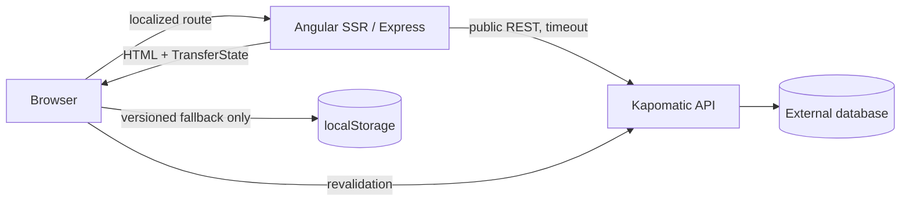
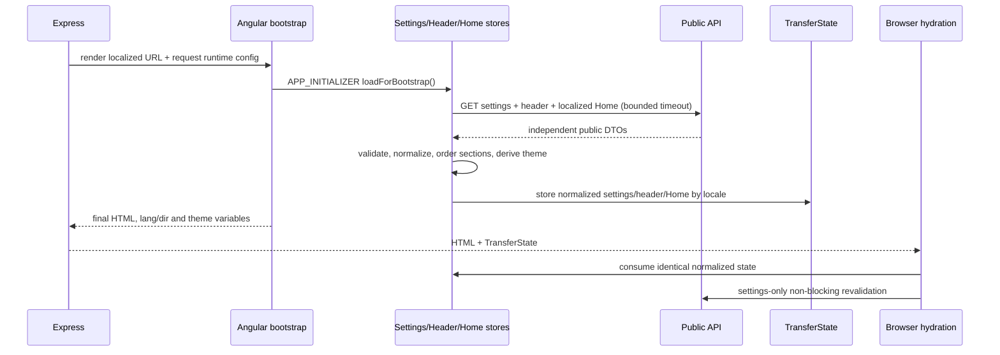
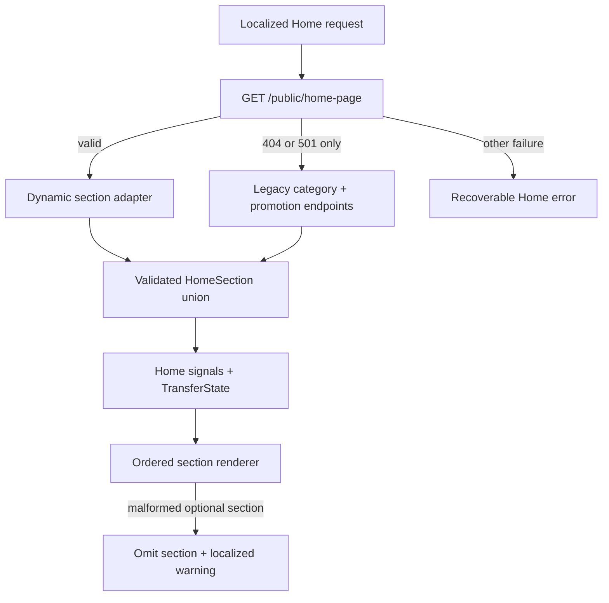

# Architecture

## Scope and boundaries

This repository is the new Angular 17 storefront. It may read public Kapomatic APIs but owns no backend, database, inventory authority, payment review, or administration workflow. The legacy storefront at `/home/yehia_ahmed/Desktop/ecommerce-website` is read-only evidence.



## Runtime layers

| Layer                       | Responsibility                                                              | Current path                                                                 |
| --------------------------- | --------------------------------------------------------------------------- | ---------------------------------------------------------------------------- |
| Core configuration          | Typed browser/server runtime values and safe normalization                  | `src/app/core/config`, `src/main.ts`, `server.ts`                            |
| HTTP                        | One URL builder, endpoint catalogue, timeout/error normalization            | `src/app/core/http`                                                          |
| I18n                        | Locale signal, document language/direction, translation catalogue           | `src/app/core/i18n`                                                          |
| Routing                     | `ar`/`en` matcher, legacy ordering, localized shell and lazy feature routes | `src/app/core/routing`, `src/app/app.routes.ts`                              |
| SEO                         | Titles, metadata, canonical, hreflang and JSON-LD primitives                | `src/app/core/seo`                                                           |
| Theme                       | Validated dynamic semantic tokens and contrast choice                       | `src/app/core/theme`                                                         |
| Domain settings/header/Home | DTO isolation, runtime normalization, TransferState and state               | `src/app/domains/settings`, `src/app/domains/header`, `src/app/domains/home` |
| Cart shell                  | Validated versioned display snapshot, duplicate merge and count             | `src/app/domains/cart`                                                       |
| Layout                      | Header, desktop navigation, modal mobile drawer, footer and shell           | `src/app/layout`                                                             |
| Features                    | Implemented Home plus approval-gate placeholders for all later routes       | `src/app/features`                                                           |

Catalog/checkout/location domains must follow the implemented DTO → runtime validation → adapter → normalized domain model → store → component direction. The Home page sees only the `HomeSection` discriminated union; no template chooses components from unchecked backend strings.

## Bootstrap sequence



`localStorage` is browser-only, versioned and non-authoritative. Settings cache can seed a degraded render before revalidation. Cart persistence stores validated IDs, quantities, and display snapshots; all price/stock data must be revalidated by later cart/checkout APIs. Header and Home use locale-keyed normalized `TransferState`. Angular's raw HTTP transfer cache is disabled so permissive backend DTOs are not serialized a second time.

## Home capability boundary

`HomeRepository` first requests the confirmed newer `GET /public/home-page?device=desktop&locale=<ar|en>` capability. The server device is deliberately deterministic so SSR and hydration produce identical markup; the normalized public response contains no confirmed visibility flags, so responsive layout is CSS-driven. Only an explicit 404 or 501 negotiates the older confirmed endpoints. Timeouts, network failures, 401/403, malformed payloads, and 5xx responses remain errors and do not silently switch contracts.



Header uses its own `GET /header` adapter. It owns header/navigation capability; general settings remain authoritative for semantic color, general logo fallback, locations, social links, currency, and free-shipping threshold. If header is unavailable, a localized internal navigation fallback is used without inventing contact details or branding.

## Runtime-provider separation

Shared `appConfig` provides `APP_RUNTIME_CONFIG` through `provideRuntimeConfig(environment)`, so the initializer and every root service can resolve the same validated contract in a normal browser bootstrap. The provider factory reads an optional `APP_RUNTIME_CONFIG_OVERRIDE`; `server.ts` supplies that separate token per request after normalizing environment/request values. This avoids competing declarations of the main token while preserving request-specific SSR configuration. `app.config.server.ts` merges `appConfig` with `provideServerRendering()`, and `src/main.ts` bootstraps the shared configuration directly. Express retains a bounded 502 fail-safe when a deployment omits the required reverse proxy.

## Routing

Target localized routes:

```text
/ -> /ar
/:lang
/:lang/categories/:categorySlug
/:lang/search
/:lang/products/:productSlug
/:lang/cart
/:lang/checkout
/:lang/locations
/:lang/not-found
```

`localeMatcher` consumes only `ar` and `en`. Legacy `/cart`, `/checkout`, `/locations`, and `/products` declarations appear first. `/products/:legacyId` is intentionally retained without fabricating an ID-to-slug redirect; the real resolver is a later catalog task. Unknown routes use the not-found page, and Express returns 404 for structurally unknown URLs.

## State rules

- Signals: settings/theme/locale, header, Home, cart shell, drawer and derived UI state.
- RxJS: HTTP, route/query composition, debounce, cancellation and concurrency.
- Every feature request should expose explicit loading/success/empty/error state.
- Use `switchMap` for route/search/filter cancellation and `takeUntilDestroyed` for owned subscriptions.
- No NgRx is justified by current requirements.

## Design approval boundary

Home and the shared shell are approved and implemented from Home v3. `FoundationPlaceholderPageComponent` remains temporary technical evidence for category, search, product, cart, checkout, locations and not-found routes; it is not approval to implement those pages.
